From a 231-strain panel to a single residue
================
Assembled 2026-09-04

-   [Conventions that cross every
    figure](#conventions-that-cross-every-figure)
    -   [RNAi dose is not constant](#rnai-dose-is-not-constant)
    -   [Two thresholds, always both](#two-thresholds-always-both)
-   [I. The assay](#i-the-assay)
    -   [Figure 1 — the validated assay, the phenotype it produces, and
        the
        map](#figure-1--the-validated-assay-the-phenotype-it-produces-and-the-map)
    -   [Supplement — the sample-level measurements behind the Figure 1
        slopes](#supplement--the-sample-level-measurements-behind-the-figure-1-slopes)
    -   [Supplement — the bootstrap propagation
        checks](#supplement--the-bootstrap-propagation-checks)
    -   [Supplement — the sequencing-depth
        requirement](#supplement--the-sequencing-depth-requirement)
    -   [Supplement — replicate reproducibility of the
        phenotype](#supplement--replicate-reproducibility-of-the-phenotype)
    -   [Supplement — the plate assay, validated
        externally](#supplement--the-plate-assay-validated-externally)
-   [II. The map](#ii-the-map)
    -   [Figure 2 — pooled GWAS and cross mapping identify overlapping
        loci](#figure-2--pooled-gwas-and-cross-mapping-identify-overlapping-loci)
    -   [Supplement — why these cross
        parents](#supplement--why-these-cross-parents)
    -   [Supplement — the expanded view behind Figure 2’s
        tracks](#supplement--the-expanded-view-behind-figure-2s-tracks)
-   [III. The interval](#iii-the-interval)
    -   [Figure 3 — NILs fine-map the chromosome III QTL to 37
        kb](#figure-3--nils-fine-map-the-chromosome-iii-qtl-to-37-kb)
    -   [Supplement — the complete NIL hatching
        experiment](#supplement--the-complete-nil-hatching-experiment)
-   [IV. The residue](#iv-the-residue)
    -   [Figure 4 — editing *sid-2* residue 96 moves sensitivity in
        three
        backgrounds](#figure-4--editing-sid-2-residue-96-moves-sensitivity-in-three-backgrounds)
    -   [Supplement — the full N2 dose
        series](#supplement--the-full-n2-dose-series)
    -   [Supplement — everything held back from Figure
        4A](#supplement--everything-held-back-from-figure-4a)
    -   [Supplement — the honest negative
        check](#supplement--the-honest-negative-check)
    -   [Supplement — surface charge of the
        ectodomain](#supplement--surface-charge-of-the-ectodomain)
-   [Open before submission](#open-before-submission)
-   [Figure manifest](#figure-manifest)

<!--
FIGURE_REPORT.Rmd -- the sixteen manuscript figures with their captions, ordered
by the argument rather than by build order.

  Rscript -e 'rmarkdown::render("FIGURE_REPORT.Rmd", "all")'

builds both targets:

  FIGURE_REPORT.md     the GitHub-rendered version. Figures are referenced from
                       plots/ rather than embedded, so GitHub displays them and
                       the file stays a few tens of kB. This is the tracked one.
  FIGURE_REPORT.html   the styled, self-contained version (~13 MB, figures
                       base64-embedded, click-to-zoom). Git-ignored; rebuild it
                       when you want the designed reading copy.

The CSS, the webfont link and the zoom overlay are guarded on the output
format, so none of them leak into the Markdown.

Run from the repository root; the Rmd lives there so that "plots/..." and
"supplemental_data/..." resolve without any setwd().

WHAT IS DERIVED AND WHAT IS PROSE. Every table below marked "derived" is
computed from supplemental_data/ when this file knits, so it cannot drift from
the deposit. Four such tables were checked against the numbers in
FIGURE_CAPTIONS.txt and reproduce them exactly. Numbers inside the caption prose
came from the figure scripts' console output and are literal text; the figure
scripts remain the authority for those.

The figures themselves are read from plots/ and base64-embedded by pandoc, so
the knitted HTML is a single self-contained file.
-->

The manuscript figure set for RNAi sensitivity in wild *Caenorhabditis
elegans*, ordered by the argument rather than by build order. Each
figure carries its caption, with the caveats kept attached to the panel
they qualify. Click any figure to enlarge it.

The argument narrows by roughly an order of magnitude at each step:
**231 wild isolates** given a quantitative phenotype, **six
chromosomes** scanned in two crosses, **37 kb** resolved by a NIL
series, **one residue** edited in three backgrounds.

# Conventions that cross every figure

## RNAi dose is not constant

Every embryo-hatching experiment ran on a lawn of *pos-1* RNAi bacteria
diluted with HT115, and the dilution differs.

| Experiment                    | Dose            |
|:------------------------------|:----------------|
| Figure 3C, and its supplement | 50% *pos-1*     |
| Figure 4A, and its supplement | 50% *pos-1*     |
| Figure 4B                     | **25% *pos-1*** |

Hatching percentages are therefore **not comparable between Figure 4A
and Figure 4B**, and the text should not put those numbers side by side.
The 25% dose is not an oversight: in the N2 background it is the only
dilution with any dynamic range — at 0% every genotype hatches, and from
50% upward every genotype is dead. The dose series below the Figure 4
entry shows this.

## Two thresholds, always both

Bonferroni over every tested marker assumes markers are independent,
which they are not in this panel. The eigen threshold divides α by the
effective number of independent tests from the eigenvalues of the marker
correlation matrix (Li & Ji 2005).

| Panel            |   n | Markers | Meff | Bonferroni | Eigen |
|:-----------------|----:|--------:|----------------:|-----------:|------:|
| pooled_RNAi_expt |  84 | 322,010 |             732 |       6.81 |  4.17 |
| pos1_2023        | 231 | 464,045 |           1,972 |       6.97 |  4.60 |

Thresholds as −log10*p*. Cross scans use LOD instead, with a
genome-wide threshold of LOD 3.57 (α = 0.05 over 2,000 effective tests).
**vst** throughout is the variance-stabilised pooled phenotype — the
exact trait the GEMMA associations were run on, so phenotype and
Manhattan panels always share a scale.

# I. The assay

231 isolates

Pooled whole-genome sequencing, deconvolved to per-strain frequencies,
reproduces a published targeted measurement — and then yields a
quantitative *pos-1* RNAi phenotype across the wild panel that a
genome-wide scan can be run on.

## Figure 1 — the validated assay, the phenotype it produces, and the map

**Script** `scripts/Figure1_pos1.R`  **Test bed** Baugh L1
starvation, the one dataset with pooled WGS and published MIP-seq on the
same samples  **n** 98 strains (A) · 231 strains (B, C) · 464,045
markers

plots/Figure1_pos1.pdf · .png

A Per-strain rate of change in pool frequency
during L1 starvation, MIP-seq against NNLS, one point per wild isolate
averaged over five replicate arms — `n = 98`, Spearman `ρ = 0.97`,
`p < 1e-4`. Slopes are the regression of frequency change on day, taking
day 1 as baseline and excluding day 17. The dashed line is `y = x`, not
a fit.

B Distribution of the 2023 pooled *pos-1* RNAi
response across wild isotypes on the vst scale (`n = 231` strains with a
vst value, of 366 in the trait file). The dashed line marks zero;
positive values are strains that gained pool frequency under *pos-1*
RNAi, i.e. resistant.

C GEMMA LOCO association scan for that
phenotype: 464,045 markers, `n = 231`. The grey dashed line is
Bonferroni over every marker (`6.97`); the green dotted line divides α
by the 1,972 effective independent tests (`4.60`). Markers clearing
Bonferroni are red, markers clearing only the eigen threshold are green.

Two things to state in the text

N2 is excluded from panel A throughout: as the reference strain its
genotype shares sites with every other strain in the pool, so its NNLS
frequency is not identified on the same footing as the wild isolates’.

The shipped vst value for JU1793 still carries the duplicate-entry
averaging documented in `scripts/2023_pos1_analysis.R` — which matters,
because JU1793 is a cross parent in Figures 2 and 3.

## Supplement — the sample-level measurements behind the Figure 1 slopes

**Script** `scripts/SUPP_FIG_XX_baugh_per_sample_frequencies.R` 
**Supports** Figure 1A · 15 samples used by the slope fits

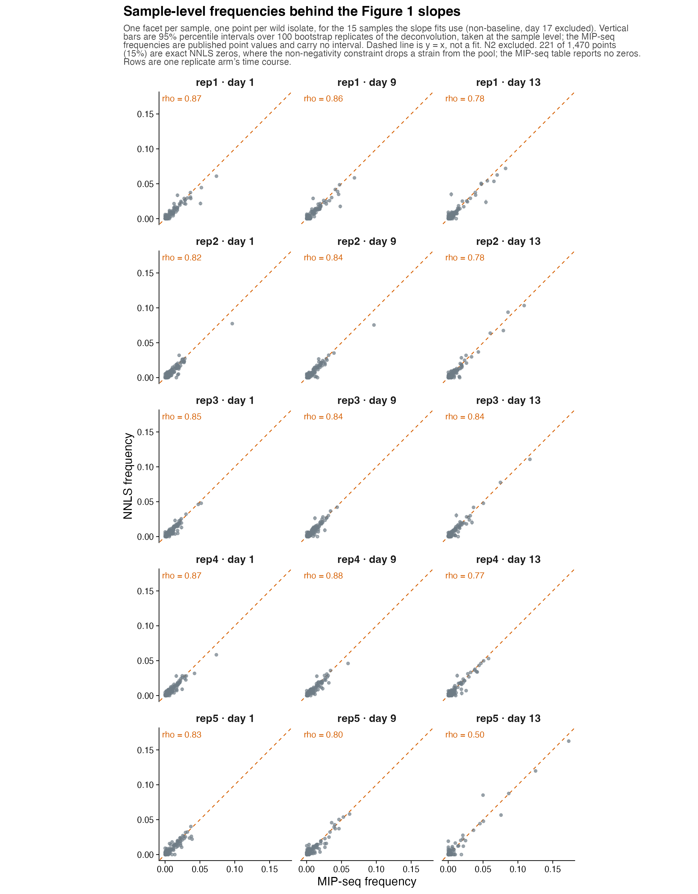

SUPP_FIG_XX_baugh_per_sample_frequencies

One facet per sample for the 15 samples the slope fits use
(non-baseline, day 17 excluded), one point per wild isolate, published
MIP-seq frequency against NNLS frequency, with 95% percentile intervals
over 100 bootstrap replicates of the deconvolution taken at the sample
level. Rows are one replicate arm’s time course; Spearman ρ is given per
facet. Dashed line is `y = x`, not a fit; N2 excluded.

Vertical bars only: the published MIP-seq frequencies are point values
with no distributed uncertainty, so an interval on that axis would be
invented.

Two things Figure 1 cannot show. First, `rep5_d13` agrees far worse than
any other sample (`ρ = 0.50` against 0.77–0.88 elsewhere) and is the
single low bar in the per-sample distribution. Second, 221 of 1,470
points (15%) are exact NNLS zeros — the non-negativity constraint
clamping a strain out of a pool — while the MIP-seq table reports no
zeros at all. A block of ties at zero cannot be ranked, which is the
likely reason per-sample ρ (median 0.84) is so much lower than the
slope-level 0.97.

## Supplement — the bootstrap propagation checks

**Script** `scripts/SUPP_FIG_XX_bootstrap_propagation_checks.R` 
**Supports** the bootstrap intervals · 100 replicates

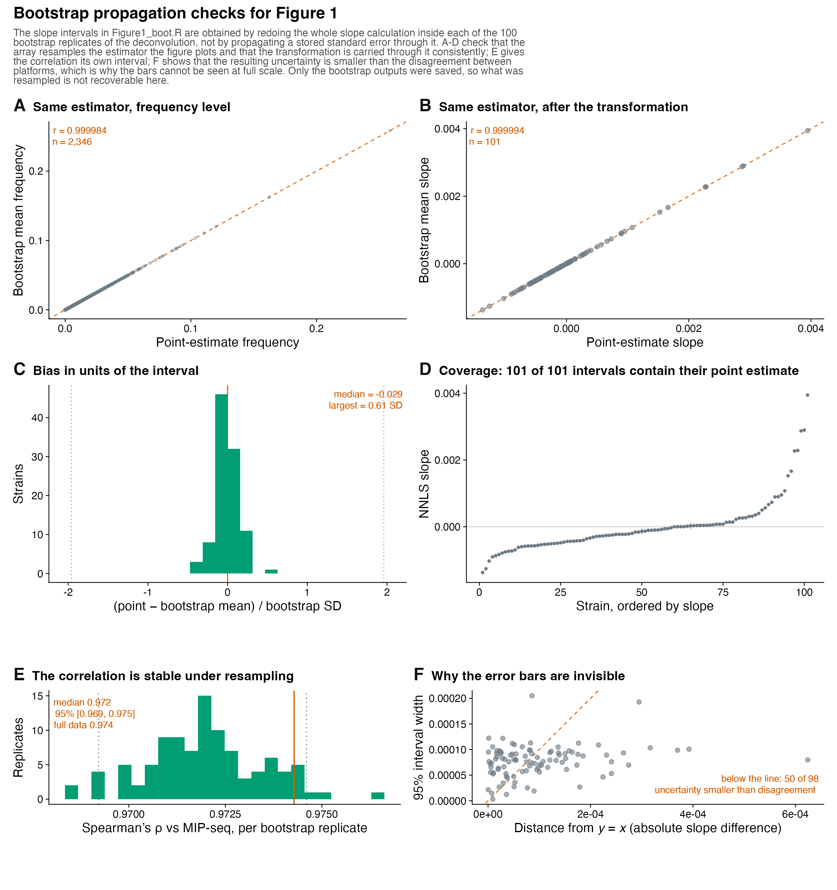

SUPP_FIG_XX_bootstrap_propagation_checks

The intervals are obtained by redoing the whole slope calculation inside
each of the 100 bootstrap replicates of the deconvolution, not by
propagating a stored standard error through that chain. Each panel is a
check that could have failed.

A Frequency level: bootstrap mean against point
estimate, *r* = `0.999984`, `n = 2,346`. Confirms the array resamples
the estimator Figure 1 plots.

B The same after the transformation, *r* =
`0.999994`, `n = 101`. This is the panel that would break if the day-1
baseline were taken from the point estimate rather than from within each
replicate, or if the replicate arms were averaged in the wrong order.

C Standardised bias, (point estimate − bootstrap
mean) / bootstrap SD: median −0.029, largest 0.61 SD. Dotted lines at
±1.96.

D Coverage: each strain’s interval with its
point estimate marked. All 101 of 101 intervals contain their own point
estimate.

E The correlation’s own bootstrap distribution:
median 0.972, 95% percentile interval `[0.969, 0.975]`, full-data value
0.974.

F Bootstrap interval width against distance from
`y = x`, per strain. The uncertainty is smaller than the platform
disagreement for 50 of 98 strains, and 0.57× it on average — which is
why the bars are invisible at full scale.

Caveat, and it is not resolvable from the archived
data

Only the bootstrap outputs were saved. The archive holds the 102 × 23 ×
100 array and a reshaped copy of it, not the resampling scheme, and the
generating code is not in this repository. These panels establish that
the array resamples the plotted estimator and that the transformation is
carried through it consistently. They cannot establish *what* was
resampled — reads, markers or strains. No statement stronger than “100
bootstrap replicates of the deconvolution” is supported by what is on
disk.

## Supplement — the sequencing-depth requirement

**Script** `scripts/SUPP_FIG_XX_downsample_per_sample.R` 
**Supports** Figure 1C · depths 0.25× to 10×

SUPP_FIG_XX_downsample_per_sample

A Per-sample agreement against depth: one grey
line per sample (23 samples), dark line the median across samples,
dashed line the median full-depth agreement (0.835). Median ρ rises
0.724 at 0.25× to 0.827 at 5×, saturating by 3–5×.

B The aggregate, slope-level curve — Figure 1C —
with the 0.5× depth restored: 0.833, 0.870, 0.851, 0.903, 0.906, 0.904
for 0.25× through 10×.

Panel B correlates slopes, which average fifteen measurements, so it
sits above A at every depth and saturates sooner: averaging removes most
of what depth costs an individual sample. **Quoting the depth
requirement from B alone overstates how well any single sample is
measured.**

Two further points. The spread between samples exceeds the effect of
depth — the median moves about 0.10 across a fortyfold depth range while
samples span roughly 0.43 to 0.88 at any fixed depth. And `rep5_d13` is
worst at every depth (0.428–0.478) without improving, so its
disagreement is not a depth problem and no amount of sequencing would
have fixed it.

The 0.5× inversion visible in B — 0.870, above the 0.851 of the 1× that
follows — is why that depth is omitted from Figure 1C. No such inversion
appears per sample, so it looks like noise in one downsampling draw
rather than a property of that depth. No error bars here: the bootstrap
array holds replicates of the full-depth deconvolution only, so there is
nothing to resample at a reduced depth.

## Supplement — replicate reproducibility of the phenotype

**Script**
`scripts/SUPP_FIG_XX_original_pos1_dfreq_rep_correlation.R` 
**Supports** the Figure 1B phenotype · all 6 pairwise comparisons of 4
replicates

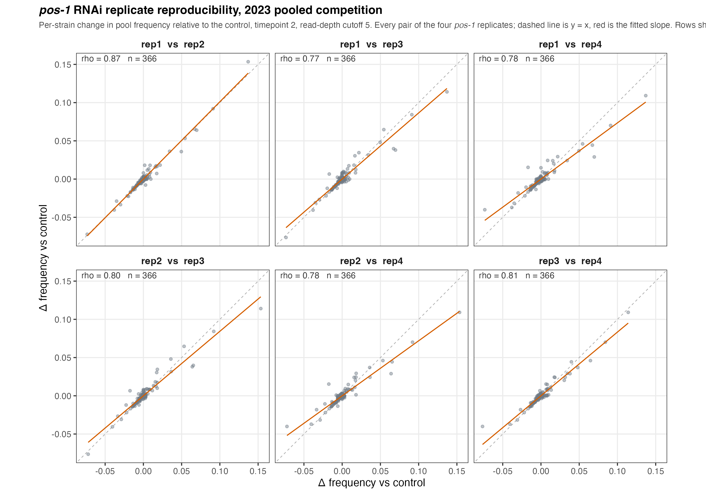

SUPP_FIG_XX_original_pos1_dfreq_rep_correlation

All six pairwise comparisons of the four *pos-1* replicates, at
read-depth cutoff 5, with Spearman ρ and n on each facet. Dashed line is
`y = x`; red is the fitted slope.

Depth cutoff 5 is used because it is the cutoff the shipped association
traits were built from: taking the mean *pos-1* delta per strain at
cutoff 5 reproduces `delta_ctrl_pos-1_T2` to `2.5e-16`, against *r* =
`0.9998` at cutoff 3 and `0.9988` at cutoff 10.

One strain needs a sentence

Rows sharing a (strain, sample) key are summed before the delta is
taken. This affects JU1793 only, which appears twice per sample at every
depth cutoff and in both arms — one row carrying the real frequency and
the other `~1e-21`. That is NNLS splitting one strain’s abundance across
two identical entries in the genotype reference, not two measurements.
Summing roughly doubles JU1793’s *pos-1* delta, from 0.00857 to about
0.0171. For every other strain the collapse is a no-op.

## Supplement — the plate assay, validated externally

**Script** `scripts/SUPP_FIG_plate_vs_paaby_vs_pos1original.R` 
**Supports** the pooled phenotype, against two independent
measurements  **n** 111 strains (A) · 19 strains (B)

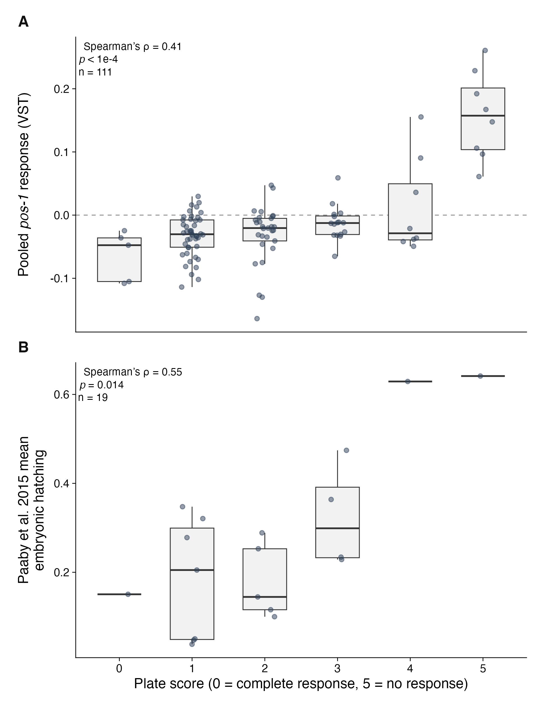

SUPP_FIG_plate_vs_paaby_vs_pos1original

The plate score is a six-level ordinal scale (0 = complete RNAi
response/sensitive, 5 = no response/resistant), so Spearman rank
correlation is used throughout: it requires only a monotonic
relationship, not shared units or linearity.

A Plate score against the pooled 2023 *pos-1*
response on the VST scale (`vst_ctrl_pos-1_T2`), the same trait the
association mapping was run on: `ρ = 0.41`, `n = 111`, `p = 7.8e-06`.
Positive is the expected direction — VST is positive for strains that
gained pool frequency under *pos-1* RNAi, and resistant strains score
high on the plate. Dashed line marks zero.

B Plate score against Paaby et al. 2015 mean
embryonic lethality for the *pos-1* clone, computed per well as
unhatched eggs over eggs plus larvae and averaged within a strain:
`ρ = −0.55`, `n = 19`, `p = 0.014`. Negative is the expected direction —
a low plate score means sensitive, and sensitive means high lethality.

Both agree with the plate assay in the predicted direction. **The Paaby
comparison rests on 19 shared strains and should be described as
consistent rather than as independent confirmation.**

Rebuilt on the VST trait

The earlier version of panel A used a bootstrap frequency change from a
different export (`ρ = 0.42`, `n = 106`), which was on no scale used
elsewhere in the manuscript. The VST version puts it on the same scale
as every other phenotype panel.

# II. The map

genome-wide · two crosses

Pooled GWAS and F2 bulk-segregant cross mapping identify overlapping
loci, and the two cross contrasts separate general RNAi-response loci
from knockdown-specific ones.

## Figure 2 — pooled GWAS and cross mapping identify overlapping loci

**Script** `scripts/Figure2.R`  **GWAS** n = 84 strains · 322,010
markers  **Crosses** N2 × XZ1516 · JU1793 × JU2466  **Drawn** QTL
with peak LOD \> 100 (9 intervals)

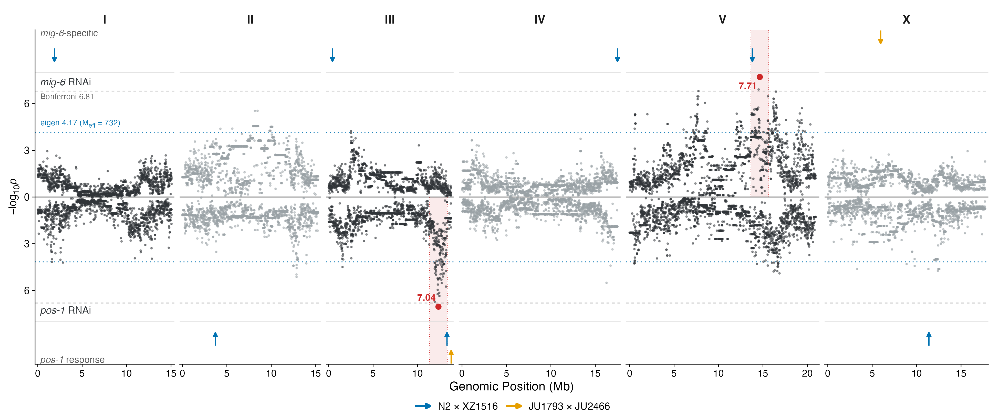

plots/Figure2.pdf · .png

Mirrored Manhattan of the pooled GWAS on the vst traits: the *mig-6*
response above the axis, the *pos-1* response below (`n = 84`, 322,010
markers). Grey dashed lines are Bonferroni over every marker (`6.81`);
green dotted lines divide α by the 732 effective independent tests
(`4.17`). Threshold labels sit in the chromosome I panel.

Overlaid tracks compress the F2 cross QTL into intervals, flush against
the significance line and directional: *mig-6*-specific QTL above, the
*pos-1* response below. Intervals are a 5% LOD drop from the chromosome
peak marker, coloured by cross with opacity scaled to peak LOD. The
*mig-6* track is drawn from the *mig-6*-vs-*pos-1* contrast and the
*pos-1* track from the HT115-vs-*pos-1* contrast, so each track shows
the comparison that isolates the effect it is labelled with. Shaded
vertical bands mark ±1 Mb around the pooled GWAS peaks.

| Track              | Cross         | Chr | Peak Mb | Interval    |  kb | LOD |
|:-------------------|:--------------|:----|--------:|:------------|----:|----:|
| *mig-6* vs *pos-1* | N2×XZ1516     | I   |    1.88 | 1.80–1.96   | 166 | 751 |
| *mig-6* vs *pos-1* | N2×XZ1516     | III |    0.43 | 0.28–0.59   | 304 | 165 |
| *mig-6* vs *pos-1* | N2×XZ1516     | IV  |   17.49 | 17.44–17.49 |  52 | 167 |
| *mig-6* vs *pos-1* | N2×XZ1516     | V   |   13.81 | 13.63–13.91 | 278 | 730 |
| *mig-6* vs *pos-1* | JU1793×JU2466 | X   |    5.96 | 5.66–6.24   | 582 | 361 |
| HT115 vs *pos-1*   | N2×XZ1516     | II  |    3.71 | 3.59–3.80   | 212 | 148 |
| HT115 vs *pos-1*   | N2×XZ1516     | III |   13.31 | 13.11–13.50 | 394 | 710 |
| HT115 vs *pos-1*   | JU1793×JU2466 | III |   13.78 | 13.73–13.78 |  51 | 140 |
| HT115 vs *pos-1*   | N2×XZ1516     | X   |   11.38 | 11.13–11.62 | 492 | 183 |

Transcribed from `Figure2.R` console output; there is no interval table
in the deposit to derive this from. Only these nine are drawn — the
complete significant set is the legacy supplement
`SUPP_FIG_XX_cross_qtl_all`.

State this in the text rather than leave a reader to
notice it

**No cross interval contains its matching pooled GWAS peak marker.** The
nearest correspondences are the *mig-6* peak at V:14.65 Mb against the
N2×XZ1516 chromosome V interval at 13.81 Mb (0.84 Mb apart), and the
*pos-1* peak at III:12.35 Mb against the N2×XZ1516 chromosome III
interval at 13.31 Mb (0.96 Mb) and the JU1793×JU2466 interval at 13.78
Mb (1.43 Mb). A GWAS on 84 strains is not expected to localise to a
cross interval; the claim is concordance of *locus*, not of marker.

## Supplement — why these cross parents

**Script** `scripts/SUPP_FIG_XX_pooled_phenotype_ranks.R` 
**Supports** the choice of cross parents · n = 84 of 93 panel strains

SUPP_FIG_XX_pooled_phenotype_ranks

Per-strain pooled RNAi response for *mig-6* and *pos-1* on the vst
scale, ranked, with the cross parents highlighted. Establishes that the
crosses were built from the extremes of the pooled assay rather than
from convenience. Nine of the 93 panel strains have no vst value, so
`n = 84` and ranks are out of 84.

## Supplement — the expanded view behind Figure 2’s tracks

**Script** `scripts/SUPP_FIG_XX_cross_contrast_panels.R` 
**Supports** Figure 2’s compressed tracks  **Contrasts**
HT115-vs-*pos-1* · *mig-6*-vs-*pos-1*

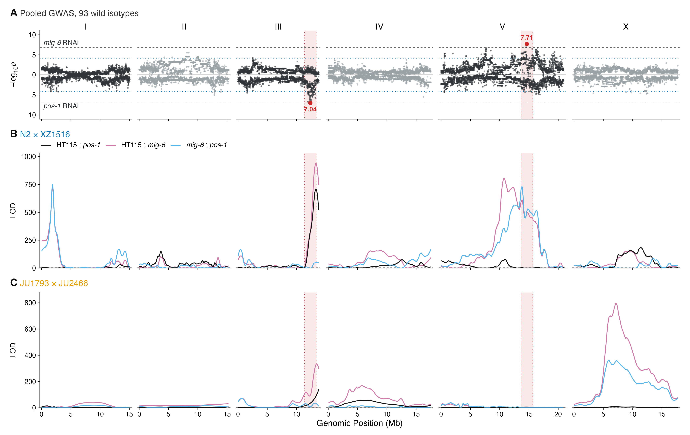

SUPP_FIG_XX_cross_contrast_panels

Mirrored pooled GWAS on top, then one panel per cross with both
contrasts overlaid: HT115 vs *pos-1* in purple and *mig-6* vs *pos-1* in
blue.

Purple high with blue flat marks a **general** RNAi-response locus — the
machinery is affected whatever the target — and blue high marks a
**knockdown-specific** one. This is the panel that justifies calling the
chromosome III locus general and the chromosome V, I and X loci
specific.

# III. The interval

13.8 Mb → 37 kb

A near-isogenic line series on the right arm of chromosome III fine-maps
the general RNAi-response QTL to 37 kb, and gives an allelic series in
hatching.

## Figure 3 — NILs fine-map the chromosome III QTL to 37 kb

**Script** `scripts/Figure3_quad.R` · 50% *pos-1* RNAi  **Cross**
JU1793 × JU2466, HT115 vs *pos-1*  **chrIII peak** 13.784 Mb, LOD
139.7 · **resolved** 13.658–13.695 Mb (37 kb)

plots/Figure3_quad.pdf · .png

Four panels, arranged so the figure reads in the order the argument
runs: two strains at opposite ends of the pooled panel, crossing them
maps a QTL, NILs carrying pieces of it give an allelic series, and the
pieces they carry are these.

A The pooled *pos-1* phenotype distribution as a
histogram, with both cross parents marked by equal-height lollipops —
JU1793 vst 0.121, rank 83/84; JU2466 −0.051, rank 10/84. This makes
visible that the cross was built from opposite ends of the pooled panel.

B The JU1793×JU2466 F2 bulk-segregant scan on
chromosome III, HT115 against *pos-1* RNAi. The resolved interval is
drawn as a shaded band with dotted edges — possible at this scale
because 37 kb is 0.3% of a 13.8 Mb axis, and not possible genome-wide,
where it is sub-pixel. The genome-wide threshold (LOD 3.57) is not
drawn; the peak is at 13.784 Mb, LOD 139.7.

C Embryos hatched under 50% *pos-1* RNAi, rows
aligned to panel D. Bars are one plate per strain with Wilson 95%
binomial intervals.

<table>
<thead>
<tr>
<th style="text-align:left;">
Strain
</th>
<th style="text-align:right;">
Embryos
</th>
<th style="text-align:right;">
Hatched
</th>
</tr>
</thead>
<tbody>
<tr>
<td style="text-align:left;">
JU1793
</td>
<td style="text-align:right;">
179
</td>
<td style="text-align:right;">
99.4%
</td>
</tr>
<tr>
<td style="text-align:left;">
wSZ196
</td>
<td style="text-align:right;">
261
</td>
<td style="text-align:right;">
97.3%
</td>
</tr>
<tr>
<td style="text-align:left;">
wSZ191
</td>
<td style="text-align:right;">
252
</td>
<td style="text-align:right;">
79.4%
</td>
</tr>
<tr>
<td style="text-align:left;">
wSZ176
</td>
<td style="text-align:right;">
272
</td>
<td style="text-align:right;">
58.5%
</td>
</tr>
<tr>
<td style="text-align:left;">
JU2466
</td>
<td style="text-align:right;">
230
</td>
<td style="text-align:right;">
35.7%
</td>
</tr>
</tbody>
</table>

Derived from supplemental_data/hatching_assays/nil_series_hatching.tsv

D Introgressions carried by the NIL series on
the right arm of chromosome III, 13.60 Mb to the telomere. JU1793
genotype in orange, JU2466 in teal; rows run JU1793 at the bottom to
JU2466 at the top. The shaded band with dotted edges is the interval the
series resolves, **13.658–13.695 Mb** — the region wSZ191 carries and
wSZ196 does not.

Two caveats, the second worth a sentence in the
text

1.  One plate per strain per condition, so the intervals in C describe
    *counting* uncertainty, not between-plate variability, and no strain
    is replicated. The ordering should be read as an allelic series, not
    as a set of tested contrasts. The HT115 control arm and four further
    NILs are in the supplement below.
2.  The chromosome III peak marker at 13.784 Mb **is the terminal marker
    of the chromosome**. A scan cannot place a peak past the chromosome
    end, so that position is a boundary artefact rather than a
    localisation, and the NIL interval at 13.658–13.695 Mb is the claim.
    “The peak coincides with the NIL interval” is not a sentence these
    data support.

## Supplement — the complete NIL hatching experiment

**Script** `scripts/SUPP_FIG_XX_nil_hatching_full.R` · 50% *pos-1*
RNAi  **Supports** Figure 3C · 10 strains, both food conditions

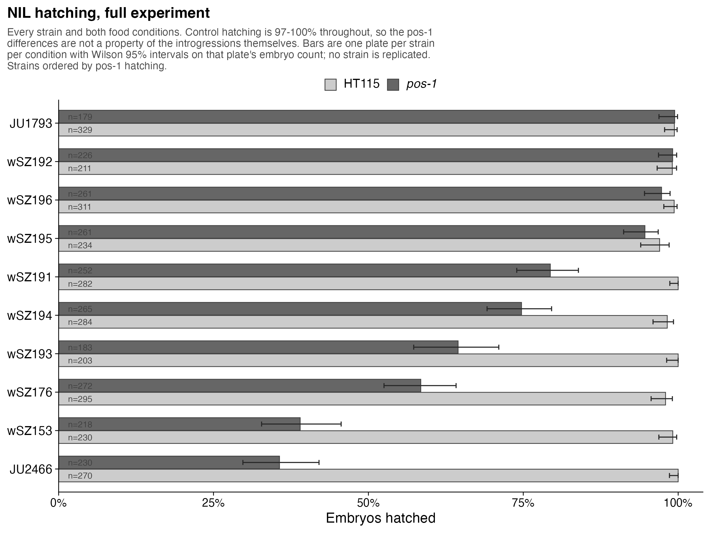

SUPP_FIG_XX_nil_hatching_full

All 10 strains on both food conditions at 50% *pos-1* RNAi, strains
labelled and ordered by *pos-1* hatching, with embryo counts on each bar
and Wilson 95% binomial intervals. **Control hatching is 97–100% for
every strain**, which is what makes the *pos-1* differences in Figure 3C
attributable to the RNAi rather than to the introgressions themselves.

Adds four NILs that Figure 3 does not use — wSZ192, wSZ193, wSZ194,
wSZ195 — and wSZ153.

Why those four are not in Figure 3D

None of the four has introgression coordinates in the NIL ranges file,
so their genotypes cannot be drawn. **wSZ192 and wSZ193 in particular
would sharpen the interval if their breakpoints can be recovered.** One
plate per strain per condition, as in Figure 3C.

# IV. The residue

one residue

Editing *sid-2* residue 96 moves RNAi sensitivity in three genetic
backgrounds and in both directions, and the residue sits on the lumenal
face of the ectodomain alongside residues already known to be required
for dsRNA uptake.

## Figure 4 — editing *sid-2* residue 96 moves sensitivity in three backgrounds

**Script** `scripts/Figure4_sid2.R`  **Assets**
`scripts/sid2_ribbon_render.py` · `scripts/sid2_zoom_render.py` 
**Variant** chrIII:13,680,248 C>A · T96K  **Dose** 50% *pos-1* (A) ·
**25%** *pos-1* (B)

plots/Figure4_sid2.pdf · .png

Panels carry letters only; all descriptive text is here.

A Embryos hatched on **50%** *pos-1* RNAi for
reciprocal edits at residue 96 in the two cross parents. JU1793\[96T\],
the resistant parental allele, 94.8% (`n = 213` embryos); JU1793\[96K\]
53.1% (`n = 207`); JU2466\[96K\], the sensitive parental allele, 5.4%
(`n = 204`); JU2466\[96T\] 18.4% (`n = 217`). Parental alleles are in
the strain colours and edited alleles in grey. Fisher’s exact test, each
edit against the unedited allele in the same background: `p = 1.7e-24`
and `p = 3.9e-05`. Editing 96T→K removes most of JU1793’s resistance and
96K→T recovers part of JU2466’s, so residue 96 contributes in both
directions without accounting for the whole difference between the
parents.

B The same substitution in N2, at **25%**
*pos-1* RNAi. N2 carries 96T and hatches 32.3% (`n = 220`); two
independently derived lines edited to 96K hatch 4.4% (wSZ203, `n = 273`)
and 3.7% (wSZ204, `n = 295`), Fisher `p = 7.8e-17` and `p = 6.2e-19`.
The two edited lines are labelled by genotype and not distinguished on
the axis, because they are independent lines of the same edit. This is
the third genetic background to show the effect and the only one with
two independent edits, and the direction is the same throughout: **96K
sensitive, 96T resistant**.

C The SID-2 ectodomain, AlphaFold3 model,
rotated onto the membrane normal so the intestinal lumen is up;
β-strands dark, coil pale, and the grey slab is the bilayer. Left,
residues 21–188 of chain A with the dashed ring marking the region
enlarged at right. Right, side chains for T96 (orange) and for the three
residues with a published effect on dsRNA uptake — H32 (reduced uptake),
D34 (*qt13*, complete RNAi resistance) and H168 (no detectable uptake) —
with dashed lines giving Cα–Cα distances of 16.4, 13.5 and 19.2 Å. In
the zoom the ribbon is scaffold only and carries no secondary-structure
meaning.

D *sid-2* coding variation in the wild
population: the protein drawn vertically with residue 1 at the top and
its topology as a filled bar, and each protein-altering variant labelled
to the right with its CeNDR allele frequency, then two columns giving
the JU1793 and JU2466 allele state. Callout rows are evenly spaced and
joined to the residue by a leader rather than sitting at the residue’s
own height: four of the eight fall between residues 141 and 153 and
would overlap completely at true scale.

<table>
<thead>
<tr>
<th style="text-align:left;">
Variant
</th>
<th style="text-align:right;">
Residue
</th>
<th style="text-align:right;">
CeNDR AF
</th>
<th style="text-align:right;">
Isotypes
</th>
<th style="text-align:center;">
JU1793
</th>
<th style="text-align:center;">
JU2466
</th>
<th style="text-align:center;">
N2
</th>
<th style="text-align:center;">
XZ1516
</th>
<th style="text-align:center;">
Parents differ
</th>
</tr>
</thead>
<tbody>
<tr>
<td style="text-align:left;">
V5L
</td>
<td style="text-align:right;">
5
</td>
<td style="text-align:right;">
0.015
</td>
<td style="text-align:right;">
540
</td>
<td style="text-align:center;">
L
</td>
<td style="text-align:center;">
V
</td>
<td style="text-align:center;">
V
</td>
<td style="text-align:center;">
V
</td>
<td style="text-align:center;">
yes
</td>
</tr>
<tr>
<td style="text-align:left;">
D78A
</td>
<td style="text-align:right;">
78
</td>
<td style="text-align:right;">
0.009
</td>
<td style="text-align:right;">
540
</td>
<td style="text-align:center;">
D
</td>
<td style="text-align:center;">
D
</td>
<td style="text-align:center;">
D
</td>
<td style="text-align:center;">
A
</td>
<td style="text-align:center;">
</td>
</tr>
<tr>
<td style="text-align:left;">
T96K
</td>
<td style="text-align:right;">
96
</td>
<td style="text-align:right;">
0.453
</td>
<td style="text-align:right;">
537
</td>
<td style="text-align:center;">
T
</td>
<td style="text-align:center;">
K
</td>
<td style="text-align:center;">
T
</td>
<td style="text-align:center;">
K
</td>
<td style="text-align:center;">
yes
</td>
</tr>
<tr>
<td style="text-align:left;">
M141V
</td>
<td style="text-align:right;">
141
</td>
<td style="text-align:right;">
0.009
</td>
<td style="text-align:right;">
540
</td>
<td style="text-align:center;">
M
</td>
<td style="text-align:center;">
M
</td>
<td style="text-align:center;">
M
</td>
<td style="text-align:center;">
V
</td>
<td style="text-align:center;">
</td>
</tr>
<tr>
<td style="text-align:left;">
Q144P
</td>
<td style="text-align:right;">
144
</td>
<td style="text-align:right;">
0.009
</td>
<td style="text-align:right;">
540
</td>
<td style="text-align:center;">
Q
</td>
<td style="text-align:center;">
Q
</td>
<td style="text-align:center;">
Q
</td>
<td style="text-align:center;">
P
</td>
<td style="text-align:center;">
</td>
</tr>
<tr>
<td style="text-align:left;">
A151I/T
</td>
<td style="text-align:right;">
151
</td>
<td style="text-align:right;">
0.195
</td>
<td style="text-align:right;">
539
</td>
<td style="text-align:center;">
A
</td>
<td style="text-align:center;">
A
</td>
<td style="text-align:center;">
A
</td>
<td style="text-align:center;">
I/T
</td>
<td style="text-align:center;">
</td>
</tr>
<tr>
<td style="text-align:left;">
P153T
</td>
<td style="text-align:right;">
153
</td>
<td style="text-align:right;">
0.470
</td>
<td style="text-align:right;">
538
</td>
<td style="text-align:center;">
T
</td>
<td style="text-align:center;">
T
</td>
<td style="text-align:center;">
P
</td>
<td style="text-align:center;">
T
</td>
<td style="text-align:center;">
</td>
</tr>
<tr>
<td style="text-align:left;">
L209M
</td>
<td style="text-align:right;">
209
</td>
<td style="text-align:right;">
0.195
</td>
<td style="text-align:right;">
539
</td>
<td style="text-align:center;">
L
</td>
<td style="text-align:center;">
L
</td>
<td style="text-align:center;">
L
</td>
<td style="text-align:center;">
M
</td>
<td style="text-align:center;">
</td>
</tr>
</tbody>
</table>

Derived from supplemental_data/structure/sid2_variants_cendr.tsv

Panel D is not an exhaustive catalogue: the amino-acid annotation covers
variants segregating among the four cross parents. 81 variants of any
kind segregate in the 3 kb span in CeNDR, and the 8 protein-altering
ones above are what is annotated.

Linkage, and why it does not confound the cross

T96K and P153T are in near-complete linkage disequilibrium across the
wild population, r² = 0.935: 96K never occurs without 153T, though 153T
occurs without 96K in nine isotypes. **Both cross parents carry 153T** —
JU1793 is 96T/T153 and JU2466 is 96K/T153 — so P153T does not segregate
in the JU1793×JU2466 cross and cannot account for the mapped effect.

Of the 8 annotated coding variants, only 2 differ between the two
parents: **V5L and T96K**. That narrows the cross’s candidate coding
changes to two by inspection.

Caveats — all of which belong in the text

1.  **One plate per strain per condition throughout A and B.** The
    intervals are Wilson binomial intervals on that plate’s embryo count
    and describe counting uncertainty, not between-plate variability.
    wSZ203 and wSZ204 in panel B are the closest thing to a biological
    replicate anywhere in the figure.
2.  **Doses differ between A and B** — 50% against 25%. The percentages
    are not comparable between the two panels.
3.  The proximity in panel C is **spatial context, not evidence of a
    shared site**. Three of the four annotated residues are nearer to
    T96 than the domain’s median Cα–Cα distance (23.8 Å), but 41% of the
    ectodomain lies within 20 Å, so three of four landing there gives
    binomial `p = 0.19` and a permutation test on their mean distance
    gives `p = 0.30`.
4.  The prediction is a dimer, but **ipTM is 0.45–0.46 across all five
    models** and 43–46% of the model is called disordered, so no dimer
    is shown and dimerisation is not claimed. Only the ectodomain
    reaches the confident pLDDT band (mean 72.3; T96 79.3).
5.  Secondary structure is assigned from the backbone with the Kabsch &
    Sander hydrogen-bond criterion, not DSSP, which is not installed. It
    is corroborated independently: the criterion calls residues 194–211
    100% helix, exactly the span DeepTMHMM calls the transmembrane
    helix.
6.  T96 is the threonine of an N94-C95-T96 sequon, so T96K removes a
    predicted N-glycosylation site — **but the N94A test of that
    hypothesis fails, and the figure makes no glycosylation claim.** See
    the allele-swaps supplement.
7.  **The variant has no marginal effect across the wild panel.** See
    the in-panel supplement.
8.  Published allele positions come from the UniProt annotation for
    `G5EEV9` as recorded in the earlier structure-modelling work.
    **Verify the residue numbers against UniProt before publication.**

## Supplement — the full N2 dose series

**Script** `scripts/SUPP_FIG_XX_n2_swap_dose.R`  **Supports** Figure
4B’s dose choice · doses 0, 25, 50, 75, 100%

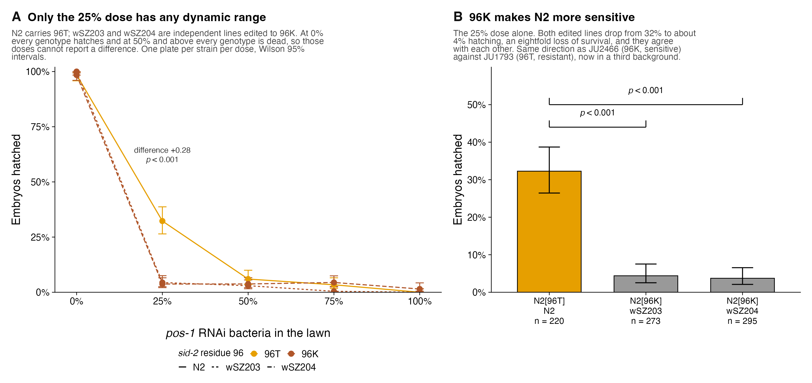

SUPP_FIG_XX_n2_swap_dose

A Every genotype at every dose: 0, 25, 50, 75
and 100% *pos-1* RNAi bacteria. N2 carries 96T; wSZ203 and wSZ204 are
independent lines edited to 96K. One plate per strain per dose with
Wilson 95% intervals.

B The 25% dose alone, as in Figure 4B.

<table>
<thead>
<tr>
<th style="text-align:right;">
% pos-1
</th>
<th style="text-align:right;">
96T
</th>
<th style="text-align:right;">
96K
</th>
<th style="text-align:right;">
Difference
</th>
<th style="text-align:right;">
Fisher p
</th>
</tr>
</thead>
<tbody>
<tr>
<td style="text-align:right;">
0
</td>
<td style="text-align:right;">
0.985
</td>
<td style="text-align:right;">
0.992
</td>
<td style="text-align:right;">
-0.006
</td>
<td style="text-align:right;">
0.43
</td>
</tr>
<tr>
<td style="text-align:right;">
25
</td>
<td style="text-align:right;">
0.323
</td>
<td style="text-align:right;">
0.040
</td>
<td style="text-align:right;">
+0.282
</td>
<td style="text-align:right;">
8.0e-25
</td>
</tr>
<tr>
<td style="text-align:right;">
50
</td>
<td style="text-align:right;">
0.060
</td>
<td style="text-align:right;">
0.034
</td>
<td style="text-align:right;">
+0.026
</td>
<td style="text-align:right;">
0.11
</td>
</tr>
<tr>
<td style="text-align:right;">
75
</td>
<td style="text-align:right;">
0.034
</td>
<td style="text-align:right;">
0.027
</td>
<td style="text-align:right;">
+0.007
</td>
<td style="text-align:right;">
0.64
</td>
</tr>
<tr>
<td style="text-align:right;">
100
</td>
<td style="text-align:right;">
0.000
</td>
<td style="text-align:right;">
0.007
</td>
<td style="text-align:right;">
-0.007
</td>
<td style="text-align:right;">
0.55
</td>
</tr>
</tbody>
</table>

Derived from
supplemental_data/hatching_assays/n2_allele_swaps_hatching.tsv

25% is not merely where the difference is largest (+0.282, Fisher
8.0e-25) — it is the only dose that can carry one. Every other dilution
sits at the ceiling or the floor for all three genotypes. **A
single-dose experiment at full strength would have found nothing** —
worth stating, because it is also the likely reason a sub-maximal dose
is needed to see *sid-2* alleles in a resistant background at all.

## Supplement — everything held back from Figure 4A

**Script** `scripts/SUPP_FIG_XX_sid2_allele_swaps_full.R` · 50% *pos-1*
RNAi  **Supports** Figure 4A · 7 constructs, both food conditions

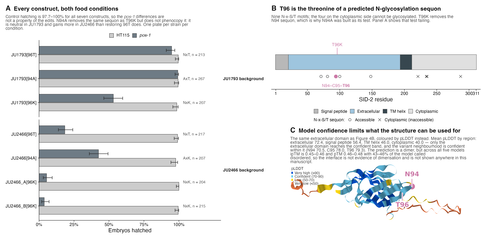

SUPP_FIG_XX_sid2_allele_swaps_full

A All seven constructs, HT115 and *pos-1*.
Control hatching is 97.7–100% for every construct, so the *pos-1*
differences are not a property of the edits.

B T96 is the threonine of an N94-C95-T96 sequon;
nine N-x-S/T motifs are marked, and the four on the cytoplasmic side
cannot be glycosylated.

C The ectodomain coloured by pLDDT, with
per-domain means and the dimer ipTM values that limit what the structure
can be used for.

Why the glycosylation hypothesis is not in Figure
4

N94A removes the same sequon as T96K while leaving residue 96 alone, and
should phenocopy T96K if loss of the glycan is what matters. It does
not:

<table>
<thead>
<tr>
<th style="text-align:left;">
Background
</th>
<th style="text-align:left;">
Construct
</th>
<th style="text-align:left;">
Motif
</th>
<th style="text-align:right;">
Embryos
</th>
<th style="text-align:right;">
pos-1 hatching
</th>
</tr>
</thead>
<tbody>
<tr>
<td style="text-align:left;">
JU1793
</td>
<td style="text-align:left;">
96T (wt)
</td>
<td style="text-align:left;">
NxT
</td>
<td style="text-align:right;">
213
</td>
<td style="text-align:right;">
0.948
</td>
</tr>
<tr>
<td style="text-align:left;">
JU1793
</td>
<td style="text-align:left;">
94A
</td>
<td style="text-align:left;">
AxT
</td>
<td style="text-align:right;">
267
</td>
<td style="text-align:right;">
0.993
</td>
</tr>
<tr>
<td style="text-align:left;">
JU1793
</td>
<td style="text-align:left;">
96K
</td>
<td style="text-align:left;">
NxK
</td>
<td style="text-align:right;">
207
</td>
<td style="text-align:right;">
0.531
</td>
</tr>
<tr>
<td style="text-align:left;">
JU2466
</td>
<td style="text-align:left;">
96T
</td>
<td style="text-align:left;">
NxT
</td>
<td style="text-align:right;">
217
</td>
<td style="text-align:right;">
0.184
</td>
</tr>
<tr>
<td style="text-align:left;">
JU2466
</td>
<td style="text-align:left;">
94A
</td>
<td style="text-align:left;">
AxK
</td>
<td style="text-align:right;">
207
</td>
<td style="text-align:right;">
0.425
</td>
</tr>
<tr>
<td style="text-align:left;">
JU2466
</td>
<td style="text-align:left;">
96K (wt)
</td>
<td style="text-align:left;">
NxK
</td>
<td style="text-align:right;">
419
</td>
<td style="text-align:right;">
0.045
</td>
</tr>
</tbody>
</table>

Derived from
supplemental_data/hatching_assays/ju_allele_swaps_hatching.csv

The AxT construct cannot be glycosylated at N94 and is fully resistant,
so the glycan is not required for resistance; and removing Asn94 gains
more in JU2466 (+0.38) than restoring Thr96 does (+0.14), while gaining
almost nothing in JU1793 (+0.045). Positions 94 and 96 interact. A
description that fits all six numbers is that Lys96 is deleterious and
an unglycosylated Asn94 makes it worse, either relievable independently
— **but that is epistasis between neighbouring residues, not a
mechanism, and each genotype is a single plate.**

## Supplement — the honest negative check

**Script** `scripts/SUPP_FIG_XX_sid2_allele_in_panel.R`  **Supports**
the candidate, against the mapping panel  **n** 230 of 231 phenotyped
strains · site chrIII:13,680,248 C>A

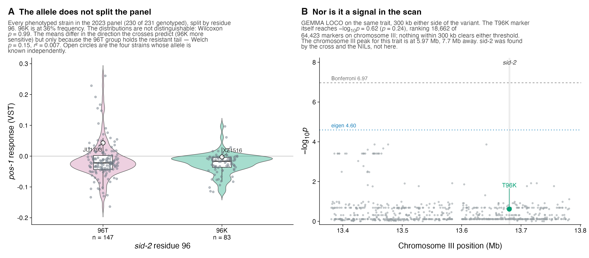

SUPP_FIG_XX_sid2_allele_in_panel

The T96K allele has no marginal effect across the mapping panel. This is
a negative result and it is the honest check on the candidate.

A The 2023 pooled *pos-1* phenotype split by
*sid-2* residue 96 for every phenotyped strain with a genotype (230 of
231). 96K is at 36% frequency in this set. 96T: `n = 147`, mean −0.0147,
median −0.0220. 96K: `n = 83`, mean −0.0236, median −0.0164. Wilcoxon
`p = 0.99`; Welch `p = 0.16`; `r² = 0.007`. The means differ in the
direction the crosses predict but the medians do not, because the 96T
group carries the resistant tail — so the mean difference is a tail
effect rather than a shift. Open circles mark the four strains whose
allele is known independently: JU1793 and N2 are 96T, JU2466 and XZ1516
are 96K.

B The association scan 300 kb either side of the
variant. The T96K marker itself reaches `−log10 p = 0.62` (`p = 0.24`),
ranking **18,662 of 64,423** markers on chromosome III, and nothing
within 300 kb clears either threshold. The chromosome III peak for this
trait is 7.7 Mb away, at 5.97 Mb.

How to say this in the text

This is not evidence against the allele; it is what a
background-dependent effect looks like from a marginal test. The editing
experiments put the T96K contribution at roughly half of the
JU1793–JU2466 difference in one pair of backgrounds, and a 36%-frequency
variant with an effect that context-dependent would not be expected to
surface in a marginal scan of 231 strains. **It is worth stating plainly
that *sid-2* was found by the cross and the NILs, not by the GWAS.**

## Supplement — surface charge of the ectodomain

**Script** `scripts/SUPP_FIG_XX_sid2_electrostatics.R`  **Supports**
Figure 4C, as hypothesis framing  **Scope** residues 21–193 · gut
lumen pH 4.4

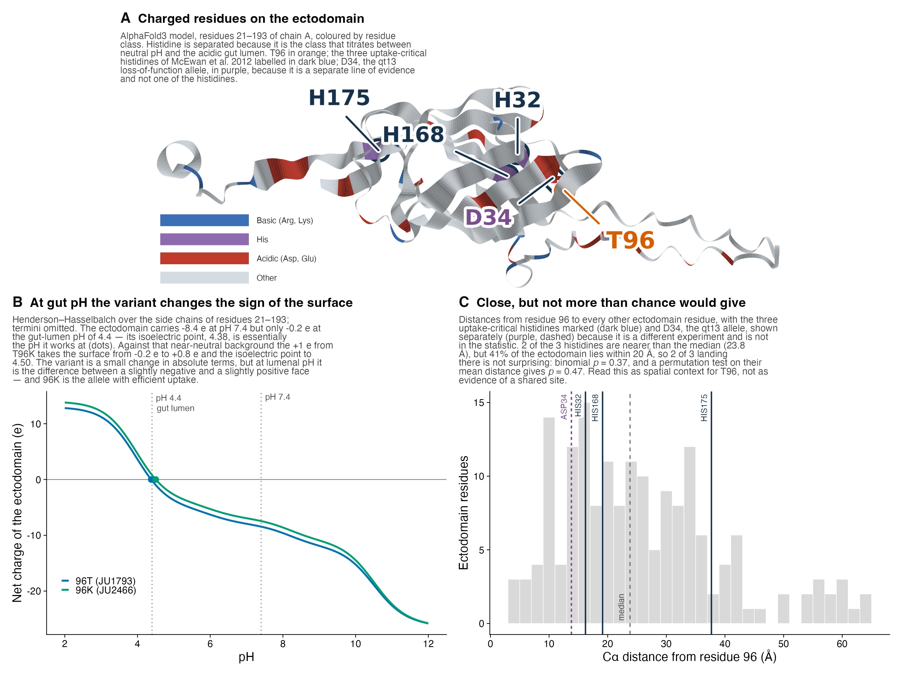

SUPP_FIG_XX_sid2_electrostatics

A hypothesis-framing figure: it estimates no binding affinity and
contains no docking result.

A The ectodomain coloured by residue class, with
histidine separated because it is the class that titrates between
neutral pH and the acidic gut lumen. T96 in orange, the uptake-critical
residues in white.

B Net charge against pH, by
Henderson–Hasselbalch over the side chains of residues 21–193 (11 Asp, 7
Glu, 3 His, 4 Cys, 5 Tyr, 9 Lys, 1 Arg; termini omitted because the
ectodomain runs into the transmembrane helix). The domain carries
`−8.4 e` at pH 7.4 but only `−0.2 e` at the gut-lumen pH of 4.4, and its
isoelectric point, 4.38, is essentially the pH it works at. Against that
near-neutral background the +1 e from T96K takes the surface from −0.2 e
to `+0.8 e` and the isoelectric point to 4.50 — a small change in
absolute terms, but at lumenal pH it is the difference between a
slightly negative and a slightly positive face, and **96K is the allele
with efficient uptake**.

C Cα distances from residue 96 to every other
ectodomain residue, with the four published uptake-critical residues
marked against the null. Three of four are nearer than the median, but
41% of the domain is within 20 Å, so binomial `p = 0.19` and a
permutation test on their mean distance gives `p = 0.30`.

This corrects an earlier internal figure

The stage4 analysis in the structure-modelling folder reported the
ectodomain flipping to *strongly* net positive at pH 4.4. It assigned
fixed fractional charges of −0.240 to Asp and −0.334 to Glu, which
correspond to pKa values near 3.4–3.7; with standard pKa values Asp is
still about 76% ionised at pH 4.4 and the domain comes out close to
electroneutral. **The numbers in panel B are the ones to quote.**

No potential map is shown, deliberately

The one in the structure-modelling folder is a Coulomb potential with a
distance-dependent dielectric sampled on a plane 55 Å above the protein,
in arbitrary units, with no ionic screening — and its headline panel is
the difference between the T96 and K96 surfaces, necessarily a smooth
positive blob centred on residue 96, since adding +1 e there cannot
produce anything else. The HADDOCK dsRNA docking in the same folder is
also unusable: positive HADDOCK scores (+98 to +200, where favourable is
negative), interaction energies of order 1e4, restraint-violation
energies of 480–1380, 4–13 structures per cluster, and different
91-residue active-residue lists between the two arms being compared.

# Open before submission

Everything above is generated and verified. These are the items that
still need a decision or a number from outside the repository.

**Caption missing.** Figure 4 panel D has no entry in
`FIGURE_CAPTIONS.txt`. The wild-variation panel was added after that
file was generated, so the panel D caption above was written from the
script header and the variant table rather than copied from the caption
file. Fold it back so the two agree.

**Naming.** The caption file still describes Figures 1, 3 and 4 by their
superseded filenames and carries captions for the layout variants now in
`plots/legacy/`. The curated set is `Figure1_pos1`, `Figure2`,
`Figure3_quad`, `Figure4_sid2` — worth renumbering to 1–4 and S1–S12 in
one pass before submission.

**Verify.** Published *sid-2* allele positions (residues 32, 34, 168,
175, 199) come from a UniProt annotation for `G5EEV9` recorded in
earlier structure-modelling work. Check the residue numbers against
UniProt directly — they carry the proximity argument in Figure 4C.

**To fill.** `METHODS.txt` has 17 `[TO FILL]` markers — husbandry,
library prep, sequencing platform, editing protocol, the VST transform
definition, what the bootstrap resampled, and GEMMA / GATK / DeepTMHMM /
AlphaFold versions. The Dryad DOI is a placeholder in
`DATA_AVAILABILITY.md`.

**Repository.** Two figure scripts in `scripts/legacy/` still resolve
their working directory through the RStudio API and cannot run headless.
`.git` remains \~380 MB because the untracked bulk data is still in
history; shrinking it needs a history rewrite and a force-push.

# Figure manifest

<table>
<thead>
<tr>
<th style="text-align:left;">
Figure
</th>
<th style="text-align:right;">
Size (KB)
</th>
<th style="text-align:right;">
Modified
</th>
</tr>
</thead>
<tbody>
<tr>
<td style="text-align:left;">
Figure1_pos1
</td>
<td style="text-align:right;">
807
</td>
<td style="text-align:right;">
2026-09-04 11:02
</td>
</tr>
<tr>
<td style="text-align:left;">
SUPP_FIG_XX_baugh_per_sample_frequencies
</td>
<td style="text-align:right;">
396
</td>
<td style="text-align:right;">
2026-09-04 11:03
</td>
</tr>
<tr>
<td style="text-align:left;">
SUPP_FIG_XX_bootstrap_propagation_checks
</td>
<td style="text-align:right;">
448
</td>
<td style="text-align:right;">
2026-09-04 11:03
</td>
</tr>
<tr>
<td style="text-align:left;">
SUPP_FIG_XX_downsample_per_sample
</td>
<td style="text-align:right;">
269
</td>
<td style="text-align:right;">
2026-09-04 11:03
</td>
</tr>
<tr>
<td style="text-align:left;">
SUPP_FIG_XX_original_pos1_dfreq_rep_correlation
</td>
<td style="text-align:right;">
341
</td>
<td style="text-align:right;">
2026-09-04 11:03
</td>
</tr>
<tr>
<td style="text-align:left;">
SUPP_FIG_plate_vs_paaby_vs_pos1original
</td>
<td style="text-align:right;">
199
</td>
<td style="text-align:right;">
2026-09-04 11:03
</td>
</tr>
<tr>
<td style="text-align:left;">
Figure2
</td>
<td style="text-align:right;">
1336
</td>
<td style="text-align:right;">
2026-09-04 11:02
</td>
</tr>
<tr>
<td style="text-align:left;">
SUPP_FIG_XX_pooled_phenotype_ranks
</td>
<td style="text-align:right;">
132
</td>
<td style="text-align:right;">
2026-09-04 11:03
</td>
</tr>
<tr>
<td style="text-align:left;">
SUPP_FIG_XX_cross_contrast_panels
</td>
<td style="text-align:right;">
966
</td>
<td style="text-align:right;">
2026-09-04 11:03
</td>
</tr>
<tr>
<td style="text-align:left;">
Figure3_quad
</td>
<td style="text-align:right;">
125
</td>
<td style="text-align:right;">
2026-09-04 11:03
</td>
</tr>
<tr>
<td style="text-align:left;">
SUPP_FIG_XX_nil_hatching_full
</td>
<td style="text-align:right;">
163
</td>
<td style="text-align:right;">
2026-09-04 11:04
</td>
</tr>
<tr>
<td style="text-align:left;">
Figure4_sid2
</td>
<td style="text-align:right;">
562
</td>
<td style="text-align:right;">
2026-09-04 11:03
</td>
</tr>
<tr>
<td style="text-align:left;">
SUPP_FIG_XX_n2_swap_dose
</td>
<td style="text-align:right;">
240
</td>
<td style="text-align:right;">
2026-09-04 11:04
</td>
</tr>
<tr>
<td style="text-align:left;">
SUPP_FIG_XX_sid2_allele_swaps_full
</td>
<td style="text-align:right;">
562
</td>
<td style="text-align:right;">
2026-09-04 11:04
</td>
</tr>
<tr>
<td style="text-align:left;">
SUPP_FIG_XX_sid2_allele_in_panel
</td>
<td style="text-align:right;">
486
</td>
<td style="text-align:right;">
2026-09-04 11:04
</td>
</tr>
<tr>
<td style="text-align:left;">
SUPP_FIG_XX_sid2_electrostatics
</td>
<td style="text-align:right;">
795
</td>
<td style="text-align:right;">
2026-09-04 11:04
</td>
</tr>
</tbody>
</table>

All sixteen figures rebuild from `supplemental_data/` with `data/`
absent, and are pixel-identical across repeated runs. Captions
transcribed from `FIGURE_CAPTIONS.txt`; every number in the caption
prose was taken from the generating scripts’ console output, and every
table marked *derived* is recomputed from the deposit each time this
file knits.

