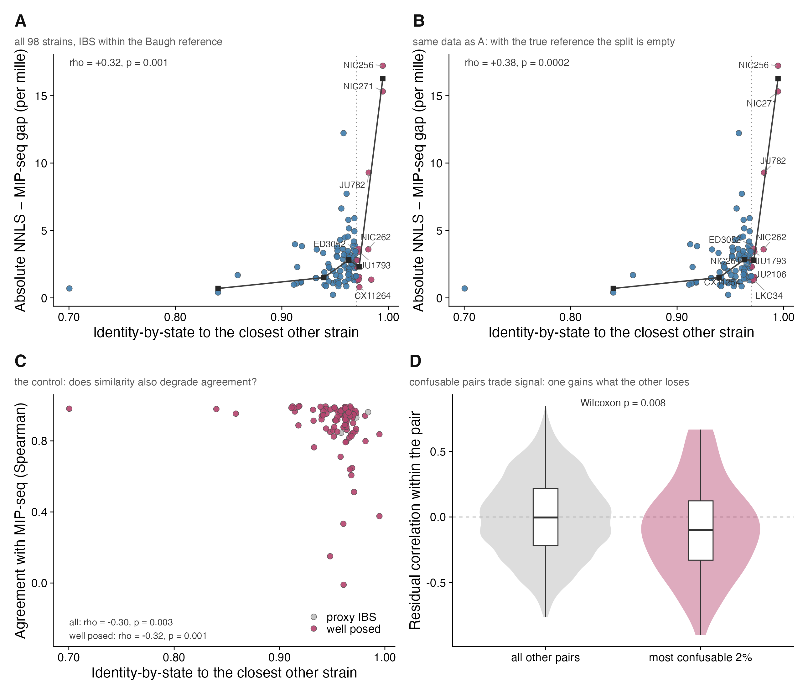
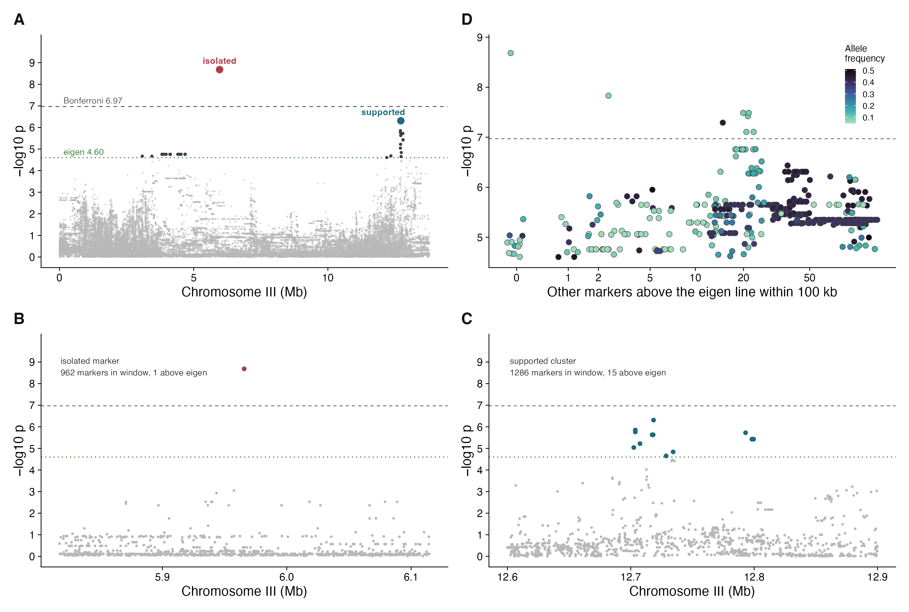
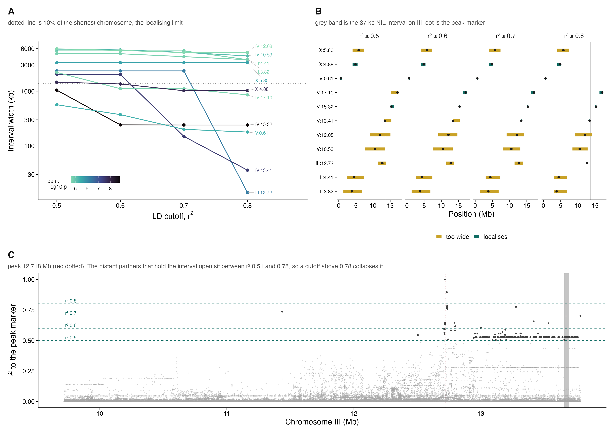
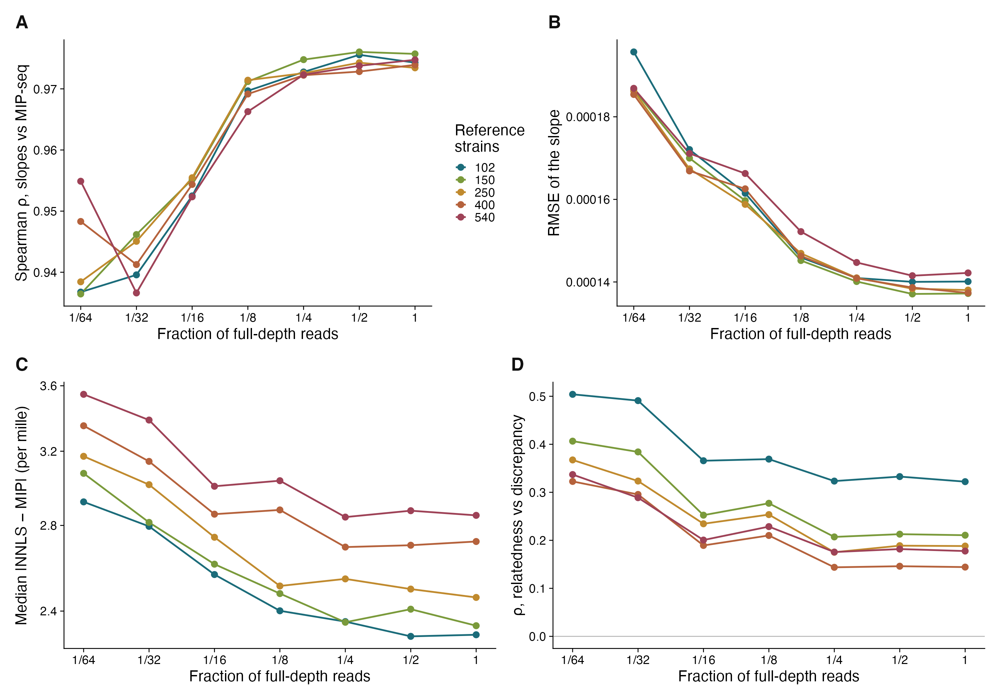
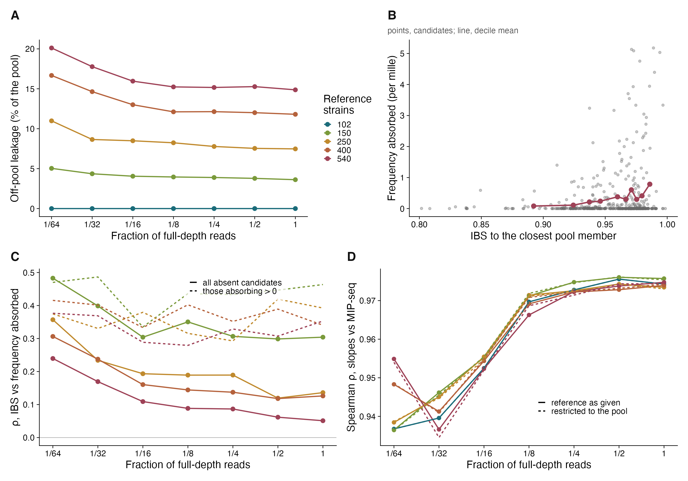
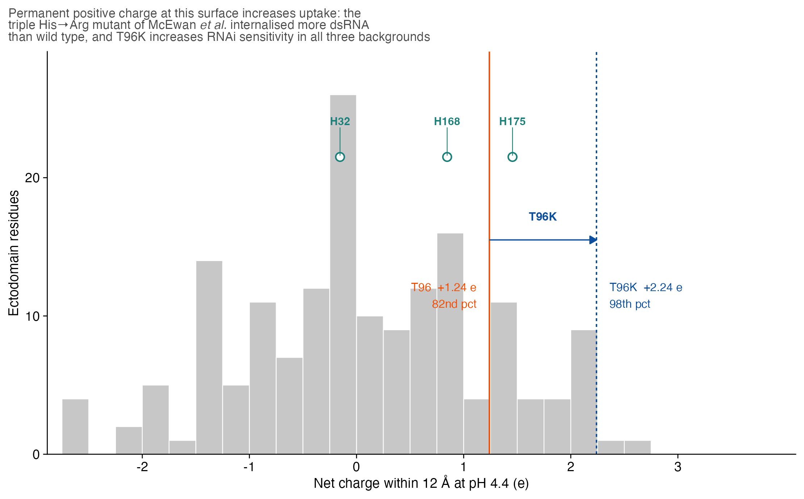
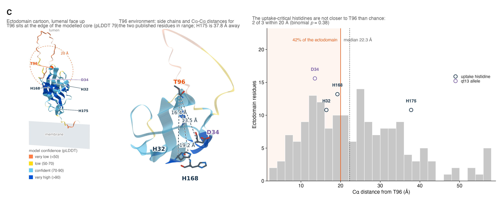

From a 231-strain panel to a single residue
================
Assembled 2026-09-08

-   [Results, as a narrative](#results-as-a-narrative)
-   [Conventions that cross every
    figure](#conventions-that-cross-every-figure)
    -   [RNAi dose is not constant](#rnai-dose-is-not-constant)
    -   [Two thresholds, always both](#two-thresholds-always-both)
-   [I. The assay](#i-the-assay)
    -   [Figure S1 — the simulation the project started
        from](#figure-s1--the-simulation-the-project-started-from)
    -   [Figure S2 — the designed DNA
        mixture](#figure-s2--the-designed-dna-mixture)
    -   [Figure 1 — the validated assay, the phenotype it produces, and
        the
        map](#figure-1--the-validated-assay-the-phenotype-it-produces-and-the-map)
    -   [Figure S3 — the sample-level measurements behind the Figure 1
        slopes](#figure-s3--the-sample-level-measurements-behind-the-figure-1-slopes)
    -   [Figure S4 — the bootstrap propagation
        checks](#figure-s4--the-bootstrap-propagation-checks)
    -   [Figure S5 — the sequencing-depth
        requirement](#figure-s5--the-sequencing-depth-requirement)
    -   [Figure S6 — replicate reproducibility of the
        phenotype](#figure-s6--replicate-reproducibility-of-the-phenotype)
    -   [Figure S7 — the plate assay, validated
        externally](#figure-s7--the-plate-assay-validated-externally)
-   [II. The map](#ii-the-map)
    -   [Figure 2 — pooled GWAS and cross mapping identify overlapping
        loci](#figure-2--pooled-gwas-and-cross-mapping-identify-overlapping-loci)
    -   [Figure S8 — why these cross
        parents](#figure-s8--why-these-cross-parents)
    -   [Figure S9 — the expanded view behind Figure 2’s
        tracks](#figure-s9--the-expanded-view-behind-figure-2s-tracks)
-   [III. The interval](#iii-the-interval)
    -   [Figure 3 — NILs fine-map the chromosome III QTL to 37
        kb](#figure-3--nils-fine-map-the-chromosome-iii-qtl-to-37-kb)
    -   [Figure S10 — the complete NIL hatching
        experiment](#figure-s10--the-complete-nil-hatching-experiment)
-   [IV. The residue](#iv-the-residue)
    -   [Figure 4 — editing *sid-2* residue 96 moves sensitivity in
        three
        backgrounds](#figure-4--editing-sid-2-residue-96-moves-sensitivity-in-three-backgrounds)
    -   [Figure S11 — the full N2 dose
        series](#figure-s11--the-full-n2-dose-series)
    -   [Figure S12 — everything held back from Figure
        4A](#figure-s12--everything-held-back-from-figure-4a)
    -   [Figure S13 — the honest negative
        check](#figure-s13--the-honest-negative-check)
    -   [Figure S14 — surface charge of the
        ectodomain](#figure-s14--surface-charge-of-the-ectodomain)
-   [Diagnostics](#diagnostics)
    -   [Leakage in the MIP-seq
        validation](#leakage-in-the-mip-seq-validation)
    -   [GWAS interval admission](#gwas-interval-admission)
    -   [Coverage against reference
        size](#coverage-against-reference-size)
    -   [Off-pool leakage against
        coverage](#off-pool-leakage-against-coverage)
    -   [Figure S15 — where T96’s pocket sits in the charge
        distribution](#figure-s15--where-t96s-pocket-sits-in-the-charge-distribution)
    -   [Figure S16 — model confidence, and the proximity
        null](#figure-s16--model-confidence-and-the-proximity-null)
-   [Open before submission](#open-before-submission)
-   [Figure manifest](#figure-manifest)

<!--
FIGURE_REPORT.Rmd -- the eighteen manuscript figures with their captions, ordered
by the argument rather than by build order.

  Rscript -e 'rmarkdown::render("FIGURE_REPORT.Rmd", "all")'

builds both targets:

  FIGURE_REPORT.md     the GitHub-rendered version. Figures are referenced from
                       plots/ rather than embedded, so GitHub displays them and
                       the file stays a few tens of kB. This is the tracked one.
  FIGURE_REPORT.html   the styled, self-contained version (~13 MB, figures
                       base64-embedded, click-to-zoom). Git-ignored; rebuild it
                       when you want the designed reading copy.

The CSS, the webfont link and the zoom overlay are guarded on the output
format, so none of them leak into the Markdown.

Run from the repository root; the Rmd lives there so that "plots/..." and
"supplemental_data/..." resolve without any setwd().

WHAT IS DERIVED AND WHAT IS PROSE. Every table below marked "derived" is
computed from supplemental_data/ when this file knits, so it cannot drift from
the deposit. Four such tables were checked against the numbers in
FIGURE_CAPTIONS.txt and reproduce them exactly. Numbers inside the caption prose
came from the figure scripts' console output and are literal text; the figure
scripts remain the authority for those.

The figures themselves are read from plots/ and base64-embedded by pandoc, so
the knitted HTML is a single self-contained file.
-->

The manuscript figure set for RNAi sensitivity in wild *Caenorhabditis
elegans*, ordered by the argument rather than by build order. Each
figure carries its caption, with the caveats kept attached to the panel
they qualify. Click any figure to enlarge it.

The argument narrows by roughly an order of magnitude at each step:
**231 wild isolates** given a quantitative phenotype, **six
chromosomes** scanned in two crosses, **37 kb** resolved by a NIL
series, **one residue** edited in three backgrounds.

# Results, as a narrative

A draft Results section in manuscript voice, written to be a reference
point rather than final text. Every number in it is one this repository
computes, and each is traceable to the figure entry below that produces
it. Where the data will not carry a sentence, the sentence is not made —
the closing box lists the claims to avoid.

Figure numbers follow the curated set: four main figures and fourteen
supplements, `S1`–`S14`, in the order the argument uses them.

### A pooled sequencing assay measures RNAi response across wild isolates

To measure the RNAi response of many wild isolates at once, we pooled
strains, exposed the pool to RNAi, and sequenced it, inferring each
strain’s frequency from bulk allele counts by non-negative least squares
(NNLS) regression. Because every downstream result depends on that
inference, we validated it three times, each time conceding something
the previous test controlled.

We first asked whether the inference is possible in principle. We
assigned each wild isolate a fitness value drawn from an inverse χ²
distribution, computed the pooled allele frequencies such a population
would produce, simulated observed alt-allele counts by binomial sampling
across 1–500× coverage, and deconvolved the simulated counts back to
per-strain frequencies (Figure S1). Using
seven published traits with validated QTL to seed seven independent
populations of 327 strains, recovery of the known input was essentially
exact at high coverage (r² = 1.00 at 500× for all seven traits) and
degraded gradually as coverage fell. At 1× coverage recovery was
trait-dependent, ranging from r² = 0.91 to 0.52 (median 0.79); 10× was
sufficient for five of the seven traits, and 30× was the lowest coverage
at which all seven reached r² ≥ 0.95.

We then asked whether real libraries behave as the simulation predicts.
We divided 174 wild isolates into four sets, pooled genomic DNA from
each, and sequenced the pools both pure and as a seven-step titration of
one set against another (Figure S2). Pure
pools returned 0.775–0.853 of their own set. Across the titration the
two titrated sets traded off monotonically — set B rising from 0.12 to
0.72 and set C falling from 0.70 to 0.10 (Spearman ρ = +1 and −1 against
titration step) — while the two untitrated sets remained flat. Because
only two sets were titrated against each other, their combined share of
the pool must remain constant however the DNA was mixed; it did, to a
standard deviation of 0.86% and a maximum departure of 1.38%. Against
the designed proportions themselves the recovered fractions were
accurate to a root mean squared error of 0.038 (Pearson r = 0.997), with
the largest single deviation at the step whose 0.1 µL of set B was the
smallest volume pipetted; each dilution was prepared once, so pipetting
error is unreplicated and enters that figure in full.

Two limits of the inference emerged from the same experiment. Roughly a
fifth of each pure pool was assigned to strains absent from it, and that
misassignment was predicted by relatedness: a strain’s frequency in
pools it did not belong to rose with its identity-by-state to the
nearest other strain in the reference (Spearman ρ = 0.326, p = 1.4 ×
10⁻⁵, n = 170). The fraction of its own pool a strain recovered, by
contrast, was uncorrelated with relatedness (ρ = 0.046, p = 0.55).
Genetic similarity therefore causes strains to absorb signal from one
another without systematically depleting their own estimates, and the
shortfall in pure-pool recovery has some other cause.

Finally we compared the inference against an independent measurement of
the same material. For the one experiment in which both pooled
whole-genome sequence and published targeted MIP-seq exist — an L1
starvation time course — per-strain rates of change in pool frequency
agreed closely across platforms (Spearman ρ = 0.97, p \< 10⁻⁴, n = 98
strains) (Figure 1A). Repeating the entire
slope calculation inside each of 100 bootstrap replicates of the
deconvolution gave intervals narrower than the platform disagreement for
50 of 98 strains and 0.57× it on average (Figure
S4), so the residual scatter reflects disagreement between
platforms rather than noise in the inference. Agreement was lower and
more variable at the level of individual samples than of fitted slopes
(median ρ = 0.84, minimum 0.517) (Figures S3,
S5), and saturated by 3× coverage, consistent with the
simulation.

Applying the assay to 231 wild isotypes exposed to *pos-1* RNAi produced
a continuously distributed response phenotype on a variance-stabilised
scale (Figure 1B), reproducible across
replicate pools (Figure S6) and correlated in
the expected direction with manual plate scoring of the same strains
(Spearman ρ = 0.41, n = 111, p = 7.8 × 10⁻⁶) and with published
embryonic-lethality measurements (ρ = −0.55, n = 19, p = 0.014) (Figure S7).

### Pooled association and cross mapping converge on overlapping loci

A genome-wide association scan of the *pos-1* response across 231
isotypes and 464,045 markers identified ten markers exceeding a
Bonferroni threshold (maximum −log₁₀*p* = 8.84) and 465 exceeding a
threshold corrected for the 1,972 effective independent tests (Figure 1C). Eight of the ten lay on chromosome IV,
in two clusters near 13.41 and 15.32 Mb, with single markers on
chromosome III at 5.97 Mb (−log₁₀*p* = 8.68) and chromosome X at 4.88
Mb.

To separate loci affecting the RNAi response generally from those
specific to one target, we measured the pooled response to several RNAi
targets across 84 isotypes and mapped the same responses in F2
bulk-segregant crosses (Figure 2). Cross
parents were drawn from opposite extremes of the pooled assay rather
than for convenience (Figure S8). Nine cross
QTL exceeded LOD 100 across the two crosses, on chromosomes I, II, III,
IV, V and X. Contrasting the response to *pos-1* knockdown against the
response to knockdown of an unrelated target distinguished the two
classes (Figure S9): a locus on the right arm
of chromosome III behaved as a general RNAi-response locus, while loci
on chromosomes I, V and X were target-specific.

Association and cross mapping agreed at the level of locus rather than
of marker. No cross interval contained its matching association peak,
the closest correspondences being 0.84 Mb and 0.96 Mb apart, which is
the resolution a panel of 84 phenotyped strains supports. We therefore
pursued the chromosome III locus by introgression rather than by
association.

### Near-isogenic lines resolve the chromosome III locus to 37 kb

To fine-map the general RNAi-response locus, we constructed
near-isogenic lines carrying overlapping introgressions across the right
arm of chromosome III in the two cross-parent backgrounds and scored
embryonic hatching on *pos-1* RNAi (Figure 3).
Hatching formed a graded series across the introgression series — 99.4%
in the resistant parent, 97.3%, 79.4% and 58.5% in successive lines, and
35.7% in the sensitive parent — and the smallest interval distinguishing
a resistant from a sensitive line spanned **37 kb**, from 13.658 to
13.695 Mb. Control hatching was 97–100% for every line (Figure S10), so the differences are attributable to
the RNAi exposure rather than to the introgressions themselves.

### A missense variant in *sid-2* accounts for part of the response

The resolved interval contains *sid-2*, which encodes an intestinal
transmembrane protein required for the uptake of ingested
double-stranded RNA. Of eight annotated protein-altering variants
segregating in *sid-2* in the wild population, only two differ between
the cross parents, one of which is a threonine-to-lysine substitution at
residue 96 (Figure 4D). A second common
variant, P153T, is in near-complete linkage disequilibrium with T96K
across the wild population (r² = 0.935) but is carried by both cross
parents and therefore cannot contribute to the mapped difference.

Reciprocal editing of residue 96 in both parental backgrounds moved
hatching in both directions (Figure 4A).
Introducing 96K into the resistant parent reduced hatching from 94.8% to
53.1% (Fisher’s exact test, p = 1.7 × 10⁻²⁴), and restoring 96T in the
sensitive parent raised hatching from 5.4% to 18.4% (p = 3.9 × 10⁻⁵).
Residue 96 therefore contributes in both directions without accounting
for the whole difference between the parents. The same substitution
introduced into the laboratory reference background reduced hatching
from 32.3% to 4.4% and 3.7% in two independently derived lines (p = 7.8
× 10⁻¹⁷ and 6.2 × 10⁻¹⁹) (Figure 4B) — a third
genetic background, and the only one with independent edits, with the
direction unchanged throughout: 96K sensitive, 96T resistant. That
comparison required a sub-maximal RNAi dose: in the reference background
25% *pos-1* bacteria is the only dilution with dynamic range, since
every genotype hatches without RNAi and every genotype is inviable from
50% upward (Figure S11). Hatching percentages
are therefore not comparable between the two backgrounds.

Two further observations bound the interpretation. First, T96K has no
marginal effect across the mapping panel: the variant reaches p = 0.24
in the association scan, ranking 18,662 of 64,423 markers on chromosome
III, and splitting the pooled phenotype by residue 96 gives no shift
(Wilcoxon p = 0.99, r² = 0.007) (Figure S13).
*sid-2* was identified by the crosses and the introgression series, not
by association, and a variant at 36% frequency whose effect is this
context-dependent would not be expected to surface in a marginal test.
Second, residue 96 lies on the lumenal face of the predicted ectodomain,
on the same face as three residues with published effects on dsRNA
uptake (Figure 4C), and the substitution
raises the domain’s net charge at gut-lumen pH from −0.2 e to +0.8 e
(Figure S14). Both observations are spatial
and electrostatic context; neither is evidence of a shared binding site,
and 41% of the ectodomain lies within 20 Å of residue 96 (binomial p =
0.19, permutation p = 0.30). A predicted N-glycosylation sequon is
removed by T96K, but an edit that removes the same sequon while leaving
residue 96 intact does not phenocopy it (Figure
S12), so no glycosylation mechanism is proposed.

#### Claims to avoid, each because a figure contradicts or fails to support it

-   **“Accurate at 1× coverage.”** True for the best traits, false for
    the worst (r² 0.91 to 0.52). Quote the median, or quote 10× and 30×.
-   **“The dilution series recovers the intended proportions.”** The
    intended proportions are not recorded. Say monotonic and
    complementary, and quote the conservation bound (0.86% sd) as the
    accuracy statement.
-   **“The association scan found nothing.”** It found ten
    Bonferroni-significant markers, eight of them on chromosome IV. What
    it did not find is the chromosome III interval the crosses resolved.
-   **“The association scan identified *sid-2*.”** It did not — the
    variant ranks 18,662 of 64,423, and the chromosome III association
    peak at 5.97 Mb lies 7.7 Mb away. The crosses and the NILs
    identified it.
-   **“The chromosome III peak coincides with the NIL interval.”** The
    peak marker at 13.784 Mb is the chromosome’s terminal marker, so its
    position is a boundary artefact. The 37 kb NIL interval is the
    claim.
-   **Putting Figure 4A and 4B hatching percentages side by side.** 50%
    versus 25% *pos-1* RNAi; the numbers are not comparable.
-   **“T96 sits at the dsRNA binding site.”** Proximity only, and not
    significant (p = 0.19–0.30).
-   **“T96K acts by removing a glycosylation site.”** The N94A control
    fails.
-   **Any statement about what the bootstrap resampled.** Only its
    outputs were archived.

# Conventions that cross every figure

## RNAi dose is not constant

Every embryo-hatching experiment ran on a lawn of *pos-1* RNAi bacteria
diluted with HT115, and the dilution differs.

| Experiment                    | Dose            |
|:------------------------------|:----------------|
| Figure 3C, and its supplement | 50% *pos-1*     |
| Figure 4A, and its supplement | 50% *pos-1*     |
| Figure 4B                     | **25% *pos-1*** |

Hatching percentages are therefore **not comparable between Figure 4A
and Figure 4B**, and the text should not put those numbers side by side.
The 25% dose is not an oversight: in the N2 background it is the only
dilution with any dynamic range — at 0% every genotype hatches, and from
50% upward every genotype is dead. The dose series below the Figure 4
entry shows this.

## Two thresholds, always both

Bonferroni over every tested marker assumes markers are independent,
which they are not in this panel. The eigen threshold divides α by the
effective number of independent tests from the eigenvalues of the marker
correlation matrix (Li & Ji 2005).

| Panel            |   n | Markers | Meff | Bonferroni | Eigen |
|:-----------------|----:|--------:|----------------:|-----------:|------:|
| pooled_RNAi_expt |  84 | 322,010 |             732 |       6.81 |  4.17 |
| pos1_2023        | 231 | 464,045 |           1,972 |       6.97 |  4.60 |

Thresholds as −log10*p*. Cross scans use LOD instead, with a
genome-wide threshold of LOD 3.57 (α = 0.05 over 2,000 effective tests).
**vst** throughout is the variance-stabilised pooled phenotype — the
exact trait the GEMMA associations were run on, so phenotype and
Manhattan panels always share a scale.

# I. The assay

231 isolates

The method everything else rests on is validated three times, each
conceding something the one before it controlled: in simulation, where
both the input frequencies and the counts are synthetic; on a designed
DNA mixture, where the input is known and the counts are real; and
against published MIP-seq on the same samples, where neither is
controlled. It then yields a quantitative *pos-1* RNAi phenotype across
the wild panel that a genome-wide scan can be run on.

Read these three in order

Quote the **simulation** for the depth requirement, the **DNA dilution**
for the fact that real libraries behave, and **Figure 1A** for agreement
with an independent published measurement. No one of them carries the
claim alone.

## Figure S1 — the simulation the project started from

**Script** `scripts/SUPP_FIG_XX_simulation_depth.R`  **Validates**
NNLS against a known input, with synthetic counts  **Scope** 7 seeded
traits × 8 depths (1–500×) × 327 strains  **Depth for r² ≥ 0.95 in
all seven** 30×

SUPP_FIG_XX_simulation_depth

Each wild isolate was assigned a fitness value drawn from an inverse χ²
distribution; the expected pooled allele frequencies such a population
would produce were computed; alt-allele counts were simulated by
binomial sampling at 1, 3, 5, 10, 30, 50, 100 and 500×; and those counts
were deconvolved back to per-strain frequencies by NNLS and compared
with the known input. Seven published traits with validated QTL seeded
seven independent populations of 327 strains.

A r² of estimated against known input frequency,
against simulated depth, one line per trait. Every trait reaches 1.00 by
500×. At 1× the spread is wide — PC1 `0.91`, value `0.86`, assay_norm
`0.81`, amsacrine_f.L1 `0.79`, etoposide_median.TOF `0.72`,
Albendazole_q75.TOF `0.56`, mtDNA_ratio `0.52`; median `0.79`. The
lowest depth from which a trait stays at or above 0.95 is 3× for PC1 and
value, 5× for amsacrine_f.L1, 10× for assay_norm and
etoposide_median.TOF, and 30× for Albendazole_q75.TOF and mtDNA_ratio.

B The archived estimates against the 500×
estimate, faceted by depth, all seven traits pooled. Axes share limits
so the dashed y = x line means the same thing in
every facet. Pooled r² against 500×: `0.79` at 1×, `0.91` at 3×, `0.94`
at 5×, `0.97` at 10×, `0.99` at 30× and 50×, `1.00` at 100×.

<table>
<thead>
<tr>
<th style="text-align:left;">
Trait
</th>
<th style="text-align:right;">
500×
</th>
<th style="text-align:right;">
100×
</th>
<th style="text-align:right;">
50×
</th>
<th style="text-align:right;">
30×
</th>
<th style="text-align:right;">
10×
</th>
<th style="text-align:right;">
5×
</th>
<th style="text-align:right;">
3×
</th>
<th style="text-align:right;">
1×
</th>
</tr>
</thead>
<tbody>
<tr>
<td style="text-align:left;">
PC1
</td>
<td style="text-align:right;">
1
</td>
<td style="text-align:right;">
1.00
</td>
<td style="text-align:right;">
1.00
</td>
<td style="text-align:right;">
1.00
</td>
<td style="text-align:right;">
0.99
</td>
<td style="text-align:right;">
0.98
</td>
<td style="text-align:right;">
0.98
</td>
<td style="text-align:right;">
0.91
</td>
</tr>
<tr>
<td style="text-align:left;">
value
</td>
<td style="text-align:right;">
1
</td>
<td style="text-align:right;">
1.00
</td>
<td style="text-align:right;">
1.00
</td>
<td style="text-align:right;">
0.99
</td>
<td style="text-align:right;">
0.99
</td>
<td style="text-align:right;">
0.98
</td>
<td style="text-align:right;">
0.96
</td>
<td style="text-align:right;">
0.86
</td>
</tr>
<tr>
<td style="text-align:left;">
assay_norm
</td>
<td style="text-align:right;">
1
</td>
<td style="text-align:right;">
1.00
</td>
<td style="text-align:right;">
1.00
</td>
<td style="text-align:right;">
0.99
</td>
<td style="text-align:right;">
0.96
</td>
<td style="text-align:right;">
0.93
</td>
<td style="text-align:right;">
0.89
</td>
<td style="text-align:right;">
0.81
</td>
</tr>
<tr>
<td style="text-align:left;">
amsacrine_f.L1
</td>
<td style="text-align:right;">
1
</td>
<td style="text-align:right;">
1.00
</td>
<td style="text-align:right;">
1.00
</td>
<td style="text-align:right;">
0.99
</td>
<td style="text-align:right;">
0.97
</td>
<td style="text-align:right;">
0.95
</td>
<td style="text-align:right;">
0.93
</td>
<td style="text-align:right;">
0.79
</td>
</tr>
<tr>
<td style="text-align:left;">
etoposide_median.TOF
</td>
<td style="text-align:right;">
1
</td>
<td style="text-align:right;">
1.00
</td>
<td style="text-align:right;">
1.00
</td>
<td style="text-align:right;">
0.99
</td>
<td style="text-align:right;">
0.97
</td>
<td style="text-align:right;">
0.93
</td>
<td style="text-align:right;">
0.89
</td>
<td style="text-align:right;">
0.72
</td>
</tr>
<tr>
<td style="text-align:left;">
Albendazole_q75.TOF
</td>
<td style="text-align:right;">
1
</td>
<td style="text-align:right;">
0.97
</td>
<td style="text-align:right;">
0.97
</td>
<td style="text-align:right;">
0.95
</td>
<td style="text-align:right;">
0.90
</td>
<td style="text-align:right;">
0.84
</td>
<td style="text-align:right;">
0.77
</td>
<td style="text-align:right;">
0.56
</td>
</tr>
<tr>
<td style="text-align:left;">
mtDNA_ratio
</td>
<td style="text-align:right;">
1
</td>
<td style="text-align:right;">
0.99
</td>
<td style="text-align:right;">
0.96
</td>
<td style="text-align:right;">
0.95
</td>
<td style="text-align:right;">
0.89
</td>
<td style="text-align:right;">
0.78
</td>
<td style="text-align:right;">
0.69
</td>
<td style="text-align:right;">
0.52
</td>
</tr>
</tbody>
</table>

Derived from supplemental_data/deconvolution/simulation_reported_r2.tsv

This decides what the figure can be used for

**Only the NNLS output is archived.** The simulation script, the drawn
fitness values and the expected input frequencies are all absent, as is
the trait directory the original processing script reads. Panel A
therefore **cannot be recomputed**: its values are read back out of text
embedded in the original per-trait PDFs by
`scripts/extract_sim_reported_r2.py`, the only surviving record of the
comparison against the known input. Panel B *is* recomputed, but against
the 500× estimate standing in for the truth — defensible, because panel
A puts 500× at r² = 1.00 for all seven traits and the two agree where
they can be compared (pooled convergence at 1× is 0.79 against a median
reported accuracy of 0.79), but a stand-in all the same.

On the wording of the claim

“NNLS can accurately infer strain frequencies with as little as 1×
sequencing depth” holds for the best-behaved traits and not for the
worst: at 1×, r² runs from **0.91 down to 0.52**. What the whole figure
supports is that 1× recovers most of the signal for most traits (median
r² 0.79), that 10× suffices for five traits of seven, and that **30×**
is the lowest depth at which all seven sit at or above 0.95.

Separately, 139 of 18,312 archived coefficients (0.8%) are negative, at
depths 5 through 100. A strict non-negative solver cannot return those,
so the archive carries solver or post-processing noise of order 1e-2 on
the count scale. It changes no conclusion, but the archived values are
not exactly a clean NNLS output.

## Figure S2 — the designed DNA mixture

**Script** `scripts/SUPP_FIG_XX_dilution_validation.R`  **Validates**
NNLS against a known input, with real counts  **Design** 174 isolates
in 4 sets; pure pools in triplicate + a 7-step B-into-C titration 
**Counts** GATK ASEReadCounter

SUPP_FIG_XX_dilution_validation

A Pure pools, three libraries each. The fraction
assigned to the pool’s own set is `0.785` (A), `0.775` (B), `0.796` (C),
`0.853` (D) — filled points. The fraction misassigned to each other set
runs `0.020`–`0.127`, mean `0.066` (open points); total misassigned per
pool `0.135`–`0.242`.

B The titration on the 170-strain pool
reference, each B and C value labelled. Set B rises monotonically 0.12 →
0.72 and set C falls monotonically 0.70 → 0.10 (Spearman ρ `+1` and `−1`
against step). The two untitrated sets stay flat — A `0.061`–`0.086`, D
`0.093`–`0.116`, drawn dotted.

C The same seven samples with the reference
restricted to the 84 strains of sets B and C and renormalised — the
analysis the original figure showed: B 0.17 → 0.84 against C 0.83 →
0.16, crossing between BC4 and BC5.

D Whether the strains that resolve badly are the
genetically similar ones. For each of the 170 strains, x is
identity-by-state to the closest *other* strain in the reference and y
is its **leakage** — the mean frequency it picks up across the nine
libraries of the three sets it is **not** in. That must be zero whatever
the DNA input was, so unlike own-pool recovery it assumes nothing about
the design. Grey squares are bin medians; points are coloured by the
strain’s own set.

**Leakage rises with genetic similarity: Spearman ρ `+0.326`,
`p = 1.4e-05`, n = 170.** Mean identity to all strains gives the same
answer more weakly (ρ `+0.258`, `p = 6.8e-04`).

<table>
<thead>
<tr>
<th style="text-align:left;">
Bin
</th>
<th style="text-align:right;">
Strains
</th>
<th style="text-align:right;">
Median leakage
</th>
</tr>
</thead>
<tbody>
<tr>
<td style="text-align:left;">
\[0.66,0.9\]
</td>
<td style="text-align:right;">
5
</td>
<td style="text-align:right;">
0.00000
</td>
</tr>
<tr>
<td style="text-align:left;">
(0.9,0.95\]
</td>
<td style="text-align:right;">
34
</td>
<td style="text-align:right;">
0.00010
</td>
</tr>
<tr>
<td style="text-align:left;">
(0.95,0.97\]
</td>
<td style="text-align:right;">
75
</td>
<td style="text-align:right;">
0.00023
</td>
</tr>
<tr>
<td style="text-align:left;">
(0.97,0.99\]
</td>
<td style="text-align:right;">
52
</td>
<td style="text-align:right;">
0.00143
</td>
</tr>
<tr>
<td style="text-align:left;">
(0.99,1\]
</td>
<td style="text-align:right;">
4
</td>
<td style="text-align:right;">
0.00106
</td>
</tr>
</tbody>
</table>

Derived from dilution_predictions_poolref.tsv.gz +
dilution_strain_similarity.tsv

The ceiling and the leakage are one quantity, not
two

For a pure pool the fractions sum to 1, so **own-set share = 1 − (mass
assigned to strains not in the pool)**. Checked: `own + out = 1` to
4.4e-16 across all twelve pure pools, mean own-set share `0.802` against
out-of-pool `0.198`. The \~0.8 ceiling in panel A *is* the leakage in
panel D, seen from the other side.

**And the leakage is relatedness-directed.** Across the 1,530
strain-by-pool combinations where a strain is absent from the pool, mass
assigned to it averages `1.33` per mille when its nearest neighbour is
elsewhere and `2.25` per mille when its nearest neighbour is *in* that
pool — a 1.70× enrichment, Mann-Whitney `p = 3.6e-05`. Those pairs are
24.3% of the combinations but carry **35.3%** of all out-of-pool mass.
Rescaling, relatedness accounts for about **14%** of the out-of-pool
mass, so it is a real contributor to the ceiling.

That 14% is a **lower bound**, because “nearest neighbour in the pool”
is the crudest possible measure: a strain has many relatives among a
pool’s \~43 members, not one. The proper test is mass against
relatedness to *all* pool members, which needs the full genotype matrix.

What the per-strain null actually showed.
`ρ(nn_ibs, own-pool recovery) = +0.046, p = 0.55` is about *per-strain*
recovery, which is **bidirectional** — a strain both loses mass to
confusable partners and gains it from them, and a trade with a partner
in the same set does not move the set total at all. So per-strain
recovery can show no correlation while relatedness drives every
transfer. Leakage is unidirectional, which is why the signal survives
there.

Restricting the reference does recover the input ratios
better

Against the designed B fraction, in RMSE:

| estimate                                      |     RMSE |      bias |
|:----------------------------------------------|---------:|----------:|
| 170-strain reference, raw                     | `0.0788` | `−0.0593` |
| 170-strain reference, renormalised within B+C | `0.0415` | `+0.0297` |
| 84-strain B+C reference                       | `0.0376` | `+0.0208` |

Most of the damage is undone by renormalising — that removes the \~18%
of mass sitting on sets A and D — and restricting the reference to the
strains actually present recovers a further **9%**. So the panel B
against panel C comparison reads the way you would expect: the fewer
absent candidates the solver is offered, the closer the set frequencies
land to the input.

One thing these data still **cannot** support: that the damage
concentrates in near-identical pairs *split across sets*. Only 30
reciprocal nearest-neighbour pairs exist, two above IBS 0.99, so that
comparison is underpowered and answers differently at different
thresholds.

Both panels’ plotted fractions are pinned as literals in the script and
checked against the deposit on every run, so these numbers cannot drift
from the figure without the script failing.

### The renormalisation, step by step

There are two normalisations here and they do different things. The
second one is why panel C looks the way it does, and it is worth being
explicit about.

1 **Within each sample, after the solve.** NNLS
fits the observed alt-allele counts of one sample as a non-negative
combination of the reference strains’ genotypes, returning one
coefficient per strain. Those coefficients are on an arbitrary scale —
they grow with sequencing depth — so each sample’s vector is divided by
its own sum. After this every sample’s strain frequencies sum to exactly
1 and read as “the fraction of this pool contributed by that strain”.
The division is *within* a sample, so it cannot move signal between
samples.

2 **Which strains the sum runs over.** Step 1’s
denominator covers whatever is in the reference, so the reference
decides what “the whole pool” means. On the **170-strain pool
reference** (panels A, B) the denominator includes all four sets, so B +
C comes to about `0.82` and the remaining `0.18` is assigned to the
untitrated sets A and D. On the **84-strain B+C reference** (panel C)
the reference contains only sets B and C, so the denominator runs over
those strains alone and **B + C = 1 by construction**.

3 **Set-level sums.** Per-strain frequencies are
added within a set. Nothing is renormalised at this stage.

What this means for reading panel C

**Panel C’s two series are exact complements because the normalisation
makes them so, not because the inference discovered it.** B and C
summing to 1 there carries no information. The informative quantity is
in panel B, where the denominator is the whole panel and B + C is free
to move — and it barely does, which is metric 1 below.

Before either normalisation, markers were restricted to mean depth above
5 and below 100 across samples, high-frequency variants were recoded so
the minor allele is counted throughout, and sites with any missing
genotype were dropped.

### How far off was the inference?

<table>
<thead>
<tr>
<th style="text-align:left;">
Sample
</th>
<th style="text-align:right;">
Set B
</th>
<th style="text-align:right;">
Set C
</th>
<th style="text-align:right;">
B + C
</th>
<th style="text-align:right;">
A + D
</th>
</tr>
</thead>
<tbody>
<tr>
<td style="text-align:left;">
BC1
</td>
<td style="text-align:right;">
0.121
</td>
<td style="text-align:right;">
0.701
</td>
<td style="text-align:right;">
0.822
</td>
<td style="text-align:right;">
0.178
</td>
</tr>
<tr>
<td style="text-align:left;">
BC2
</td>
<td style="text-align:right;">
0.157
</td>
<td style="text-align:right;">
0.669
</td>
<td style="text-align:right;">
0.826
</td>
<td style="text-align:right;">
0.174
</td>
</tr>
<tr>
<td style="text-align:left;">
BC3
</td>
<td style="text-align:right;">
0.211
</td>
<td style="text-align:right;">
0.614
</td>
<td style="text-align:right;">
0.825
</td>
<td style="text-align:right;">
0.175
</td>
</tr>
<tr>
<td style="text-align:left;">
BC4
</td>
<td style="text-align:right;">
0.395
</td>
<td style="text-align:right;">
0.413
</td>
<td style="text-align:right;">
0.808
</td>
<td style="text-align:right;">
0.192
</td>
</tr>
<tr>
<td style="text-align:left;">
BC5
</td>
<td style="text-align:right;">
0.530
</td>
<td style="text-align:right;">
0.281
</td>
<td style="text-align:right;">
0.811
</td>
<td style="text-align:right;">
0.189
</td>
</tr>
<tr>
<td style="text-align:left;">
BC6
</td>
<td style="text-align:right;">
0.678
</td>
<td style="text-align:right;">
0.144
</td>
<td style="text-align:right;">
0.822
</td>
<td style="text-align:right;">
0.178
</td>
</tr>
<tr>
<td style="text-align:left;">
BC7
</td>
<td style="text-align:right;">
0.724
</td>
<td style="text-align:right;">
0.100
</td>
<td style="text-align:right;">
0.824
</td>
<td style="text-align:right;">
0.176
</td>
</tr>
</tbody>
</table>

Derived from
supplemental_data/deconvolution/dilution_predictions_poolref.tsv.gz

**Metric 1 — conservation of the titrated pair. Assumes nothing about
the design, and is the one to quote.** Only B and C are titrated against
each other, so whatever the intended proportions were, the pair’s
combined share of the pool has to stay constant across BC1–BC7: moving
DNA from C to B cannot change how much of the pool is B-or-C. Any wobble
in `B + C` is therefore inference error, measurable without knowing a
single nominal ratio. Observed: mean 0.8198, sd 0.0070 (0.86% of the
mean), largest deviation 0.0113 (1.38%). **The pair is conserved to
better than 1.5% across a titration that moves each set sixfold**, which
bounds the inference error without invoking the design at all.

**Metric 2 — deviation from the designed series.** The design was
recovered from the lab record on 2026-09-08 and is in
`supplemental_data/deconvolution/dilution_design.tsv`: a two-fold
doubling series of set B against a fixed 1 µL of set C, made up to 10 µL
with water. Stocks measured 100 ng/µL (B1) against 99.9 ng/µL (C1), so
the DNA mass fraction equals the volume fraction to within `2.5e-4` —
the equal-concentration assumption is verified, not assumed, and the
correction is four orders of magnitude below the error being measured.

Recovery tracks the design at **Pearson r = 0.997**, **RMSE 0.038** in
fraction units, Spearman ρ `+1`:

<table>
<thead>
<tr>
<th style="text-align:left;">
Sample
</th>
<th style="text-align:right;">
B (µL)
</th>
<th style="text-align:right;">
Total DNA (ng)
</th>
<th style="text-align:right;">
Designed
</th>
<th style="text-align:right;">
Recovered
</th>
<th style="text-align:right;">
Deviation
</th>
</tr>
</thead>
<tbody>
<tr>
<td style="text-align:left;">
BC1
</td>
<td style="text-align:right;">
0.1
</td>
<td style="text-align:right;">
11
</td>
<td style="text-align:right;">
0.091
</td>
<td style="text-align:right;">
0.171
</td>
<td style="text-align:right;">
+0.080
</td>
</tr>
<tr>
<td style="text-align:left;">
BC2
</td>
<td style="text-align:right;">
0.2
</td>
<td style="text-align:right;">
12
</td>
<td style="text-align:right;">
0.167
</td>
<td style="text-align:right;">
0.209
</td>
<td style="text-align:right;">
+0.043
</td>
</tr>
<tr>
<td style="text-align:left;">
BC3
</td>
<td style="text-align:right;">
0.4
</td>
<td style="text-align:right;">
14
</td>
<td style="text-align:right;">
0.286
</td>
<td style="text-align:right;">
0.285
</td>
<td style="text-align:right;">
-0.001
</td>
</tr>
<tr>
<td style="text-align:left;">
BC4
</td>
<td style="text-align:right;">
0.8
</td>
<td style="text-align:right;">
18
</td>
<td style="text-align:right;">
0.445
</td>
<td style="text-align:right;">
0.478
</td>
<td style="text-align:right;">
+0.033
</td>
</tr>
<tr>
<td style="text-align:left;">
BC5
</td>
<td style="text-align:right;">
1.6
</td>
<td style="text-align:right;">
26
</td>
<td style="text-align:right;">
0.616
</td>
<td style="text-align:right;">
0.620
</td>
<td style="text-align:right;">
+0.004
</td>
</tr>
<tr>
<td style="text-align:left;">
BC6
</td>
<td style="text-align:right;">
3.2
</td>
<td style="text-align:right;">
42
</td>
<td style="text-align:right;">
0.762
</td>
<td style="text-align:right;">
0.771
</td>
<td style="text-align:right;">
+0.009
</td>
</tr>
<tr>
<td style="text-align:left;">
BC7
</td>
<td style="text-align:right;">
6.4
</td>
<td style="text-align:right;">
74
</td>
<td style="text-align:right;">
0.865
</td>
<td style="text-align:right;">
0.843
</td>
<td style="text-align:right;">
-0.022
</td>
</tr>
</tbody>
</table>

Derived from dilution_design.tsv + dilution_predictions_bcref.tsv.gz

**Metric 3 — shape.** The recovered B share is linear in titration step
with R² `0.974`, and Spearman ρ `+1` against both step and designed
fraction.

E Recovered against designed fraction of set B,
point area giving the volume of B pipetted. This is the accuracy panel,
and it exists because the design was recovered.

The error is unreplicated, and one step dominates
it

**There are no replicate dilutions**, so pipetting error enters the
comparison in full. The largest deviation is at **BC1** (`+0.080`),
whose B volume is 0.1 µL — the smallest and hardest-to-pipette volume in
the series. Dropping BC1 halves the error to RMSE `0.024`, max `0.043`.
Deviation does trend with 1/volume across the series, but not
significantly at n = 7 (Spearman `+0.50`, `p = 0.27`), so the pipetting
explanation is mechanistically plausible and statistically unproven.

**Total DNA is not constant** across the series either — 11 ng at BC1
rising to 74 ng at BC7, because only the B volume varied. Input mass and
B fraction are therefore perfectly confounded, and a deviation that
scaled with total DNA would be indistinguishable from one that scaled
with B fraction.

**The bias runs toward B**: mean deviation `+0.021` on the B+C
reference, `+0.030` on the pool reference. Stock concentration is
excluded as the cause (100 vs 99.9 ng/µL). Set B holds 46 of the 84
reference columns against set C’s 38, which is a candidate explanation
and is not tested here.

One isotype is assigned to two sets, and it is not
cosmetic

Strains JU1580 and JU1793 are the same isotype, and the experiment put
them in sets B and D. The deconvolution returns one frequency for the
pair, so the source tables carry that isotype **twice** — once labelled
B, once D. Summed naively the single estimate is added to both sets,
where it is **5–19% of set D’s apparent frequency** in BC1–BC7 and
*rises across the titration*, making the untitrated set D appear to
drift upward. The figure resolves it to set B — what the original
analysis did, and what the estimate’s own behaviour says — and asserts
no other isotype is ambiguous. This is the same strain whose duplicated
genotype-reference entry is documented for the *pos-1* phenotype, and it
is a cross parent in Figures 2 and 3.

Two further limits

Pure-pool recovery tops out near 0.8, not 1.0, so roughly a fifth of
each pool is assigned to strains that are not in it — and that fifth
*is* the leakage of panel D, since the two sum to 1 by construction.
Relatedness demonstrably directs it (1.70× enrichment when the absent
strain’s nearest neighbour is in the pool, `p = 3.6e-05`) and accounts
for at least \~14% of it. The rest is not attributed here:
cross-contamination between pools and unequal DNA input across strains
within a pool remain candidates these data cannot separate.

Panels A and B use the 170-strain pool reference and panel C the
84-strain B+C reference. After renormalising the pool reference within B
and C the two disagree by at most `0.054`, mean `0.029`, on the same
samples — the size of the reference-choice effect. The deposit also
carries the 540-strain full-panel and regenotyped references.

## Figure 1 — the validated assay, the phenotype it produces, and the map

**Script** `scripts/Figure1_pos1.R`  **Test bed** Baugh L1
starvation, the one dataset with pooled WGS and published MIP-seq on the
same samples  **n** 98 strains (A) · 231 strains (B, C) · 464,045
markers

plots/Figure1_pos1.pdf · .png

A Per-strain rate of change in pool frequency
during L1 starvation, MIP-seq against NNLS, one point per wild isolate
averaged over five replicate arms — `n = 98`, Spearman `ρ = 0.97`,
`p < 1e-4`. Slopes are the regression of frequency change on day, taking
day 1 as baseline and excluding day 17. The dashed line is `y = x`, not
a fit.

B Distribution of the 2023 pooled *pos-1* RNAi
response across wild isotypes on the vst scale (`n = 231` strains with a
vst value, of 366 in the trait file). The dashed line marks zero;
positive values are strains that gained pool frequency under *pos-1*
RNAi, i.e. resistant.

C GEMMA LOCO association scan for that
phenotype: 464,045 markers, `n = 231`. The grey dashed line is
Bonferroni over every marker (`6.97`); the green dotted line divides α
by the 1,972 effective independent tests (`4.60`). Markers clearing
Bonferroni are red, markers clearing only the eigen threshold are green.
**Ten markers clear Bonferroni and 465 clear the eigen threshold.** The
maximum is `8.84` on chromosome IV at 15.323 Mb; eight of the ten lie on
chromosome IV, in clusters near 13.41 and 15.32 Mb, with single markers
on chromosome III at 5.966 Mb (`8.68`) and chromosome X at 4.876 Mb
(`7.83`). **None is near the chromosome III interval the NILs resolve**
— the chromosome III association peak is 7.7 Mb from it.

Two things to state in the text

N2 is excluded from panel A throughout: as the reference strain its
genotype shares sites with every other strain in the pool, so its NNLS
frequency is not identified on the same footing as the wild isolates’.

The shipped vst value for JU1793 still carries the duplicate-entry
averaging documented in `scripts/2023_pos1_analysis.R` — which matters,
because JU1793 is a cross parent in Figures 2 and 3.

## Figure S3 — the sample-level measurements behind the Figure 1 slopes

**Script** `scripts/SUPP_FIG_XX_baugh_per_sample_frequencies.R` 
**Supports** Figure 1A · 15 samples used by the slope fits

SUPP_FIG_XX_baugh_per_sample_frequencies

One facet per sample for the 15 samples the slope fits use
(non-baseline, day 17 excluded), one point per wild isolate, published
MIP-seq frequency against NNLS frequency, with 95% percentile intervals
over 100 bootstrap replicates of the deconvolution taken at the sample
level. Rows are one replicate arm’s time course; Spearman ρ is given per
facet. Dashed line is `y = x`, not a fit; N2 excluded.

Vertical bars only: the published MIP-seq frequencies are point values
with no distributed uncertainty, so an interval on that axis would be
invented.

Two things Figure 1 cannot show. First, `rep5_d13` agrees far worse than
any other sample (`ρ = 0.50` against 0.77–0.88 elsewhere) and is the
single low bar in the per-sample distribution. Second, 221 of 1,470
points (15%) are exact NNLS zeros — the non-negativity constraint
clamping a strain out of a pool — while the MIP-seq table reports no
zeros at all. A block of ties at zero cannot be ranked, which is the
likely reason per-sample ρ (median 0.84) is so much lower than the
slope-level 0.97.

## Figure S4 — the bootstrap propagation checks

**Script** `scripts/SUPP_FIG_XX_bootstrap_propagation_checks.R` 
**Supports** the bootstrap intervals · 100 replicates

SUPP_FIG_XX_bootstrap_propagation_checks

The intervals are obtained by redoing the whole slope calculation inside
each of the 100 bootstrap replicates of the deconvolution, not by
propagating a stored standard error through that chain. Each panel is a
check that could have failed.

A Frequency level: bootstrap mean against point
estimate, *r* = `0.999984`, `n = 2,346`. Confirms the array resamples
the estimator Figure 1 plots.

B The same after the transformation, *r* =
`0.999994`, `n = 101`. This is the panel that would break if the day-1
baseline were taken from the point estimate rather than from within each
replicate, or if the replicate arms were averaged in the wrong order.

C Standardised bias, (point estimate − bootstrap
mean) / bootstrap SD: median −0.029, largest 0.61 SD. Dotted lines at
±1.96.

D Coverage: each strain’s interval with its
point estimate marked. All 101 of 101 intervals contain their own point
estimate.

E The correlation’s own bootstrap distribution:
median 0.972, 95% percentile interval `[0.969, 0.975]`, full-data value
0.974.

F Bootstrap interval width against distance from
`y = x`, per strain. The uncertainty is smaller than the platform
disagreement for 50 of 98 strains, and 0.57× it on average — which is
why the bars are invisible at full scale.

Caveat, and it is not resolvable from the archived
data

Only the bootstrap outputs were saved. The archive holds the 102 × 23 ×
100 array and a reshaped copy of it, not the resampling scheme, and the
generating code is not in this repository. These panels establish that
the array resamples the plotted estimator and that the transformation is
carried through it consistently. They cannot establish *what* was
resampled — reads, markers or strains. No statement stronger than “100
bootstrap replicates of the deconvolution” is supported by what is on
disk.

## Figure S5 — the sequencing-depth requirement

**Script** `scripts/SUPP_FIG_XX_downsample_per_sample.R` 
**Supports** Figure 1C · depths 0.25× to 10×

SUPP_FIG_XX_downsample_per_sample

A Per-sample agreement against depth: one grey
line per sample (23 samples), dark line the median across samples,
dashed line the median full-depth agreement (0.835). Median ρ rises
0.724 at 0.25× to 0.827 at 5×, saturating by 3–5×.

B The aggregate, slope-level curve — Figure 1C —
with the 0.5× depth restored: 0.833, 0.870, 0.851, 0.903, 0.906, 0.904
for 0.25× through 10×.

Panel B correlates slopes, which average fifteen measurements, so it
sits above A at every depth and saturates sooner: averaging removes most
of what depth costs an individual sample. **Quoting the depth
requirement from B alone overstates how well any single sample is
measured.**

Two further points. The spread between samples exceeds the effect of
depth — the median moves about 0.10 across a fortyfold depth range while
samples span roughly 0.43 to 0.88 at any fixed depth. And `rep5_d13` is
worst at every depth (0.428–0.478) without improving, so its
disagreement is not a depth problem and no amount of sequencing would
have fixed it.

The 0.5× inversion visible in B — 0.870, above the 0.851 of the 1× that
follows — is why that depth is omitted from Figure 1C. No such inversion
appears per sample, so it looks like noise in one downsampling draw
rather than a property of that depth. No error bars here: the bootstrap
array holds replicates of the full-depth deconvolution only, so there is
nothing to resample at a reduced depth.

## Figure S6 — replicate reproducibility of the phenotype

**Script**
`scripts/SUPP_FIG_XX_original_pos1_dfreq_rep_correlation.R` 
**Supports** the Figure 1B phenotype · all 6 pairwise comparisons of 4
replicates

SUPP_FIG_XX_original_pos1_dfreq_rep_correlation

All six pairwise comparisons of the four *pos-1* replicates, at
read-depth cutoff 5, with Spearman ρ and n on each facet. Dashed line is
`y = x`; red is the fitted slope.

Depth cutoff 5 is used because it is the cutoff the shipped association
traits were built from: taking the mean *pos-1* delta per strain at
cutoff 5 reproduces `delta_ctrl_pos-1_T2` to `2.5e-16`, against *r* =
`0.9998` at cutoff 3 and `0.9988` at cutoff 10.

One strain needs a sentence

Rows sharing a (strain, sample) key are summed before the delta is
taken. This affects JU1793 only, which appears twice per sample at every
depth cutoff and in both arms — one row carrying the real frequency and
the other `~1e-21`. That is NNLS splitting one strain’s abundance across
two identical entries in the genotype reference, not two measurements.
Summing roughly doubles JU1793’s *pos-1* delta, from 0.00857 to about
0.0171. For every other strain the collapse is a no-op.

## Figure S7 — the plate assay, validated externally

**Script** `scripts/SUPP_FIG_plate_vs_paaby_vs_pos1original.R` 
**Supports** the pooled phenotype, against two independent
measurements  **n** 111 strains (A) · 19 strains (B)

SUPP_FIG_plate_vs_paaby_vs_pos1original

The plate score is a six-level ordinal scale (0 = complete RNAi
response/sensitive, 5 = no response/resistant), so Spearman rank
correlation is used throughout: it requires only a monotonic
relationship, not shared units or linearity.

A Plate score against the pooled 2023 *pos-1*
response on the VST scale (`vst_ctrl_pos-1_T2`), the same trait the
association mapping was run on: `ρ = 0.41`, `n = 111`, `p = 7.8e-06`.
Positive is the expected direction — VST is positive for strains that
gained pool frequency under *pos-1* RNAi, and resistant strains score
high on the plate. Dashed line marks zero.

B Plate score against Paaby et al. 2015 mean
embryonic lethality for the *pos-1* clone, computed per well as
unhatched eggs over eggs plus larvae and averaged within a strain:
`ρ = −0.55`, `n = 19`, `p = 0.014`. Negative is the expected direction —
a low plate score means sensitive, and sensitive means high lethality.

Both agree with the plate assay in the predicted direction. **The Paaby
comparison rests on 19 shared strains and should be described as
consistent rather than as independent confirmation.**

Rebuilt on the VST trait

The earlier version of panel A used a bootstrap frequency change from a
different export (`ρ = 0.42`, `n = 106`), which was on no scale used
elsewhere in the manuscript. The VST version puts it on the same scale
as every other phenotype panel.

# II. The map

genome-wide · two crosses

Pooled GWAS and F2 bulk-segregant cross mapping identify overlapping
loci, and the two cross contrasts separate general RNAi-response loci
from knockdown-specific ones.

## Figure 2 — pooled GWAS and cross mapping identify overlapping loci

**Script** `scripts/Figure2.R`  **GWAS** n = 84 strains · 322,010
markers  **Crosses** N2 × XZ1516 · JU1793 × JU2466  **Drawn** QTL
with peak LOD \> 100 (9 intervals)

plots/Figure2.pdf · .png

Mirrored Manhattan of the pooled GWAS on the vst traits: the *mig-6*
response above the axis, the *pos-1* response below (`n = 84`, 322,010
markers). Grey dashed lines are Bonferroni over every marker (`6.81`);
green dotted lines divide α by the 732 effective independent tests
(`4.17`). Threshold labels sit in the chromosome I panel.

Overlaid tracks compress the F2 cross QTL into intervals, flush against
the significance line and directional: *mig-6*-specific QTL above, the
*pos-1* response below. Intervals are a 5% LOD drop from the chromosome
peak marker, coloured by cross with opacity scaled to peak LOD. The
*mig-6* track is drawn from the *mig-6*-vs-*pos-1* contrast and the
*pos-1* track from the HT115-vs-*pos-1* contrast, so each track shows
the comparison that isolates the effect it is labelled with. Shaded
vertical bands mark ±1 Mb around the pooled GWAS peaks.

| Track              | Cross         | Chr | Peak Mb | Interval    |  kb | LOD |
|:-------------------|:--------------|:----|--------:|:------------|----:|----:|
| *mig-6* vs *pos-1* | N2×XZ1516     | I   |    1.88 | 1.80–1.96   | 166 | 751 |
| *mig-6* vs *pos-1* | N2×XZ1516     | III |    0.43 | 0.28–0.59   | 304 | 165 |
| *mig-6* vs *pos-1* | N2×XZ1516     | IV  |   17.49 | 17.44–17.49 |  52 | 167 |
| *mig-6* vs *pos-1* | N2×XZ1516     | V   |   13.81 | 13.63–13.91 | 278 | 730 |
| *mig-6* vs *pos-1* | JU1793×JU2466 | X   |    5.96 | 5.66–6.24   | 582 | 361 |
| HT115 vs *pos-1*   | N2×XZ1516     | II  |    3.71 | 3.59–3.80   | 212 | 148 |
| HT115 vs *pos-1*   | N2×XZ1516     | III |   13.31 | 13.11–13.50 | 394 | 710 |
| HT115 vs *pos-1*   | JU1793×JU2466 | III |   13.78 | 13.73–13.78 |  51 | 140 |
| HT115 vs *pos-1*   | N2×XZ1516     | X   |   11.38 | 11.13–11.62 | 492 | 183 |

Transcribed from `Figure2.R` console output; there is no interval table
in the deposit to derive this from. Only these nine are drawn — the
complete significant set is the legacy supplement
`SUPP_FIG_XX_cross_qtl_all`.

State this in the text rather than leave a reader to
notice it

**No cross interval contains its matching pooled GWAS peak marker.** The
nearest correspondences are the *mig-6* peak at V:14.65 Mb against the
N2×XZ1516 chromosome V interval at 13.81 Mb (0.84 Mb apart), and the
*pos-1* peak at III:12.35 Mb against the N2×XZ1516 chromosome III
interval at 13.31 Mb (0.96 Mb) and the JU1793×JU2466 interval at 13.78
Mb (1.43 Mb). A GWAS on 84 strains is not expected to localise to a
cross interval; the claim is concordance of *locus*, not of marker.

## Figure S8 — why these cross parents

**Script** `scripts/SUPP_FIG_XX_pooled_phenotype_ranks.R` 
**Supports** the choice of cross parents · n = 84 of 93 panel strains

SUPP_FIG_XX_pooled_phenotype_ranks

Per-strain pooled RNAi response for *mig-6* and *pos-1* on the vst
scale, ranked, with the cross parents highlighted. Establishes that the
crosses were built from the extremes of the pooled assay rather than
from convenience. Nine of the 93 panel strains have no vst value, so
`n = 84` and ranks are out of 84.

## Figure S9 — the expanded view behind Figure 2’s tracks

**Script** `scripts/SUPP_FIG_XX_cross_contrast_panels.R` 
**Supports** Figure 2’s compressed tracks  **Contrasts**
HT115-vs-*pos-1* · *mig-6*-vs-*pos-1*

SUPP_FIG_XX_cross_contrast_panels

Mirrored pooled GWAS on top, then one panel per cross with both
contrasts overlaid: HT115 vs *pos-1* in purple and *mig-6* vs *pos-1* in
blue.

Purple high with blue flat marks a **general** RNAi-response locus — the
machinery is affected whatever the target — and blue high marks a
**knockdown-specific** one. This is the panel that justifies calling the
chromosome III locus general and the chromosome V, I and X loci
specific.

# III. The interval

13.8 Mb → 37 kb

A near-isogenic line series on the right arm of chromosome III fine-maps
the general RNAi-response QTL to 37 kb, and gives an allelic series in
hatching.

## Figure 3 — NILs fine-map the chromosome III QTL to 37 kb

**Script** `scripts/Figure3_quad.R` · 50% *pos-1* RNAi  **Cross**
JU1793 × JU2466, HT115 vs *pos-1*  **chrIII peak** 13.784 Mb, LOD
139.7 · **resolved** 13.658–13.695 Mb (37 kb)

plots/Figure3_quad.pdf · .png

Four panels, arranged so the figure reads in the order the argument
runs: two strains at opposite ends of the pooled panel, crossing them
maps a QTL, NILs carrying pieces of it give an allelic series, and the
pieces they carry are these.

A The pooled *pos-1* phenotype distribution as a
histogram, with both cross parents marked by equal-height lollipops —
JU1793 vst 0.121, rank 83/84; JU2466 −0.051, rank 10/84. This makes
visible that the cross was built from opposite ends of the pooled panel.

B The JU1793×JU2466 F2 bulk-segregant scan on
chromosome III, HT115 against *pos-1* RNAi. The resolved interval is
drawn as a shaded band with dotted edges — possible at this scale
because 37 kb is 0.3% of a 13.8 Mb axis, and not possible genome-wide,
where it is sub-pixel. The genome-wide threshold (LOD 3.57) is not
drawn; the peak is at 13.784 Mb, LOD 139.7.

C Embryos hatched under 50% *pos-1* RNAi, rows
aligned to panel D. Bars are one plate per strain with Wilson 95%
binomial intervals.

<table>
<thead>
<tr>
<th style="text-align:left;">
Strain
</th>
<th style="text-align:right;">
Embryos
</th>
<th style="text-align:right;">
Hatched
</th>
</tr>
</thead>
<tbody>
<tr>
<td style="text-align:left;">
JU1793
</td>
<td style="text-align:right;">
179
</td>
<td style="text-align:right;">
99.4%
</td>
</tr>
<tr>
<td style="text-align:left;">
wSZ196
</td>
<td style="text-align:right;">
261
</td>
<td style="text-align:right;">
97.3%
</td>
</tr>
<tr>
<td style="text-align:left;">
wSZ191
</td>
<td style="text-align:right;">
252
</td>
<td style="text-align:right;">
79.4%
</td>
</tr>
<tr>
<td style="text-align:left;">
wSZ176
</td>
<td style="text-align:right;">
272
</td>
<td style="text-align:right;">
58.5%
</td>
</tr>
<tr>
<td style="text-align:left;">
JU2466
</td>
<td style="text-align:right;">
230
</td>
<td style="text-align:right;">
35.7%
</td>
</tr>
</tbody>
</table>

Derived from supplemental_data/hatching_assays/nil_series_hatching.tsv

D Introgressions carried by the NIL series on
the right arm of chromosome III, 13.60 Mb to the telomere. JU1793
genotype in orange, JU2466 in teal; rows run JU1793 at the bottom to
JU2466 at the top. The shaded band with dotted edges is the interval the
series resolves, **13.658–13.695 Mb** — the region wSZ191 carries and
wSZ196 does not.

Two caveats, the second worth a sentence in the
text

1.  One plate per strain per condition, so the intervals in C describe
    *counting* uncertainty, not between-plate variability, and no strain
    is replicated. The ordering should be read as an allelic series, not
    as a set of tested contrasts. The HT115 control arm and four further
    NILs are in the supplement below.
2.  The chromosome III peak marker at 13.784 Mb **is the terminal marker
    of the chromosome**. A scan cannot place a peak past the chromosome
    end, so that position is a boundary artefact rather than a
    localisation, and the NIL interval at 13.658–13.695 Mb is the claim.
    “The peak coincides with the NIL interval” is not a sentence these
    data support.

## Figure S10 — the complete NIL hatching experiment

**Script** `scripts/SUPP_FIG_XX_nil_hatching_full.R` · 50% *pos-1*
RNAi  **Supports** Figure 3C · 10 strains, both food conditions

SUPP_FIG_XX_nil_hatching_full

All 10 strains on both food conditions at 50% *pos-1* RNAi, strains
labelled and ordered by *pos-1* hatching, with embryo counts on each bar
and Wilson 95% binomial intervals. **Control hatching is 97–100% for
every strain**, which is what makes the *pos-1* differences in Figure 3C
attributable to the RNAi rather than to the introgressions themselves.

Adds four NILs that Figure 3 does not use — wSZ192, wSZ193, wSZ194,
wSZ195 — and wSZ153.

Why those four are not in Figure 3D

None of the four has introgression coordinates in the NIL ranges file,
so their genotypes cannot be drawn. **wSZ192 and wSZ193 in particular
would sharpen the interval if their breakpoints can be recovered.** One
plate per strain per condition, as in Figure 3C.

# IV. The residue

one residue

Editing *sid-2* residue 96 moves RNAi sensitivity in three genetic
backgrounds and in both directions, and the residue sits on the lumenal
face of the ectodomain alongside residues already known to be required
for dsRNA uptake.

## Figure 4 — editing *sid-2* residue 96 moves sensitivity in three backgrounds

**Script** `scripts/Figure4_sid2.R`  **Assets**
`scripts/sid2_ribbon_render.py` · `scripts/sid2_zoom_render.py` 
**Variant** chrIII:13,680,248 C>A · T96K  **Dose** 50% *pos-1* (A) ·
**25%** *pos-1* (B)

plots/Figure4_sid2.pdf · .png

Panels carry letters only; all descriptive text is here.

A Embryos hatched on **50%** *pos-1* RNAi for
reciprocal edits at residue 96 in the two cross parents. JU1793\[96T\],
the resistant parental allele, 94.8% (`n = 213` embryos); JU1793\[96K\]
53.1% (`n = 207`); JU2466\[96K\], the sensitive parental allele, 5.4%
(`n = 204`); JU2466\[96T\] 18.4% (`n = 217`). Parental alleles are in
the strain colours and edited alleles in grey. Fisher’s exact test, each
edit against the unedited allele in the same background: `p = 1.7e-24`
and `p = 3.9e-05`. Editing 96T→K removes most of JU1793’s resistance and
96K→T recovers part of JU2466’s, so residue 96 contributes in both
directions without accounting for the whole difference between the
parents.

B The same substitution in N2, at **25%**
*pos-1* RNAi. N2 carries 96T and hatches 32.3% (`n = 220`); two
independently derived lines edited to 96K hatch 4.4% (wSZ203, `n = 273`)
and 3.7% (wSZ204, `n = 295`), Fisher `p = 7.8e-17` and `p = 6.2e-19`.
The two edited lines are labelled by genotype and not distinguished on
the axis, because they are independent lines of the same edit. This is
the third genetic background to show the effect and the only one with
two independent edits, and the direction is the same throughout: **96K
sensitive, 96T resistant**.

C The SID-2 ectodomain coloured by **local net
charge**, AlphaFold3 model, rotated onto the membrane normal so the
intestinal lumen is up; the grey slab is the bilayer. Colour is the net
side-chain charge of every ectodomain residue with a Cα within 12 Å, by
Henderson–Hasselbalch at pH 4.4 — the gut-lumen pH at which SID-2
functions — on a diverging scale saturating at ±`2` e, red negative and
blue positive. Left, residues 21–188 of chain A: T96 (orange), the two
lysines that make its pocket, K93 and K132 (blue), and SID-2’s three
extracellular histidines H32, H168 and H175 (teal). Right, the pocket
enlarged, with Cα distances from T96 of `6.6` Å to K93 and `6.8` Å to
K132 (nearest heavy atoms `4.5` and `4.4` Å).

Why this panel is about charge and not about
shape

The panel used to be coloured by secondary structure, which showed the
fold — not the argument, and not anything in dispute. The argument is
electrostatic, and it rests on a precedent running the same direction as
our own result.

SID-1’s dsRNA recognition is **electrostatic and sequence-independent**:
basic side chains against the phosphate backbone, no sequence
preference. That transfers as physics without any fold relationship,
which matters because the fold relationship does *not* hold — an
unrelated immunoglobulin domain scores higher against the SID-2 model
(TM `0.427`) than SID-1’s BRD1 does (`0.404`), while the two genuine
BRDs of SID-1 score `0.525` against each other. The resemblance is the
background level for any compact β-sandwich of this size. Nothing in the
manuscript claims otherwise, and nothing should: do not superpose the
8XC1 dsRNA onto this model.

What the charge measurement says: the ectodomain is net **acidic**
overall (`−8.34` e at pH 7.4, `+0.47` e at pH 4.4 across the modelled
21–188), yet T96’s own neighbourhood is `+1.24` e — the **82nd
percentile** of the domain — and T96K takes it to `+2.24` e, the
**98th**. T96 is solvent-exposed at the domain median (SASA `62.4` Ų,
48th percentile), so the side chain is available. The precedent: the
triple His→Arg mutant of McEwan et al. internalised **more** dsRNA than
wild type — replacing pH-dependent positive charge with permanent
positive charge increased uptake. T96K adds permanent positive charge to
the same surface and increases RNAi sensitivity in all three
backgrounds.

Read it as a hypothesis with a direction, not a result. Whether SID-2
contacts dsRNA at all is untested here, charge counting ignores pKa
shifts and glycan shielding (three of the nine N-glycosylation sequons
are in the ectodomain), and the direction is a correlation across three
backgrounds. The discriminating experiment is charge-matched: T96R
should behave like T96K if charge is the mechanism, T96Q (isosteric,
neutral) like the wild type. See Figure S15 for the distribution and
Figure S16 for model confidence.

D *sid-2* coding variation in the wild
population: the protein drawn vertically with residue 1 at the top and
its topology as a filled bar, and each protein-altering variant labelled
to the right with its CeNDR allele frequency, then two columns giving
the JU1793 and JU2466 allele state. Callout rows are evenly spaced and
joined to the residue by a leader rather than sitting at the residue’s
own height: four of the eight fall between residues 141 and 153 and
would overlap completely at true scale.

<table>
<thead>
<tr>
<th style="text-align:left;">
Variant
</th>
<th style="text-align:right;">
Residue
</th>
<th style="text-align:right;">
CeNDR AF
</th>
<th style="text-align:right;">
Isotypes
</th>
<th style="text-align:center;">
JU1793
</th>
<th style="text-align:center;">
JU2466
</th>
<th style="text-align:center;">
N2
</th>
<th style="text-align:center;">
XZ1516
</th>
<th style="text-align:center;">
Parents differ
</th>
</tr>
</thead>
<tbody>
<tr>
<td style="text-align:left;">
V5L
</td>
<td style="text-align:right;">
5
</td>
<td style="text-align:right;">
0.015
</td>
<td style="text-align:right;">
540
</td>
<td style="text-align:center;">
L
</td>
<td style="text-align:center;">
V
</td>
<td style="text-align:center;">
V
</td>
<td style="text-align:center;">
V
</td>
<td style="text-align:center;">
yes
</td>
</tr>
<tr>
<td style="text-align:left;">
D78A
</td>
<td style="text-align:right;">
78
</td>
<td style="text-align:right;">
0.009
</td>
<td style="text-align:right;">
540
</td>
<td style="text-align:center;">
D
</td>
<td style="text-align:center;">
D
</td>
<td style="text-align:center;">
D
</td>
<td style="text-align:center;">
A
</td>
<td style="text-align:center;">
</td>
</tr>
<tr>
<td style="text-align:left;">
T96K
</td>
<td style="text-align:right;">
96
</td>
<td style="text-align:right;">
0.453
</td>
<td style="text-align:right;">
537
</td>
<td style="text-align:center;">
T
</td>
<td style="text-align:center;">
K
</td>
<td style="text-align:center;">
T
</td>
<td style="text-align:center;">
K
</td>
<td style="text-align:center;">
yes
</td>
</tr>
<tr>
<td style="text-align:left;">
M141V
</td>
<td style="text-align:right;">
141
</td>
<td style="text-align:right;">
0.009
</td>
<td style="text-align:right;">
540
</td>
<td style="text-align:center;">
M
</td>
<td style="text-align:center;">
M
</td>
<td style="text-align:center;">
M
</td>
<td style="text-align:center;">
V
</td>
<td style="text-align:center;">
</td>
</tr>
<tr>
<td style="text-align:left;">
Q144P
</td>
<td style="text-align:right;">
144
</td>
<td style="text-align:right;">
0.009
</td>
<td style="text-align:right;">
540
</td>
<td style="text-align:center;">
Q
</td>
<td style="text-align:center;">
Q
</td>
<td style="text-align:center;">
Q
</td>
<td style="text-align:center;">
P
</td>
<td style="text-align:center;">
</td>
</tr>
<tr>
<td style="text-align:left;">
A151I/T
</td>
<td style="text-align:right;">
151
</td>
<td style="text-align:right;">
0.195
</td>
<td style="text-align:right;">
539
</td>
<td style="text-align:center;">
A
</td>
<td style="text-align:center;">
A
</td>
<td style="text-align:center;">
A
</td>
<td style="text-align:center;">
I/T
</td>
<td style="text-align:center;">
</td>
</tr>
<tr>
<td style="text-align:left;">
P153T
</td>
<td style="text-align:right;">
153
</td>
<td style="text-align:right;">
0.470
</td>
<td style="text-align:right;">
538
</td>
<td style="text-align:center;">
T
</td>
<td style="text-align:center;">
T
</td>
<td style="text-align:center;">
P
</td>
<td style="text-align:center;">
T
</td>
<td style="text-align:center;">
</td>
</tr>
<tr>
<td style="text-align:left;">
L209M
</td>
<td style="text-align:right;">
209
</td>
<td style="text-align:right;">
0.195
</td>
<td style="text-align:right;">
539
</td>
<td style="text-align:center;">
L
</td>
<td style="text-align:center;">
L
</td>
<td style="text-align:center;">
L
</td>
<td style="text-align:center;">
M
</td>
<td style="text-align:center;">
</td>
</tr>
</tbody>
</table>

Derived from supplemental_data/structure/sid2_variants_cendr.tsv

Panel D is not an exhaustive catalogue: the amino-acid annotation covers
variants segregating among the four cross parents. 81 variants of any
kind segregate in the 3 kb span in CeNDR, and the 8 protein-altering
ones above are what is annotated.

Linkage, and why it does not confound the cross

T96K and P153T are in near-complete linkage disequilibrium across the
wild population, r² = 0.935: 96K never occurs without 153T, though 153T
occurs without 96K in nine isotypes. **Both cross parents carry 153T** —
JU1793 is 96T/T153 and JU2466 is 96K/T153 — so P153T does not segregate
in the JU1793×JU2466 cross and cannot account for the mapped effect.

Of the 8 annotated coding variants, only 2 differ between the two
parents: **V5L and T96K**. That narrows the cross’s candidate coding
changes to two by inspection.

Caveats — all of which belong in the text

1.  **One plate per strain per condition throughout A and B.** The
    intervals are Wilson binomial intervals on that plate’s embryo count
    and describe counting uncertainty, not between-plate variability.
    wSZ203 and wSZ204 in panel B are the closest thing to a biological
    replicate anywhere in the figure.
2.  **Doses differ between A and B** — 50% against 25%. The percentages
    are not comparable between the two panels.
3.  The proximity in panel C is **spatial context, not evidence of a
    shared site**. Three of the four annotated residues are nearer to
    T96 than the domain’s median Cα–Cα distance (23.8 Å), but 41% of the
    ectodomain lies within 20 Å, so three of four landing there gives
    binomial `p = 0.19` and a permutation test on their mean distance
    gives `p = 0.30`.
4.  The prediction is a dimer, but **ipTM is 0.45–0.46 across all five
    models** and 43–46% of the model is called disordered, so no dimer
    is shown and dimerisation is not claimed. Only the ectodomain
    reaches the confident pLDDT band (mean 72.3; T96 79.3).
5.  Secondary structure is assigned from the backbone with the Kabsch &
    Sander hydrogen-bond criterion, not DSSP, which is not installed. It
    is corroborated independently: the criterion calls residues 194–211
    100% helix, exactly the span DeepTMHMM calls the transmembrane
    helix.
6.  T96 is the threonine of an N94-C95-T96 sequon, so T96K removes a
    predicted N-glycosylation site — **but the N94A test of that
    hypothesis fails, and the figure makes no glycosylation claim.** See
    the allele-swaps supplement.
7.  **The variant has no marginal effect across the wild panel.** See
    the in-panel supplement.
8.  Published allele positions come from the UniProt annotation for
    `G5EEV9` as recorded in the earlier structure-modelling work.
    **Verify the residue numbers against UniProt before publication.**

## Figure S11 — the full N2 dose series

**Script** `scripts/SUPP_FIG_XX_n2_swap_dose.R`  **Supports** Figure
4B’s dose choice · doses 0, 25, 50, 75, 100%

SUPP_FIG_XX_n2_swap_dose

A Every genotype at every dose: 0, 25, 50, 75
and 100% *pos-1* RNAi bacteria. N2 carries 96T; wSZ203 and wSZ204 are
independent lines edited to 96K. One plate per strain per dose with
Wilson 95% intervals.

B The 25% dose alone, as in Figure 4B.

<table>
<thead>
<tr>
<th style="text-align:right;">
% pos-1
</th>
<th style="text-align:right;">
96T
</th>
<th style="text-align:right;">
96K
</th>
<th style="text-align:right;">
Difference
</th>
<th style="text-align:right;">
Fisher p
</th>
</tr>
</thead>
<tbody>
<tr>
<td style="text-align:right;">
0
</td>
<td style="text-align:right;">
0.985
</td>
<td style="text-align:right;">
0.992
</td>
<td style="text-align:right;">
-0.006
</td>
<td style="text-align:right;">
0.43
</td>
</tr>
<tr>
<td style="text-align:right;">
25
</td>
<td style="text-align:right;">
0.323
</td>
<td style="text-align:right;">
0.040
</td>
<td style="text-align:right;">
+0.282
</td>
<td style="text-align:right;">
8.0e-25
</td>
</tr>
<tr>
<td style="text-align:right;">
50
</td>
<td style="text-align:right;">
0.060
</td>
<td style="text-align:right;">
0.034
</td>
<td style="text-align:right;">
+0.026
</td>
<td style="text-align:right;">
0.11
</td>
</tr>
<tr>
<td style="text-align:right;">
75
</td>
<td style="text-align:right;">
0.034
</td>
<td style="text-align:right;">
0.027
</td>
<td style="text-align:right;">
+0.007
</td>
<td style="text-align:right;">
0.64
</td>
</tr>
<tr>
<td style="text-align:right;">
100
</td>
<td style="text-align:right;">
0.000
</td>
<td style="text-align:right;">
0.007
</td>
<td style="text-align:right;">
-0.007
</td>
<td style="text-align:right;">
0.55
</td>
</tr>
</tbody>
</table>

Derived from
supplemental_data/hatching_assays/n2_allele_swaps_hatching.tsv

25% is not merely where the difference is largest (+0.282, Fisher
8.0e-25) — it is the only dose that can carry one. Every other dilution
sits at the ceiling or the floor for all three genotypes. **A
single-dose experiment at full strength would have found nothing** —
worth stating, because it is also the likely reason a sub-maximal dose
is needed to see *sid-2* alleles in a resistant background at all.

## Figure S12 — everything held back from Figure 4A

**Script** `scripts/SUPP_FIG_XX_sid2_allele_swaps_full.R` · 50% *pos-1*
RNAi  **Supports** Figure 4A · 7 constructs, both food conditions

SUPP_FIG_XX_sid2_allele_swaps_full

A All seven constructs, HT115 and *pos-1*.
Control hatching is 97.7–100% for every construct, so the *pos-1*
differences are not a property of the edits.

B T96 is the threonine of an N94-C95-T96 sequon;
nine N-x-S/T motifs are marked, and the four on the cytoplasmic side
cannot be glycosylated.

C The ectodomain coloured by pLDDT, with
per-domain means and the dimer ipTM values that limit what the structure
can be used for.

Why the glycosylation hypothesis is not in Figure
4

N94A removes the same sequon as T96K while leaving residue 96 alone, and
should phenocopy T96K if loss of the glycan is what matters. It does
not:

<table>
<thead>
<tr>
<th style="text-align:left;">
Background
</th>
<th style="text-align:left;">
Construct
</th>
<th style="text-align:left;">
Motif
</th>
<th style="text-align:right;">
Embryos
</th>
<th style="text-align:right;">
pos-1 hatching
</th>
</tr>
</thead>
<tbody>
<tr>
<td style="text-align:left;">
JU1793
</td>
<td style="text-align:left;">
96T (wt)
</td>
<td style="text-align:left;">
NxT
</td>
<td style="text-align:right;">
213
</td>
<td style="text-align:right;">
0.948
</td>
</tr>
<tr>
<td style="text-align:left;">
JU1793
</td>
<td style="text-align:left;">
94A
</td>
<td style="text-align:left;">
AxT
</td>
<td style="text-align:right;">
267
</td>
<td style="text-align:right;">
0.993
</td>
</tr>
<tr>
<td style="text-align:left;">
JU1793
</td>
<td style="text-align:left;">
96K
</td>
<td style="text-align:left;">
NxK
</td>
<td style="text-align:right;">
207
</td>
<td style="text-align:right;">
0.531
</td>
</tr>
<tr>
<td style="text-align:left;">
JU2466
</td>
<td style="text-align:left;">
96T
</td>
<td style="text-align:left;">
NxT
</td>
<td style="text-align:right;">
217
</td>
<td style="text-align:right;">
0.184
</td>
</tr>
<tr>
<td style="text-align:left;">
JU2466
</td>
<td style="text-align:left;">
94A
</td>
<td style="text-align:left;">
AxK
</td>
<td style="text-align:right;">
207
</td>
<td style="text-align:right;">
0.425
</td>
</tr>
<tr>
<td style="text-align:left;">
JU2466
</td>
<td style="text-align:left;">
96K (wt)
</td>
<td style="text-align:left;">
NxK
</td>
<td style="text-align:right;">
419
</td>
<td style="text-align:right;">
0.045
</td>
</tr>
</tbody>
</table>

Derived from
supplemental_data/hatching_assays/ju_allele_swaps_hatching.csv

The AxT construct cannot be glycosylated at N94 and is fully resistant,
so the glycan is not required for resistance; and removing Asn94 gains
more in JU2466 (+0.38) than restoring Thr96 does (+0.14), while gaining
almost nothing in JU1793 (+0.045). Positions 94 and 96 interact. A
description that fits all six numbers is that Lys96 is deleterious and
an unglycosylated Asn94 makes it worse, either relievable independently
— **but that is epistasis between neighbouring residues, not a
mechanism, and each genotype is a single plate.**

## Figure S13 — the honest negative check

**Script** `scripts/SUPP_FIG_XX_sid2_allele_in_panel.R`  **Supports**
the candidate, against the mapping panel  **n** 230 of 231 phenotyped
strains · site chrIII:13,680,248 C>A

SUPP_FIG_XX_sid2_allele_in_panel

The T96K allele has no marginal effect across the mapping panel. This is
a negative result and it is the honest check on the candidate.

A The 2023 pooled *pos-1* phenotype split by
*sid-2* residue 96 for every phenotyped strain with a genotype (230 of
231). 96K is at 36% frequency in this set. 96T: `n = 147`, mean −0.0147,
median −0.0220. 96K: `n = 83`, mean −0.0236, median −0.0164. Wilcoxon
`p = 0.99`; Welch `p = 0.16`; `r² = 0.007`. The means differ in the
direction the crosses predict but the medians do not, because the 96T
group carries the resistant tail — so the mean difference is a tail
effect rather than a shift. Open circles mark the four strains whose
allele is known independently: JU1793 and N2 are 96T, JU2466 and XZ1516
are 96K.

B The association scan 300 kb either side of the
variant. The T96K marker itself reaches `−log10 p = 0.62` (`p = 0.24`),
ranking **18,662 of 64,423** markers on chromosome III, and nothing
within 300 kb clears either threshold. The chromosome III peak for this
trait is 7.7 Mb away, at 5.97 Mb.

How to say this in the text

This is not evidence against the allele; it is what a
background-dependent effect looks like from a marginal test. The editing
experiments put the T96K contribution at roughly half of the
JU1793–JU2466 difference in one pair of backgrounds, and a 36%-frequency
variant with an effect that context-dependent would not be expected to
surface in a marginal scan of 231 strains. **It is worth stating plainly
that *sid-2* was found by the cross and the NILs, not by the GWAS.**

## Figure S14 — surface charge of the ectodomain

**Script** `scripts/SUPP_FIG_XX_sid2_electrostatics.R`  **Supports**
Figure 4C, as hypothesis framing  **Scope** residues 21–193 · gut
lumen pH 4.4

SUPP_FIG_XX_sid2_electrostatics

A hypothesis-framing figure: it estimates no binding affinity and
contains no docking result.

A The ectodomain coloured by residue class, with
histidine separated because it is the class that titrates between
neutral pH and the acidic gut lumen. T96 in orange, the uptake-critical
residues in white.

B Net charge against pH, by
Henderson–Hasselbalch over the side chains of residues 21–193 (11 Asp, 7
Glu, 3 His, 4 Cys, 5 Tyr, 9 Lys, 1 Arg; termini omitted because the
ectodomain runs into the transmembrane helix). The domain carries
`−8.4 e` at pH 7.4 but only `−0.2 e` at the gut-lumen pH of 4.4, and its
isoelectric point, 4.38, is essentially the pH it works at. Against that
near-neutral background the +1 e from T96K takes the surface from −0.2 e
to `+0.8 e` and the isoelectric point to 4.50 — a small change in
absolute terms, but at lumenal pH it is the difference between a
slightly negative and a slightly positive face, and **96K is the allele
with efficient uptake**.

C Cα distances from residue 96 to every other
ectodomain residue, with the four published uptake-critical residues
marked against the null. Three of four are nearer than the median, but
41% of the domain is within 20 Å, so binomial `p = 0.19` and a
permutation test on their mean distance gives `p = 0.30`.

This corrects an earlier internal figure

The stage4 analysis in the structure-modelling folder reported the
ectodomain flipping to *strongly* net positive at pH 4.4. It assigned
fixed fractional charges of −0.240 to Asp and −0.334 to Glu, which
correspond to pKa values near 3.4–3.7; with standard pKa values Asp is
still about 76% ionised at pH 4.4 and the domain comes out close to
electroneutral. **The numbers in panel B are the ones to quote.**

No potential map is shown, deliberately

The one in the structure-modelling folder is a Coulomb potential with a
distance-dependent dielectric sampled on a plane 55 Å above the protein,
in arbitrary units, with no ionic screening — and its headline panel is
the difference between the T96 and K96 surfaces, necessarily a smooth
positive blob centred on residue 96, since adding +1 e there cannot
produce anything else. The HADDOCK dsRNA docking in the same folder is
also unusable: positive HADDOCK scores (+98 to +200, where favourable is
negative), interaction energies of order 1e4, restraint-violation
energies of 480–1380, 4–13 structures per cluster, and different
91-residue active-residue lists between the two arms being compared.

# Diagnostics

Not manuscript figures. These settle methodological questions that arose
while assembling the figures above, and they live in
`plots/diagnostics/`. They are tracked so this report reads from a
clone, but unlike the eighteen they need the Dryad archive to rebuild.

## Leakage in the MIP-seq validation

**Script** `scripts/baugh_leakage_vs_similarity.R`  **Asks** whether
the strains the deconvolution resolves badly are the genetically similar
ones  **Predictor** `baugh_strain_similarity.tsv` — identity-by-state
within the Baugh design matrix, the reference actually solved

This ports the dilution experiment’s question to the one dataset with an
independent measurement of the same material. Relatedness predicts
NNLS–MIP-seq disagreement: ρ `+0.319` over all 98 strains
(`p = 0.0014`), `+0.375` over the 95 whose nearest neighbour is itself
measured here (`p = 0.00018`), surviving with abundance held constant.
Confusable pairs trade signal — the most-confusable 2% of pairs have
median residual correlation `−0.100` against `−0.004` for the rest
(Wilcoxon `p = 0.0079`).

<table>
<thead>
<tr>
<th style="text-align:left;">
Strain
</th>
<th style="text-align:left;">
Closest relative
</th>
<th style="text-align:right;">
IBS
</th>
<th style="text-align:right;">
NNLS slope
</th>
<th style="text-align:right;">
MIP slope
</th>
<th style="text-align:right;">
Ratio
</th>
</tr>
</thead>
<tbody>
<tr>
<td style="text-align:left;">
NIC256
</td>
<td style="text-align:left;">
NIC271
</td>
<td style="text-align:right;">
0.9948
</td>
<td style="text-align:right;">
-1.37e-04
</td>
<td style="text-align:right;">
-4.32e-04
</td>
<td style="text-align:right;">
0.32
</td>
</tr>
<tr>
<td style="text-align:left;">
NIC271
</td>
<td style="text-align:left;">
NIC256
</td>
<td style="text-align:right;">
0.9948
</td>
<td style="text-align:right;">
2.73e-05
</td>
<td style="text-align:right;">
-5.87e-05
</td>
<td style="text-align:right;">
-0.47
</td>
</tr>
<tr>
<td style="text-align:left;">
PS2025
</td>
<td style="text-align:left;">
ECA348
</td>
<td style="text-align:right;">
0.9841
</td>
<td style="text-align:right;">
7.67e-05
</td>
<td style="text-align:right;">
1.98e-04
</td>
<td style="text-align:right;">
0.39
</td>
</tr>
<tr>
<td style="text-align:left;">
JU782
</td>
<td style="text-align:left;">
NIC271
</td>
<td style="text-align:right;">
0.9816
</td>
<td style="text-align:right;">
-5.26e-04
</td>
<td style="text-align:right;">
-6.63e-04
</td>
<td style="text-align:right;">
0.79
</td>
</tr>
<tr>
<td style="text-align:left;">
NIC262
</td>
<td style="text-align:left;">
NIC271
</td>
<td style="text-align:right;">
0.9813
</td>
<td style="text-align:right;">
2.73e-04
</td>
<td style="text-align:right;">
4.88e-04
</td>
<td style="text-align:right;">
0.56
</td>
</tr>
<tr>
<td style="text-align:left;">
CX11264
</td>
<td style="text-align:left;">
CX11262
</td>
<td style="text-align:right;">
0.9729
</td>
<td style="text-align:right;">
-5.20e-04
</td>
<td style="text-align:right;">
-4.88e-04
</td>
<td style="text-align:right;">
1.07
</td>
</tr>
<tr>
<td style="text-align:left;">
JU1793
</td>
<td style="text-align:left;">
JU2106
</td>
<td style="text-align:right;">
0.9726
</td>
<td style="text-align:right;">
-5.12e-04
</td>
<td style="text-align:right;">
-5.84e-04
</td>
<td style="text-align:right;">
0.88
</td>
</tr>
<tr>
<td style="text-align:left;">
JU2106
</td>
<td style="text-align:left;">
JU1793
</td>
<td style="text-align:right;">
0.9726
</td>
<td style="text-align:right;">
-4.79e-04
</td>
<td style="text-align:right;">
-3.29e-04
</td>
<td style="text-align:right;">
1.46
</td>
</tr>
</tbody>
</table>

Derived from baugh_nnls_with_mipseq.RData + baugh_strain_similarity.tsv

Does it reach the manuscript? Mostly not — and that is
the finding

Two things protect the manuscript, and they stack.

**The reference here contains only pooled strains.** All 102 columns are
strains that were in the pool, so the set-level leakage that costs the
dilution experiment \~20% of each pure pool is **zero by construction**.
That 20% is not a property of NNLS — it is what happens when the solver
is offered 127 candidates that are not in the pool. The transferable
finding is a **design rule**: restrict the reference to strains actually
pooled.

**The phenotype is a change, and the error differences out.**
Confusability is systematic across timepoints, so a pair splitting mass
in constant proportion gets the level wrong and the change much less so:

| error measure        | ρ vs relatedness |          p |
|:---------------------|-----------------:|-----------:|
| per-sample frequency |         `+0.322` |   `0.0012` |
| fitted slope         |         `+0.130` | **`0.20`** |

Median slope error is `0.086` per mille for the 13 strains above IBS
0.97 against `0.075` for the other 85 — 1.15×, Mann-Whitney `p = 0.48`.
The aggregation says it from the other side too: slopes agree at ρ
`0.974` where per-sample frequencies agree at `0.835`. Every manuscript
phenotype is a difference, so this applies throughout.

**Caveat on that conclusion.** `p = 0.20` at n = 98 is absence of
evidence, and the effect falls from 0.322 to 0.130 rather than to zero.
Read it as “no longer detectable at this n”, not “provably absent”.

**What still stands.** Individual strains at the extreme remain
unreliable even in slopes — NIC256’s NNLS slope is 0.32× the MIP slope
and NIC271’s has the *wrong sign* — so an extreme phenotypic outlier
from that pair deserves a check before it is believed. And a
single-timepoint frequency should not be used as a phenotype: that is
where ρ +0.32 lives, and it is structured along kinship, the same axis a
GWAS kinship matrix models.

## GWAS interval admission

**Script** `scripts/diagnostic_gwas_intervals.R`  **Settles** how to
admit a QTL from the association scan so an unsupported lone marker is
excluded and a supported sub-Bonferroni region is kept

The marker at **5.966 Mb** clears Bonferroni (`8.68`) with **zero**
other eigen-passing markers within 100 kb, out of 628 present. The
cluster at **12.70–12.80 Mb** peaks *below* Bonferroni (`6.31`) with
**14**. A threshold cannot separate them; local support can, and
admission at ≥1 supporting marker excludes the first and keeps the
second, stable up to k = 5.

Corroboration arrived independently: genome-wide, the 14 isolated
markers have median allele frequency `0.082` against `0.394` for the 451
supported ones — the low-frequency signature of spurious association.

### Interval extent against the LD cutoff

Admission by local support gives **11 loci** at the eigen threshold.
Extent is then LD to the peak marker, and the cutoff matters enormously:

<table>
<thead>
<tr>
<th style="text-align:left;">
locus
</th>
<th style="text-align:right;">
-log10 p
</th>
<th style="text-align:right;">
r² 0.5
</th>
<th style="text-align:right;">
r² 0.6
</th>
<th style="text-align:right;">
r² 0.7
</th>
<th style="text-align:right;">
r² 0.8
</th>
</tr>
</thead>
<tbody>
<tr>
<td style="text-align:left;">
IV:15.32
</td>
<td style="text-align:right;">
8.84
</td>
<td style="text-align:right;">
1046
</td>
<td style="text-align:right;">
242
</td>
<td style="text-align:right;">
241
</td>
<td style="text-align:right;">
241
</td>
</tr>
<tr>
<td style="text-align:left;">
X:4.88
</td>
<td style="text-align:right;">
7.83
</td>
<td style="text-align:right;">
1461
</td>
<td style="text-align:right;">
1355
</td>
<td style="text-align:right;">
1020
</td>
<td style="text-align:right;">
1020
</td>
</tr>
<tr>
<td style="text-align:left;">
IV:13.41
</td>
<td style="text-align:right;">
7.49
</td>
<td style="text-align:right;">
2033
</td>
<td style="text-align:right;">
2033
</td>
<td style="text-align:right;">
149
</td>
<td style="text-align:right;">
36
</td>
</tr>
<tr>
<td style="text-align:left;">
III:12.72
</td>
<td style="text-align:right;">
6.31
</td>
<td style="text-align:right;">
2347
</td>
<td style="text-align:right;">
2347
</td>
<td style="text-align:right;">
2347
</td>
<td style="text-align:right;">
14
</td>
</tr>
<tr>
<td style="text-align:left;">
X:5.80
</td>
<td style="text-align:right;">
5.62
</td>
<td style="text-align:right;">
3322
</td>
<td style="text-align:right;">
3322
</td>
<td style="text-align:right;">
3322
</td>
<td style="text-align:right;">
3322
</td>
</tr>
<tr>
<td style="text-align:left;">
V:0.61
</td>
<td style="text-align:right;">
5.40
</td>
<td style="text-align:right;">
566
</td>
<td style="text-align:right;">
373
</td>
<td style="text-align:right;">
201
</td>
<td style="text-align:right;">
179
</td>
</tr>
<tr>
<td style="text-align:left;">
IV:10.53
</td>
<td style="text-align:right;">
5.17
</td>
<td style="text-align:right;">
5885
</td>
<td style="text-align:right;">
5682
</td>
<td style="text-align:right;">
5125
</td>
<td style="text-align:right;">
4411
</td>
</tr>
<tr>
<td style="text-align:left;">
III:3.82
</td>
<td style="text-align:right;">
4.76
</td>
<td style="text-align:right;">
5453
</td>
<td style="text-align:right;">
5453
</td>
<td style="text-align:right;">
5453
</td>
<td style="text-align:right;">
3765
</td>
</tr>
<tr>
<td style="text-align:left;">
III:4.41
</td>
<td style="text-align:right;">
4.76
</td>
<td style="text-align:right;">
4868
</td>
<td style="text-align:right;">
4839
</td>
<td style="text-align:right;">
4279
</td>
<td style="text-align:right;">
3765
</td>
</tr>
<tr>
<td style="text-align:left;">
IV:17.10
</td>
<td style="text-align:right;">
4.70
</td>
<td style="text-align:right;">
2204
</td>
<td style="text-align:right;">
1111
</td>
<td style="text-align:right;">
1111
</td>
<td style="text-align:right;">
858
</td>
</tr>
<tr>
<td style="text-align:left;">
IV:12.08
</td>
<td style="text-align:right;">
4.60
</td>
<td style="text-align:right;">
5939
</td>
<td style="text-align:right;">
5568
</td>
<td style="text-align:right;">
5081
</td>
<td style="text-align:right;">
5081
</td>
</tr>
</tbody>
</table>

Derived from plots/diagnostics/TABLE_gwas_interval_r2_sweep_eigen.tsv —
widths in kb

**Loci that localise** — interval under 10% of their chromosome — go
`3`, `4`, `5`, `6` of 11 as the cutoff rises 0.5 → 0.8. It tracks signal
strength: median peak −log₁₀p is `6.90` for the localising loci against
`4.76` for the rest, because a marginal peak’s LD partners are
scattered.

What this implies for the concordance claim, and it is
cutoff-dependent

The chromosome III association locus at 12.718 Mb meets the NIL interval
at r² 0.5, 0.6 **and** 0.7 — all giving a 2,347 kb interval, 17% of the
chromosome — and collapses to **14 kb** at r² 0.8, sitting `0.93` Mb
away. The signal-drop interval (97 kb) is `0.86` Mb away.

Panel C shows why. The peak’s distant LD partners span r²
`0.505`–`0.775`, so any cutoff above 0.78 drops every one of them and
the interval falls back to the local block. The plateau at 0.5–0.7 is
held open by a marker at 13.784 Mb (r² `0.701`) — which is the
chromosome’s **terminal marker**, the same boundary artefact that makes
the cross scan’s peak position uninformative.

One distinction worth keeping: at r² 0.5 the overlap is **genuine** — 8
markers inside the NIL window reach r² ≈ `0.527` with the peak. At 0.6
and 0.7 no qualifying marker falls inside it, and the interval spans it
only as a min–max hull. So the overlap is real only under the most
permissive cutoff.

**The defensible statement** is that the association signal and the NIL
interval are about 0.9 Mb apart, and that they coincide only under an
interval definition wide enough to cover a sixth of chromosome III. That
reads as a distinct locus, not concordance.

The supported cluster sits at 12.70–12.80 Mb. The NIL interval is
13.658–13.695 Mb, and **13.5–13.9 Mb has nothing above the eigen line at
all**. Defining intervals rigorously may therefore show the association
signal is a *distinct locus* rather than confirming concordance with the
crosses. Worth deciding how to present before the intervals are drawn.
:::

## Coverage against reference size

**Script** `scripts/diagnostic_reference_size.R`  **Asks** how slope
recovery degrades as coverage falls, and how much worse it gets as the
reference admits candidates that are not in the pool

**A larger reference costs per-strain accuracy, and almost nothing in
the slopes.** The 102 pooled strains are always present; larger
references add candidates from the other 438 CeNDR isotypes. Depth is
the fraction of full-depth reads retained, by binomial thinning of the
archived alt counts (exact read thinning); full depth is 2.576 alt reads
per marker, so absolute coverage is not recoverable from this archive
and the axis is relative.

The reconstruction is validated rather than assumed: rebuilding the
reference from CeNDR genotypes and applying the recovered flip mask
reproduces the archive’s design matrix with **0 mismatching cells of
126,184,812**, and the deconvolution at reference 102 / full depth
reproduces the archived frequencies with a **maximum difference of
exactly 0** across 2,346 strain-samples.

<table>
<thead>
<tr>
<th style="text-align:left;">
Depth (fraction)
</th>
<th style="text-align:right;">
Alt reads/marker
</th>
<th style="text-align:right;">
R=102
</th>
<th style="text-align:right;">
R=150
</th>
<th style="text-align:right;">
R=250
</th>
<th style="text-align:right;">
R=400
</th>
<th style="text-align:right;">
R=540
</th>
</tr>
</thead>
<tbody>
<tr>
<td style="text-align:left;">
1/64
</td>
<td style="text-align:right;">
0.040
</td>
<td style="text-align:right;">
0.937
</td>
<td style="text-align:right;">
0.936
</td>
<td style="text-align:right;">
0.938
</td>
<td style="text-align:right;">
0.948
</td>
<td style="text-align:right;">
0.955
</td>
</tr>
<tr>
<td style="text-align:left;">
1/32
</td>
<td style="text-align:right;">
0.080
</td>
<td style="text-align:right;">
0.940
</td>
<td style="text-align:right;">
0.946
</td>
<td style="text-align:right;">
0.945
</td>
<td style="text-align:right;">
0.941
</td>
<td style="text-align:right;">
0.937
</td>
</tr>
<tr>
<td style="text-align:left;">
1/16
</td>
<td style="text-align:right;">
0.161
</td>
<td style="text-align:right;">
0.952
</td>
<td style="text-align:right;">
0.955
</td>
<td style="text-align:right;">
0.955
</td>
<td style="text-align:right;">
0.954
</td>
<td style="text-align:right;">
0.952
</td>
</tr>
<tr>
<td style="text-align:left;">
1/8
</td>
<td style="text-align:right;">
0.322
</td>
<td style="text-align:right;">
0.970
</td>
<td style="text-align:right;">
0.971
</td>
<td style="text-align:right;">
0.971
</td>
<td style="text-align:right;">
0.969
</td>
<td style="text-align:right;">
0.966
</td>
</tr>
<tr>
<td style="text-align:left;">
1/4
</td>
<td style="text-align:right;">
0.644
</td>
<td style="text-align:right;">
0.973
</td>
<td style="text-align:right;">
0.975
</td>
<td style="text-align:right;">
0.973
</td>
<td style="text-align:right;">
0.972
</td>
<td style="text-align:right;">
0.972
</td>
</tr>
<tr>
<td style="text-align:left;">
1/2
</td>
<td style="text-align:right;">
1.288
</td>
<td style="text-align:right;">
0.976
</td>
<td style="text-align:right;">
0.976
</td>
<td style="text-align:right;">
0.974
</td>
<td style="text-align:right;">
0.973
</td>
<td style="text-align:right;">
0.974
</td>
</tr>
<tr>
<td style="text-align:left;">
1/1
</td>
<td style="text-align:right;">
2.576
</td>
<td style="text-align:right;">
0.974
</td>
<td style="text-align:right;">
0.976
</td>
<td style="text-align:right;">
0.973
</td>
<td style="text-align:right;">
0.974
</td>
<td style="text-align:right;">
0.975
</td>
</tr>
</tbody>
</table>

Derived from plots/diagnostics/TABLE_reference_size_vs_coverage.tsv

Three things the surface says

**Slope recovery is flat in reference size.** At full depth ρ goes
`0.974` at 102 candidates to `0.975` at 540; at 1/64 depth it is `0.937`
against `0.955` — if anything slightly *better* with the larger
reference. So a reference carrying five times as many absent candidates
costs essentially nothing in the quantity the manuscript uses.

**Per-strain accuracy does pay.** Median \|NNLS − MIP\| rises from
`2.30` to `2.85` per mille at full depth, a 24% increase, and from
`2.92` to `3.54` at 1/64 depth. The cost is real but it lands on
individual frequencies, not on fitted slopes — the same split as the
leakage result above.

**Relatedness bites harder as coverage falls, and *less* as the
reference grows.** ρ(nn_ibs, discrepancy) at reference 102 runs `0.322`
at full depth up to `0.504` at 1/64 — confusability needs reads to
resolve, as predicted. But at fixed depth it *falls* with reference size
(`0.322` → `0.178` at full depth), because when every strain has a close
relative among 540 candidates, nearest-neighbour identity stops
discriminating. That is a property of the predictor losing range, not of
the deconvolution improving.

## Off-pool leakage against coverage

**Script** `scripts/diagnostic_downsample_leakage.R`  **Figure**
`plots/diagnostics/downsample_leakage.png`

The section above measures *discrepancy* — how far a pool member’s
estimated frequency sits from its MIP-seq measurement. This one measures
*leakage*: frequency handed to reference columns that are not in the
pool at all. They are different failure modes, and only the second is
what a real experiment risks when it cannot name its own members. At 102
candidates leakage is zero by construction, because every column is a
pool member; at 540 there are 438 columns that should carry nothing.

No deconvolution is rerun. The reference-size diagnostic saved every
fitted frequency for all 540 columns and its own tables then dropped the
absent ones in a join against the MIP-seq measurements, so these numbers
come out of the same fit and cannot drift from what is reported above.

<table>
<caption>
Median across samples of the pool frequency assigned to strains absent
from the pool.
</caption>
<thead>
<tr>
<th style="text-align:left;">
Depth
</th>
<th style="text-align:right;">
R=150
</th>
<th style="text-align:right;">
R=250
</th>
<th style="text-align:right;">
R=400
</th>
<th style="text-align:right;">
R=540
</th>
</tr>
</thead>
<tbody>
<tr>
<td style="text-align:left;">
1/64
</td>
<td style="text-align:right;">
5.03
</td>
<td style="text-align:right;">
10.99
</td>
<td style="text-align:right;">
16.67
</td>
<td style="text-align:right;">
20.11
</td>
</tr>
<tr>
<td style="text-align:left;">
1/32
</td>
<td style="text-align:right;">
4.36
</td>
<td style="text-align:right;">
8.65
</td>
<td style="text-align:right;">
14.64
</td>
<td style="text-align:right;">
17.77
</td>
</tr>
<tr>
<td style="text-align:left;">
1/16
</td>
<td style="text-align:right;">
4.05
</td>
<td style="text-align:right;">
8.49
</td>
<td style="text-align:right;">
13.00
</td>
<td style="text-align:right;">
15.96
</td>
</tr>
<tr>
<td style="text-align:left;">
1/8
</td>
<td style="text-align:right;">
3.96
</td>
<td style="text-align:right;">
8.24
</td>
<td style="text-align:right;">
12.11
</td>
<td style="text-align:right;">
15.24
</td>
</tr>
<tr>
<td style="text-align:left;">
1/4
</td>
<td style="text-align:right;">
3.89
</td>
<td style="text-align:right;">
7.78
</td>
<td style="text-align:right;">
12.14
</td>
<td style="text-align:right;">
15.17
</td>
</tr>
<tr>
<td style="text-align:left;">
1/2
</td>
<td style="text-align:right;">
3.78
</td>
<td style="text-align:right;">
7.54
</td>
<td style="text-align:right;">
12.01
</td>
<td style="text-align:right;">
15.27
</td>
</tr>
<tr>
<td style="text-align:left;">
1/1
</td>
<td style="text-align:right;">
3.62
</td>
<td style="text-align:right;">
7.47
</td>
<td style="text-align:right;">
11.81
</td>
<td style="text-align:right;">
14.87
</td>
</tr>
</tbody>
</table>

Derived from plots/diagnostics/TABLE_downsample_leakage.tsv and
TABLE_downsample_leakage_slopes.tsv

Both things are true at once

**Leakage is large, and it scales with the count of absent candidates.**
At the full 540-strain reference and full depth, `14.9%` of the pool
goes to strains that are not in it; total pool frequency retained is
`0.8505`. Across reference sizes it runs `3.6%`, `7.5%`, `11.8%`,
`14.9%` for 48, 148, 298 and 438 absent candidates — about `0.34` per
mille each throughout. Nothing subtler than the number of extra columns
is needed to predict it.

**Coverage is almost irrelevant to it.** Over a 64-fold depth reduction
leakage at 540 candidates rises only from `14.9%` to `20.1%`, most of
that in the last two halvings. Low coverage is not what makes an unknown
membership list expensive, which was the thing worth checking and is not
what I would have guessed.

**It is not spread evenly, and individual strains are displaced
outright.** Among strain-samples above 0.5% of the pool the median
retained fraction is `0.898`, but the 5–95% range is `0.396`–`1.04`. The
cleanest case: ECA36 falls from `4.17` per mille at 102 candidates to
`0.00` at 540, while JU3226 — absent from the pool, IBS `0.9898` to
ECA36 — absorbs `4.39`. One strain is swapped for its look-alike almost
exactly.

**And none of it reaches the phenotype.** Spearman agreement between
NNLS growth slopes and MIP-seq slopes is `0.975` at 540 candidates
against `0.974` at 102, with RMSE `0.0001` for both. Restricting the
reference to the true pool and renormalising — what an experiment with a
known membership list gets — moves the third decimal at most. The cost
of not knowing the membership, as loss in ρ against the 102-candidate
reference, is between `-0.001` and `+0.003` at every depth above 1/64.

So the answer to “is this a big deal” is: not for anything the
manuscript claims. Per-strain identity degrades badly at the extreme of
relatedness, and the slope phenotype behind Figure 1 and the pooled GWAS
does not notice, because displacement is consistent across the samples
of a replicate and so shifts a strain’s whole trajectory rather than its
trend.

Relatedness grades the magnitude, not the
membership

Panel C plots a whole-set rank correlation, and read alone it is
misleading — it falls from `+0.304` at 150 candidates to `+0.051` at 540
and looks like a relationship dissolving. It is not. NNLS is
non-negative, so its solutions are sparse: at 540 candidates and full
depth `56.8%` of absent columns absorb *exactly* zero, and those ties
flatten any Spearman.

Split in two, it resolves. IBS does **not** predict which candidates
enter the solution’s support at all — logistic P(absorbs \> 0) on IBS
has slope `-1.13`, `p = 0.71`, and the rank correlation with the
indicator is `-0.021`. Among the candidates that do absorb something,
IBS predicts how much, and does so consistently at every reference size
and depth: `+0.46`, `+0.39`, `+0.34`, `+0.35` at 150, 250, 400 and 540
at full depth, and between `+0.28` and `+0.49` across the whole grid.
The whole-set decline is entirely the zero fraction climbing from `25%`
to `57%`.

Panel B is the same fact in the form that matters: mean frequency
absorbed rises `9.6`-fold across IBS deciles, from `0.081` per mille in
the least related tenth of absent candidates to `0.785` in the most
related. Decile *means* are plotted rather than medians for exactly the
reason above — with 57% exact zeros every decile median is 0, which
would draw a flat line through data that has a ten-fold gradient in it.

One incidental result worth keeping: sparsity increases with depth. The
zero fraction at 540 candidates goes from `20.5%` at 1/64 depth to
`56.8%` at full depth, so shallow sequencing does not just leak more in
total — it spreads the leak across more wrong strains.

<table>
<caption>
Full depth. The whole-set correlation tracks the zero fraction; the
among-absorbers correlation does not move.
</caption>
<thead>
<tr>
<th style="text-align:right;">
Reference
</th>
<th style="text-align:right;">
Absent candidates
</th>
<th style="text-align:right;">
Absorbing exactly 0
</th>
<th style="text-align:right;">
ρ, whole set
</th>
<th style="text-align:right;">
ρ, among absorbers
</th>
</tr>
</thead>
<tbody>
<tr>
<td style="text-align:right;">
150
</td>
<td style="text-align:right;">
48
</td>
<td style="text-align:right;">
25.0%
</td>
<td style="text-align:right;">
+0.304
</td>
<td style="text-align:right;">
+0.464
</td>
</tr>
<tr>
<td style="text-align:right;">
250
</td>
<td style="text-align:right;">
148
</td>
<td style="text-align:right;">
41.9%
</td>
<td style="text-align:right;">
+0.136
</td>
<td style="text-align:right;">
+0.392
</td>
</tr>
<tr>
<td style="text-align:right;">
400
</td>
<td style="text-align:right;">
298
</td>
<td style="text-align:right;">
47.7%
</td>
<td style="text-align:right;">
+0.126
</td>
<td style="text-align:right;">
+0.340
</td>
</tr>
<tr>
<td style="text-align:right;">
540
</td>
<td style="text-align:right;">
438
</td>
<td style="text-align:right;">
56.8%
</td>
<td style="text-align:right;">
+0.051
</td>
<td style="text-align:right;">
+0.353
</td>
</tr>
</tbody>
</table>

What is still not established

Which reference columns the solver admits into its support in the first
place. That is a property of the collinearity of the whole design
matrix, not of any one pairwise distance, and nothing measured here
explains it — a strain’s IBS to its closest pool member carries no
information about whether it absorbs anything (`p = 0.71`). The claim
this section supports is about how much an admitted candidate takes,
plus the wholesale displacement seen in the near-duplicate pairs above
IBS ≈ 0.985. It does not support a story about which strains the
deconvolution will choose to be wrong about.

## Figure S15 — where T96’s pocket sits in the charge distribution

**Script** `scripts/SUPP_FIG_XX_sid2_local_charge.R`  **Supports**
Figure 4C, the quantitative half  **Scope** residues 21–188 · 12 Å
neighbourhoods · pH 4.4

SUPP_FIG_XX_sid2_local_charge

Figure 4C shows *where* the positive pocket is. This shows *how unusual*
it is, which is the part that can be argued with.

The claim, and its size

T96’s neighbourhood is `+1.24` e, the **82nd percentile** of the 168
ectodomain residues (median `0.00`); T96K takes it to `+2.24` e, the
**98th**. The pocket is made by two lysines, K93 at `6.6` Å and K132 at
`6.8` Å (`4.5` and `4.4` Å nearest heavy atom).

Two things stop this being over-read. `81` of the 168 residues have
positive local charge at this pH, so a positive pocket by itself is
unremarkable — the percentile is the claim, not the sign. And the domain
is net **acidic** overall, so this is a basic pocket in an acidic
domain, not a polybasic surface of the kind SID-1 uses.

The three uptake histidines are marked for context: H32 at `−0.15`, H168
at `+0.85`, H175 at `+1.46` e. H175 — the one `37.8` Å from T96 and so
absent from Figure 4C’s field — sits in the most positive environment of
the three.

## Figure S16 — model confidence, and the proximity null

**Script** `scripts/SUPP_FIG_XX_sid2_model_confidence.R` 
**Supports** Figure 4C, defensively  **Scope** residues 21–188 ·
AlphaFold3 pLDDT

SUPP_FIG_XX_sid2_model_confidence

Figure 4C is coloured by charge and carries no confidence encoding, so
this is where the model’s quality where it matters can be checked, and
where the proximity null is shown rather than argued.

Two defensive points

**The model is sound where the claim is made.** `117` of the 168
ectodomain residues reach pLDDT ≥ 70, and T96 itself is at `79.3` —
confident, though at the edge of the well-modelled core rather than deep
inside it. The low-confidence region is the lumenal cap above T96, and
nothing rests on the cap.

**The proximity argument is shown failing, not omitted.** `41.9%` of the
ectodomain lies within 20 Å of T96, and two of the three uptake
histidines fall inside that radius — binomial `p = 0.38`. The zoom keeps
the two evidence classes apart, the histidines against the *qt13* allele
D34, which is the distinction the released panel collapsed.
`METHODS.txt` states that no proximity claim is made; this figure is why
that can be stated rather than asserted.

# Open before submission

Everything above is generated and verified. These are the items that
still need a decision or a number from outside the repository.

**Caption missing.** Figure 4 panel D has no entry in
`FIGURE_CAPTIONS.txt`. The wild-variation panel was added after that
file was generated, so the panel D caption above was written from the
script header and the variant table rather than copied from the caption
file. Fold it back so the two agree.

**Naming.** The caption file still describes Figures 1, 3 and 4 by their
superseded filenames and carries captions for the layout variants now in
`plots/legacy/`. The curated set is `Figure1_pos1`, `Figure2`,
`Figure3_quad`, `Figure4_sid2` — worth renumbering to 1–4 and S1–S12 in
one pass before submission.

**Verify.** Published *sid-2* allele positions (residues 32, 34, 168,
175, 199) come from a UniProt annotation for `G5EEV9` recorded in
earlier structure-modelling work. Check the residue numbers against
UniProt directly — they carry the proximity argument in Figure 4C.

**To fill.** `METHODS.txt` has 17 `[TO FILL]` markers — husbandry,
library prep, sequencing platform, editing protocol, the VST transform
definition, what the bootstrap resampled, and GEMMA / GATK / DeepTMHMM /
AlphaFold versions. The Dryad DOI is a placeholder in
`DATA_AVAILABILITY.md`.

**Repository.** Two figure scripts in `scripts/legacy/` still resolve
their working directory through the RStudio API and cannot run headless.
`.git` remains \~380 MB because the untracked bulk data is still in
history; shrinking it needs a history rewrite and a force-push.

# Figure manifest

<table>
<thead>
<tr>
<th style="text-align:left;">
Number
</th>
<th style="text-align:left;">
File
</th>
<th style="text-align:right;">
Size (KB)
</th>
<th style="text-align:right;">
Modified
</th>
</tr>
</thead>
<tbody>
<tr>
<td style="text-align:left;">
Figure S1
</td>
<td style="text-align:left;">
SUPP_FIG_XX_simulation_depth
</td>
<td style="text-align:right;">
390
</td>
<td style="text-align:right;">
2026-09-08 15:07
</td>
</tr>
<tr>
<td style="text-align:left;">
Figure S2
</td>
<td style="text-align:left;">
SUPP_FIG_XX_dilution_validation
</td>
<td style="text-align:right;">
463
</td>
<td style="text-align:right;">
2026-09-08 15:07
</td>
</tr>
<tr>
<td style="text-align:left;">
Figure 1
</td>
<td style="text-align:left;">
Figure1_pos1
</td>
<td style="text-align:right;">
807
</td>
<td style="text-align:right;">
2026-09-08 15:07
</td>
</tr>
<tr>
<td style="text-align:left;">
Figure S3
</td>
<td style="text-align:left;">
SUPP_FIG_XX_baugh_per_sample_frequencies
</td>
<td style="text-align:right;">
396
</td>
<td style="text-align:right;">
2026-09-08 15:07
</td>
</tr>
<tr>
<td style="text-align:left;">
Figure S4
</td>
<td style="text-align:left;">
SUPP_FIG_XX_bootstrap_propagation_checks
</td>
<td style="text-align:right;">
448
</td>
<td style="text-align:right;">
2026-09-08 15:07
</td>
</tr>
<tr>
<td style="text-align:left;">
Figure S5
</td>
<td style="text-align:left;">
SUPP_FIG_XX_downsample_per_sample
</td>
<td style="text-align:right;">
269
</td>
<td style="text-align:right;">
2026-09-08 15:07
</td>
</tr>
<tr>
<td style="text-align:left;">
Figure S6
</td>
<td style="text-align:left;">
SUPP_FIG_XX_original_pos1_dfreq_rep_correlation
</td>
<td style="text-align:right;">
341
</td>
<td style="text-align:right;">
2026-09-08 15:07
</td>
</tr>
<tr>
<td style="text-align:left;">
Figure S7
</td>
<td style="text-align:left;">
SUPP_FIG_plate_vs_paaby_vs_pos1original
</td>
<td style="text-align:right;">
199
</td>
<td style="text-align:right;">
2026-09-08 15:07
</td>
</tr>
<tr>
<td style="text-align:left;">
Figure 2
</td>
<td style="text-align:left;">
Figure2
</td>
<td style="text-align:right;">
1336
</td>
<td style="text-align:right;">
2026-09-08 15:07
</td>
</tr>
<tr>
<td style="text-align:left;">
Figure S8
</td>
<td style="text-align:left;">
SUPP_FIG_XX_pooled_phenotype_ranks
</td>
<td style="text-align:right;">
132
</td>
<td style="text-align:right;">
2026-09-08 15:07
</td>
</tr>
<tr>
<td style="text-align:left;">
Figure S9
</td>
<td style="text-align:left;">
SUPP_FIG_XX_cross_contrast_panels
</td>
<td style="text-align:right;">
966
</td>
<td style="text-align:right;">
2026-09-08 15:07
</td>
</tr>
<tr>
<td style="text-align:left;">
Figure 3
</td>
<td style="text-align:left;">
Figure3_quad
</td>
<td style="text-align:right;">
125
</td>
<td style="text-align:right;">
2026-09-08 15:07
</td>
</tr>
<tr>
<td style="text-align:left;">
Figure S10
</td>
<td style="text-align:left;">
SUPP_FIG_XX_nil_hatching_full
</td>
<td style="text-align:right;">
163
</td>
<td style="text-align:right;">
2026-09-08 15:07
</td>
</tr>
<tr>
<td style="text-align:left;">
Figure 4
</td>
<td style="text-align:left;">
Figure4_sid2
</td>
<td style="text-align:right;">
552
</td>
<td style="text-align:right;">
2026-09-08 15:07
</td>
</tr>
<tr>
<td style="text-align:left;">
Figure S11
</td>
<td style="text-align:left;">
SUPP_FIG_XX_n2_swap_dose
</td>
<td style="text-align:right;">
240
</td>
<td style="text-align:right;">
2026-09-08 15:07
</td>
</tr>
<tr>
<td style="text-align:left;">
Figure S12
</td>
<td style="text-align:left;">
SUPP_FIG_XX_sid2_allele_swaps_full
</td>
<td style="text-align:right;">
562
</td>
<td style="text-align:right;">
2026-09-08 15:07
</td>
</tr>
<tr>
<td style="text-align:left;">
Figure S13
</td>
<td style="text-align:left;">
SUPP_FIG_XX_sid2_allele_in_panel
</td>
<td style="text-align:right;">
486
</td>
<td style="text-align:right;">
2026-09-08 15:07
</td>
</tr>
<tr>
<td style="text-align:left;">
Figure S14
</td>
<td style="text-align:left;">
SUPP_FIG_XX_sid2_electrostatics
</td>
<td style="text-align:right;">
794
</td>
<td style="text-align:right;">
2026-09-08 15:07
</td>
</tr>
<tr>
<td style="text-align:left;">
Figure S15
</td>
<td style="text-align:left;">
SUPP_FIG_XX_sid2_local_charge
</td>
<td style="text-align:right;">
96
</td>
<td style="text-align:right;">
2026-09-08 15:07
</td>
</tr>
<tr>
<td style="text-align:left;">
Figure S16
</td>
<td style="text-align:left;">
SUPP_FIG_XX_sid2_model_confidence
</td>
<td style="text-align:right;">
441
</td>
<td style="text-align:right;">
2026-09-08 15:07
</td>
</tr>
</tbody>
</table>

All eighteen figures rebuild from `supplemental_data/` with `data/`
absent, and are pixel-identical across repeated runs. Captions
transcribed from `FIGURE_CAPTIONS.txt`; every number in the caption
prose was taken from the generating scripts’ console output, and every
table marked *derived* is recomputed from the deposit each time this
file knits.

