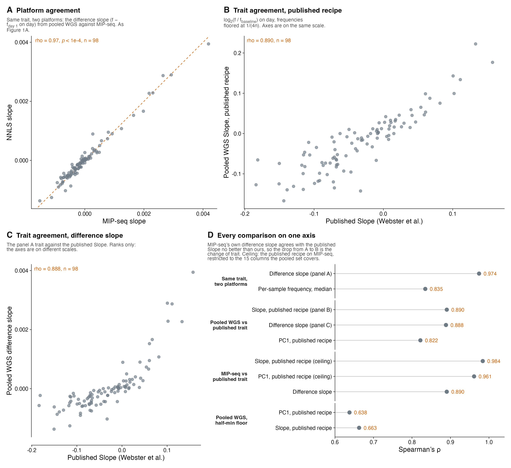

# Supplementary Note: comparing pooled-sequencing estimates with the published L1 starvation data

<!--
Every number here is printed and pinned by scripts/SUPP_FIG_XX_baugh_analyses.R
or stated in FIGURE_REPORT.md, and is checked by
scripts/check_manuscript_numbers.py. Figure numbers are manuscript numbers
(scripts/finalize_manuscript_figures.py), not the report's. Figure N1 belongs
to this note and is numbered outside the supplementary figure series.
-->

We validated pooled whole-genome sequencing against the L1 starvation time
course of Webster et al., where the same pooled samples had been genotyped by
targeted molecular inversion probe sequencing (MIP-seq). The data can be scored
in two ways, which give different correlations because they answer different
questions. A platform comparison asks whether our frequency estimates agree
with MIP-seq frequencies. A trait comparison asks whether a phenotype computed
from our frequencies recovers the phenotype Webster et al. published. The main
text reports both: Spearman's ρ = 0.974 for the first and ρ = 0.89 for the
second. This note sets out how each was computed and why they differ. All
comparisons use the same frequency estimates, from the deconvolution against the
102-strain reference panel used for Figure 1. N2 is excluded throughout because,
as the reference strain, it shares sites with every other strain in the pool;
this leaves n = 98 strains.

**Platform comparison (ρ = 0.974; Figure 1A, Figure N1A).** For each strain
and replicate arm we subtracted the day-1 frequency from the frequencies on days
1, 9 and 13 and regressed the difference on day. Day 17 was excluded and the
slopes were averaged over the five replicate arms. The identical calculation was
applied to the MIP-seq frequencies for the same samples, so the two slopes
differ only in which frequency estimates went in. They agree at ρ = 0.974, with
a 95% bootstrap interval of 0.969 to 0.975 when the deconvolution is resampled
across 100 replicates. Single samples agree less well (median ρ = 0.835 across
23 samples; Figure S3A), because a strain that the deconvolution confuses with a
close relative is misestimated by a similar amount at every timepoint. That
error largely cancels when frequency changes, rather than levels, are compared.
Every phenotype in this study is a change in frequency.

**Trait comparison (ρ = 0.89; Figure N1B, C).** Webster et al. defined their
Slope phenotype on a different scale: the log2 ratio of each frequency to the
replicate's baseline sample, regressed on day with day 17 excluded. Applying
that recipe to our frequencies requires a lower bound before taking logarithms,
because the deconvolution returns exact zeros (331 of 2,346 strain-by-sample
estimates) where MIP-seq read ratios do not. We floored frequencies at 1/(4n),
a quarter of an equal share of the pool. The resulting Slope agrees with the
published Slope at ρ = 0.890 (Figure N1B). The published PC1, the first
principal component of the same log ratios with day 17 included, is recovered
at ρ = 0.822. The difference-based slope of the platform comparison, which
takes no logarithm and needs no floor, agrees with the published Slope at
ρ = 0.888 (Figure N1C). The value of 0.89 therefore does not depend on which of
the two constructions is used.

**Why the two correlations differ (Figure N1D).** The gap between 0.974 and
0.89 reflects the change of phenotype, not error in our estimates. The
difference-based slope computed from MIP-seq frequencies themselves agrees with
the published Slope at ρ = 0.890, no better than the same slope computed from
pooled sequencing. Conversely, when the published recipe is applied to MIP-seq
frequencies, restricted to the 15 replicate-by-day samples the pooled data also
cover, it recovers the published traits at ρ = 0.984 (Slope) and ρ = 0.961
(PC1). This is the highest agreement any pooled trait could reach, given that two
of the original samples were not available for pooled sequencing.

**Sensitivity to analysis choices.** The floor is the only free parameter in the
published recipe, and it matters. The conventional choice, half the smallest
positive frequency, lies far below a typical strain frequency, so the resulting
log ratios are dominated by strains estimated at zero. With that floor,
agreement falls to ρ = 0.663 for Slope and ρ = 0.638 for PC1. The
difference-based slope avoids this choice entirely, which is why we use it
elsewhere. Read depth acts through the same mechanism. Downsampling increases the
share of exact zeros from 11.2% at 10x to 17.1% at 0.25x. Over that range the
log-ratio Slope recovers the published trait at ρ = 0.688 to 0.760 and the
difference-based slope at ρ = 0.713 to 0.801 (Methods), whereas agreement
between downsampled and full-depth frequencies levels off by 3x (Figure S3B).
Finally, the reference panel affects these values slightly: deconvolving
against the 103-strain panel used for the association scans gives ρ = 0.884 for
the published-recipe Slope across 99 strains.

**Summary.** Pooled sequencing measures the same frequency dynamics as MIP-seq
(ρ = 0.974). Phenotypes derived from those frequencies recover the published
phenotypes (ρ = 0.89) about as well as MIP-seq's own frequencies do when put
through the same difference-based calculation (ρ = 0.890).

**Figure N1. The L1 starvation data scored as a platform comparison and as a
trait comparison.** One point per wild isolate; N2 excluded, n = 98 strains
throughout. (A) Platform agreement: per-strain rate of change in pool frequency
(frequency minus its day-1 value, regressed on day) from deconvolution of pooled
whole-genome sequence against the same quantity from MIP-seq, for the same
samples. Spearman's ρ = 0.974. The dashed line is y = x. (B) Trait agreement:
the pooled Slope built on the published recipe (log2 of frequency over the
baseline sample, regressed on day, day 17 excluded, frequencies floored at
1/(4n)) against the published Slope of Webster et al., ρ = 0.890. (C) The trait
of panel A against the published Slope, ρ = 0.888. The axes are on different
scales; only ranks are compared. (D) Every comparison on one axis. MIP-seq's own
difference-based slope agrees with the published Slope at ρ = 0.890; the
published recipe applied to MIP-seq frequencies for the 15 samples the pooled
data cover reaches 0.984 (Slope) and 0.961 (PC1); pooled PC1 is 0.822; with a
floor of half the smallest positive frequency, pooled agreement falls to 0.663
(Slope) and 0.638 (PC1); median per-sample frequency agreement over 23 samples
is 0.835.
