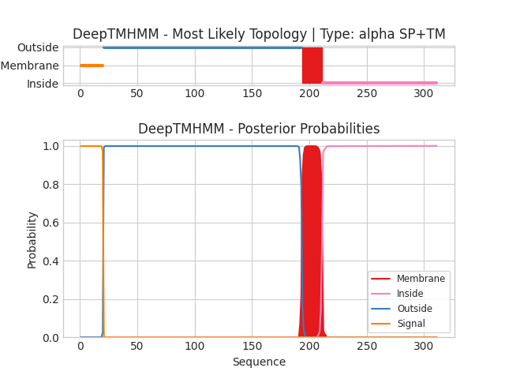

## DeepTMHMM - Predictions
Predicted topologies can be downloaded in [.gff3 format](TMRs.gff3) and [.3line format](predicted_topologies.3line)

You can download the probabilities used to generate this plot [here](SID2_probs.csv)
### Predicted Topologies
```
>SID2 | SP+TM
MPRFVYFCFALIALLPISWTMDGILITDVEIHVDVCQISCKASNTASLLINDAPFTPMCNSAGDQIFFTYNGTAAISDLKNVTFILEVTTDTKNCTFTANYTGYFTPDPKSKPFQLGFASATLNRDMGKVTKTIMEDSGEMVEQDFSNSSAVPTPASTTPLPQSTVAHLTIAYVHLQYEETKTVVNKNGGAVAVAVIEGIALIAILAFLGYRTMVNHKLQNSTRTNGLYGYDNNNSSRITVPDAMRMSDIPPPRDPMYASPPTPLSQPTPARNTVMTTQELVVPTANSSAAQPSTTSNGQFNDPFATLESW
SSSSSSSSSSSSSSSSSSSSOOOOOOOOOOOOOOOOOOOOOOOOOOOOOOOOOOOOOOOOOOOOOOOOOOOOOOOOOOOOOOOOOOOOOOOOOOOOOOOOOOOOOOOOOOOOOOOOOOOOOOOOOOOOOOOOOOOOOOOOOOOOOOOOOOOOOOOOOOOOOOOOOOOOOOOOOOOOOOOOOOOOOOOOOOOOOMMMMMMMMMMMMMMMMMMIIIIIIIIIIIIIIIIIIIIIIIIIIIIIIIIIIIIIIIIIIIIIIIIIIIIIIIIIIIIIIIIIIIIIIIIIIIIIIIIIIIIIIIIIIIIIIIIIIII

```


```
##gff-version 3
# SID2 Length: 311
# SID2 Number of predicted TMRs: 1
SID2	signal	1	20				
SID2	outside	21	193				
SID2	TMhelix	194	211				
SID2	inside	212	311				

```
