# Manuscript figures
Figures cited by the current draft, in citation order, each with the caption from `FIGURE_CAPTIONS.txt`.
PNGs are shown inline; a print-resolution PDF sits beside each one.
Generated by `scripts/finalize_manuscript_figures.py` -- edit the captions or the figure scripts and re-run rather than editing this file.

---

## Figure 1
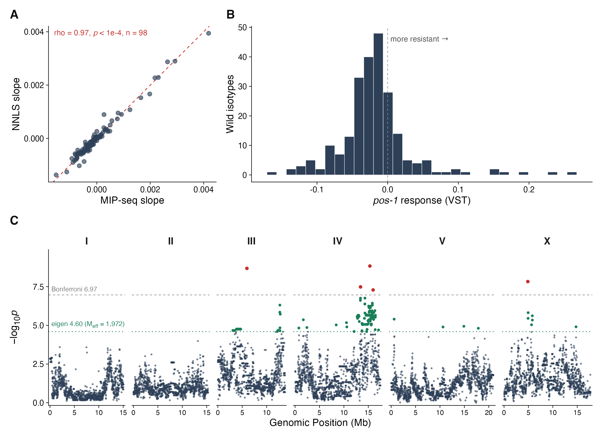
*Source: `plots/Figure1_pos1` &middot; print version: [`Figure_1.pdf`](Figure_1.pdf)*

The validated assay, the phenotype it produces, and the map -- in one figure.

(A) As Figure 1A: MIP-seq against NNLS slope, n = 98, Spearman rho = 0.97,
p < 1e-4.

(B) Distribution of the 2023 pooled pos-1 RNAi response across wild isotypes on
the vst scale (n = 231 strains with a vst value, of 366 in the trait file).
Dashed line marks zero; positive values are strains that gained pool frequency
under pos-1 RNAi, i.e. resistant.

(C) GEMMA LOCO association scan for that phenotype: 464,045 markers, n = 231
strains. Grey dashed line is the Bonferroni threshold over every marker
(-log10 p = 6.97); green dotted line divides alpha by the 1,972 effective
independent tests (4.60). Markers clearing Bonferroni are red, markers clearing
only the eigen threshold are green.

  Ten markers clear Bonferroni and 465 clear the eigen threshold. The maximum
  is -log10 p = 8.84 on chromosome IV at 15.323 Mb; eight of the ten lie on
  chromosome IV in two clusters near 13.41 and 15.32 Mb, with single markers on
  chromosome III at 5.966 Mb (8.68) and chromosome X at 4.876 Mb (7.83). NONE
  is near the chromosome III interval the NILs resolve -- the chromosome III
  association peak is 7.7 Mb away from it -- which is the point
  SUPP_FIG_XX_sid2_allele_in_panel makes at marker resolution.

The phenotype and the scan are used as shipped. scripts/2023_pos1_analysis.R
documents the read-depth cutoff, the JU1793 duplicate-entry correction, and the
caveat that the shipped vst value for JU1793 still carries that averaging --
which matters because JU1793 is a cross parent in Figures 2 and 3.

---

## Figure 2

*Source: `plots/Figure2` &middot; print version: [`Figure_2.pdf`](Figure_2.pdf)*

Pooled GWAS and cross mapping identify overlapping loci; the crosses resolve
which are general RNAi-response loci and which are knockdown-specific.

Mirrored Manhattan of the pooled GWAS on the vst traits: the mig-6 response
above the axis, the pos-1 response below (n = 84 strains, 322,010 markers).
Grey dashed lines are the Bonferroni threshold over every marker
(-log10 p = 6.81); green dotted lines divide alpha by the 732 effective
independent tests (4.17). Threshold labels are placed in the chromosome I panel.

Arrowheads mark the F2 cross QTL, one per QTL at its peak marker, coloured by
cross (N2 x XZ1516 teal, JU1793 x JU2466 orange) and directional: mig-6-specific
QTL above the axis, the pos-1 response below. The mig-6 arrows are drawn from
the mig-6-vs-pos-1 contrast and the pos-1 arrows from the HT115-vs-pos-1
contrast, so each side shows the comparison that isolates the effect it is
labelled with. Only QTL with peak LOD > 100 are drawn -- 9, listed below -- and
the complete significant set is

The arrows carry POSITION ONLY: no interval width and no peak LOD. Those were
previously drawn as interval bars with opacity scaled to LOD, which overstated
what the mark could support. A cross interval is often a few tens of kb against
a 15-20 Mb axis, so every bar had to be padded to a 0.09 Mb minimum to be
visible at all -- the drawn width was the padding, not the interval. Widths and
peak LODs are in the table below and in the cross-QTL supplement.

A variant with the cross QTL removed entirely is written by the same script for
comparison; it is captioned below as FIGURE 2, VARIANT.
SUPP_FIG_XX_cross_qtl_all. Shaded vertical bands mark +/- 1 Mb around the
pooled GWAS peaks.

  track              cross           chrom  peak Mb   interval      kb   LOD
  mig-6 vs pos-1     N2xXZ1516       I       1.88     1.80-1.96    166   751
  mig-6 vs pos-1     N2xXZ1516       III     0.43     0.28-0.59    304   165
  mig-6 vs pos-1     N2xXZ1516       IV     17.49    17.44-17.49    52   167
  mig-6 vs pos-1     N2xXZ1516       V      13.81    13.63-13.91   278   730
  mig-6 vs pos-1     JU1793xJU2466   X       5.96     5.66-6.24    582   361
  HT115 vs pos-1     N2xXZ1516       II      3.71     3.59-3.80    212   148
  HT115 vs pos-1     N2xXZ1516       III    13.31    13.11-13.50   394   710
  HT115 vs pos-1     JU1793xJU2466   III    13.78    13.73-13.78    51   140
  HT115 vs pos-1     N2xXZ1516       X      11.38    11.13-11.62   492   183

CAVEAT to state in the text rather than leave a reader to notice: no cross
interval contains its matching pooled GWAS peak marker. The nearest
correspondences are the mig-6 peak at V:14.65 Mb against the N2 x XZ1516
chromosome V interval at 13.81 Mb (0.84 Mb apart) and the pos-1 peak at
III:12.35 Mb against the N2 x XZ1516 chromosome III interval at 13.31 Mb
(0.96 Mb) and the JU1793 x JU2466 interval at 13.78 Mb (1.43 Mb). A GWAS on 84
strains is not expected to localise to a cross interval; the claim is
concordance of locus, not of marker.

---

## Figure 3
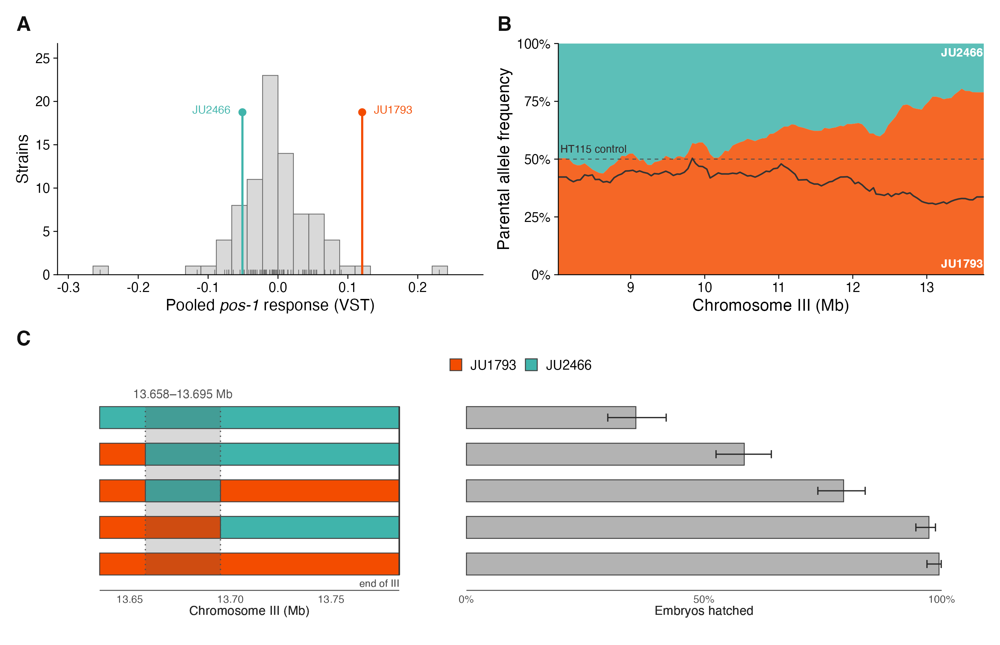
*Source: `plots/Figure3_quad` &middot; print version: [`Figure_3.pdf`](Figure_3.pdf)*

The block above describes the superseded figure3.pdf. This is the current
Figure 3, three panels rather than four.

Near-isogenic lines fine-map the chromosome III RNAi-response QTL to a 37 kb
interval.

(A) The pooled pos-1 response across the wild panel, with the two cross parents
marked: JU2466 sensitive and JU1793 resistant, at opposite ends of the
distribution the cross was built from.

(B) Parental allele frequency along the right arm of chromosome III, 8 Mb to the
telomere, in the JU1793 x JU2466 F2 pool under pos-1 RNAi. JU1793's haplotype
frequency is filled from below in orange and JU2466's above it in teal, so the
two sum to 1 and the panel reads as which parent occupies the pool at each
position. Frequencies are count-weighted within 50 kb bins -- counts summed and
the frequency taken from the sums, so depth is respected rather than each marker
counting equally -- then shown as a centred 250 kb rolling mean. The JU1793
fraction rises from 42% at 8 Mb to 79% at the telomere.

The solid line is the HT115 control pool over the same interval, and it is what
makes this selection rather than a segregation artefact: it runs the other way,
42% to 33%. A dashed line marks 50%.

This panel replaces the LOD trace of the earlier layout. A LOD trace answers
whether there is a QTL, which Figure 2 already answers, and says nothing about
which parent's allele the selection favoured -- which is the point being made
here, since sid-2 sits at 13.68 Mb.

(C) The NIL series: genotype and phenotype in one panel, one row per strain.
The rows carry no strain names; from the bottom up they are JU1793, wSZ196,
wSZ191, wSZ176, JU2466. The two parents are the two rows of a single colour,
and the per-strain values are listed below, so each row is identifiable from
its genotype and its hatching together. Figure S10 draws the same series with
the names on the rows.

Left, the introgressions on the right arm of chromosome III, 13.635 Mb to the
telomere, JU1793 genotype in orange and JU2466 in teal. The track is
deliberately the smaller half of the panel and the bars are thin: it carries two
breakpoints, where the hatching bars carry a five-level series with intervals.
The window trims dead flank on the LEFT only, leaving ~23 kb proximal to the
first breakpoint. FIVE OF THE SIX NILs
CARRY A SEGMENT THAT RUNS TO THE CHROMOSOME END at 13,783,801 bp, which the
right-hand edge marks; wSZ191 is the exception, an internal 13.658-13.695 Mb
segment that stops short. That contrast is the fine-mapping argument, so the
window keeps its right edge at the terminus rather than compressing to the
breakpoints alone. The shaded band with dotted edges is the interval the series
resolves, 13.658-13.695 Mb -- the region wSZ191 carries and wSZ196 does not.

Right, embryos hatched under 50% pos-1 RNAi on the same rows: JU1793 99.4%
(n = 179 embryos), wSZ196 97.3% (n = 261), wSZ191 79.4% (n = 252), wSZ176 58.5%
(n = 272), JU2466 35.7% (n = 230). Bars are one plate per strain with Wilson 95%
binomial intervals on that plate's embryo count. The two halves share the row
axis and carry separate x scales, labelled beneath each.

CAVEAT: one plate per strain per condition, so those intervals describe counting
uncertainty, not between-plate variability, and no strain is replicated -- the
ordering is an allelic series, not a set of tested contrasts. The HT115 control
arm and four further NILs are in SUPP_FIG_XX_nil_hatching_full.

---

## Figure 4
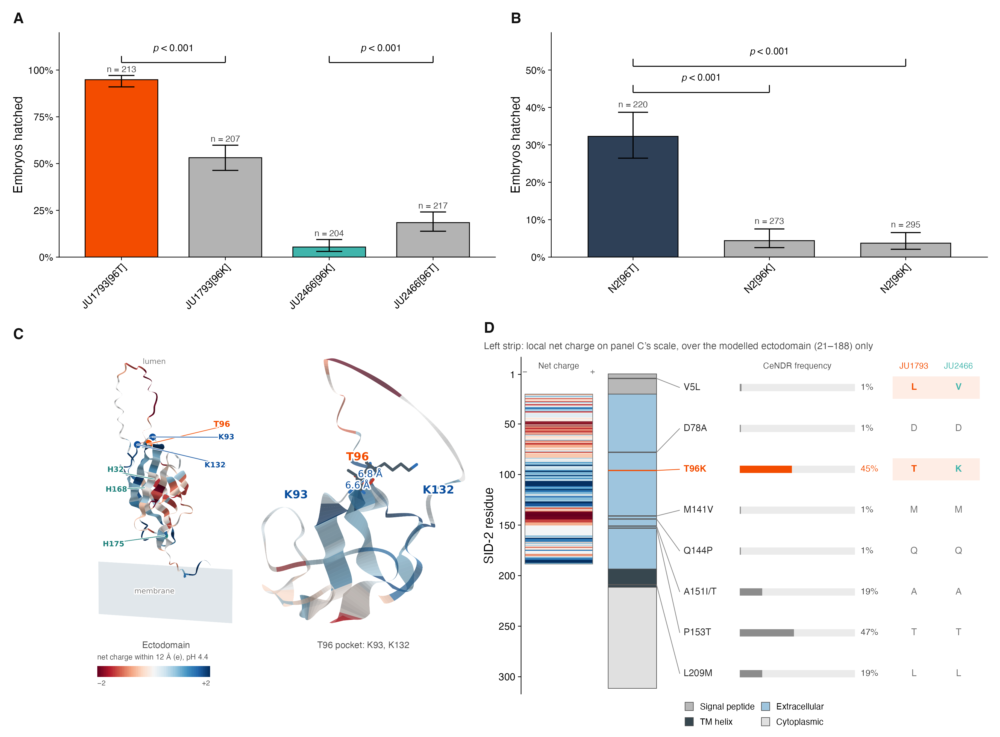
*Source: `plots/Figure4_sid2` &middot; print version: [`Figure_4.pdf`](Figure_4.pdf)*

Editing sid-2 residue 96 moves RNAi sensitivity in three genetic backgrounds,
and the residue sits on the lumenal face of the ectodomain.

Panels carry letters only; all descriptive text is here.

(A) Embryos hatched on 50% pos-1 RNAi for reciprocal edits at residue 96 in
the two cross parents. JU1793[96T], the resistant parental allele, 94.8%
(n = 213 embryos); JU1793[96K] 53.1% (n = 207); JU2466[96K], the sensitive
parental allele, 5.4% (n = 204); JU2466[96T] 18.4% (n = 217). Parental alleles
are in the strain colours and edited alleles in grey. Fisher's exact test on
the counts, each edit against the unedited allele in the same background:
p = 1.7e-24 and p = 3.9e-05. Bars are Wilson 95% binomial intervals.
Editing 96T to K removes most of JU1793's resistance and editing 96K to T
recovers part of JU2466's, so residue 96 contributes in both directions
without accounting for the whole difference between the parents.

(B) The same substitution in N2, at 25% pos-1 RNAi. N2 carries 96T and hatches
32.3% (n = 220); two independently derived lines edited to 96K hatch 4.4%
(wSZ203, n = 273) and 3.7% (wSZ204, n = 295), Fisher p = 7.8e-17 and
p = 6.2e-19. The two edited lines are labelled by genotype and are not
distinguished on the axis because they are independent lines of the same edit.
This is the third genetic background to show the effect and the only one with
two independent edits, and the direction is the same throughout: 96K sensitive,
96T resistant.

(C) The SID-2 ectodomain coloured by LOCAL NET CHARGE, AlphaFold3 model,
rotated onto the membrane normal so the intestinal lumen is up; the grey slab is
the bilayer. Colour is the net side-chain charge of all ectodomain residues with
a C-alpha within 12 A, by Henderson-Hasselbalch at pH 4.4 -- the gut-lumen pH at
which SID-2 functions -- on a diverging scale saturating at +/- 2 e, red
negative and blue positive. Left, residues 21-188 of chain A: T96 (orange), the
two lysines that make its pocket, K93 and K132 (blue), and SID-2's three
extracellular histidines, H32, H168 and H175 (teal), which McEwan et al. 2012
identified and mutated. Right, the pocket enlarged, with C-alpha distances from
T96 to K93 (6.6 A) and K132 (6.8 A); nearest heavy-atom distances are 4.5 and
4.4 A.

The panel makes a charge argument, not a proximity or homology one. The
ectodomain is net acidic overall (-8.34 e at pH 7.4, +0.47 e at pH 4.4 over the
modelled 21-188), but T96's own neighbourhood is +1.24 e, the 82nd percentile of
the domain, and T96K takes it to +2.24 e, the 98th percentile -- see
SUPP_FIG_XX_sid2_local_charge for that distribution. The relevant precedent is
that permanent positive charge at this surface INCREASES uptake: the triple
His->Arg mutant of McEwan et al. internalised more dsRNA than wild type, and
T96K raises RNAi sensitivity in all three backgrounds tested here. Whether
SID-2 contacts dsRNA at all is not established, so this is a reason to test the
charge-matched controls (T96R, T96Q) rather than a result.

(D) sid-2 coding variation in the wild population. The protein runs vertically
with residue 1 at the top and its DeepTMHMM topology as a filled bar; each
protein-altering variant is called out to the right with its CeNDR allele
frequency, then two columns give the JU1793 and JU2466 allele state.

Immediately left of the topology bar is a column headed "Net charge", with a
minus and a plus marking its ends, giving the LOCAL NET CHARGE at each residue
on exactly the ramp and the limits panel C uses -- red negative,
blue positive, saturating at +/-2 e, net charge within 12 A at pH 4.4 -- so the
two panels can be read against one another. It carries no key of its own
because panel C's key serves both; duplicating it would let the two drift
apart. The strip therefore puts panel C's charge argument on a linear axis: the
domain is acidic through roughly residues 40-85, turns positive through 90-130
where T96 sits, and is strongly acidic again at 135-150. The strip spans
residues 21-188 ONLY, which is the extent of the AlphaFold ectodomain model
there is a structure to measure charge in; the remainder of the protein is left
blank rather than filled with a zero that would read as neutral. Eight
protein-altering variants are annotated, at frequencies from 0.009 to 0.470:
V5L 0.015, D78A 0.009, T96K 0.453, M141V 0.009, Q144P 0.009, A151I/T 0.195,
P153T 0.470, L209M 0.195. Callout rows are evenly spaced and joined to the
residue by a leader rather than sitting at the residue's own height, because
four of the eight fall between residues 141 and 153 and overlap completely at
true scale.

  Two facts from panel D that belong in the text. First, only TWO of the eight
  annotated coding variants differ between the cross parents -- V5L and T96K --
  so the cross narrows the candidate coding changes to two by inspection.
  Second, T96K and P153T are in near-complete linkage disequilibrium across the
  wild population (r-squared 0.935; 96K never occurs without 153T, though 153T
  occurs without 96K in nine isotypes), but BOTH cross parents carry 153T, so
  P153T does not segregate in the JU1793 x JU2466 cross and cannot account for
  the mapped effect.

  Panel D is not an exhaustive catalogue: the amino-acid annotation covers
  variants segregating among the four cross parents. 81 variants of any kind
  segregate in the 3 kb span in CeNDR, and the 8 protein-altering ones above
  are what is annotated.

CAVEATS, all of which belong in the text rather than being left to a reader

---

## Figure S1
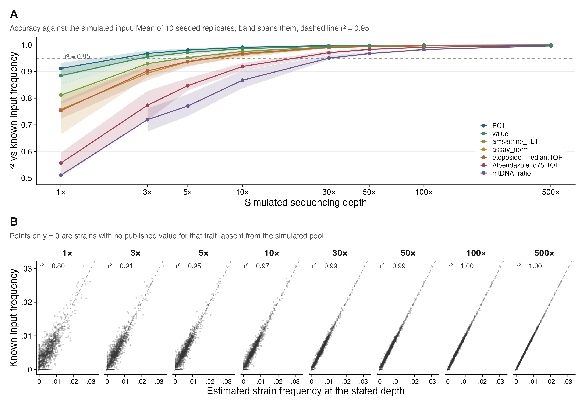
*Source: `plots/SUPP_FIG_XX_simulation_depth` &middot; print version: [`Figure_S1.pdf`](Figure_S1.pdf)*

NNLS deconvolution recovers simulated strain frequencies, and the depth it
needs depends on the trait.

This is the simulation the project started from. Each wild isolate was assigned
a fitness value taken from one of seven published C. elegans traits with
validated QTL -- the trait value itself, shifted by the trait's own minimum so
fitness is non-negative -- giving seven independent simulated populations of
327 strains. A strain with no published value for a trait was set to fitness
zero, i.e. absent from that trait's pool. The expected pooled allele
frequencies such a population would produce were computed; observed alt-allele
counts were simulated by binomial sampling at 1, 3, 5, 10, 30, 50, 100 and
500x; and those counts were deconvolved back to per-strain frequencies by NNLS
and compared with the known input.

(A) r-squared of estimated against known input frequency, against simulated
sequencing depth, one line per trait. The line is the mean of ten seeded
replicates and the band spans them, so the width of the band is the sampling
variability of a single experiment at that depth. At 1x the spread across
traits is wide: PC1 0.91, value 0.88, amsacrine_f.L1 0.81, assay_norm 0.76,
etoposide_median.TOF 0.75, Albendazole_q75.TOF 0.56, mtDNA_ratio 0.51 --
median 0.76 -- and the replicate bands are widest there too, up to 0.149 for
assay_norm.

SIX OF THE SEVEN TRAITS REACH r-squared 0.95 BY 30x, AND 50x CLEARS ALL SEVEN.
Counting a trait as clearing the bar only if it does so in every replicate, the
tally by depth is 0 traits at 1x, 1 at 3x, 2 at 5x, 5 at 10x, 6 at 30x and 7 at
50x, 100x and 500x. The exception at 30x is mtDNA_ratio, which sits on the line
rather than below it: it averages 0.9504 over the ten replicates, spans
0.9443-0.9610, and clears 0.95 in four of them. At 50x the lowest r-squared
anywhere in the ten replicates is 0.9639. This is why no single depth is quoted
for "all seven": on the replicate mean mtDNA_ratio would pass at 30x, and a
figure drawn from one draw would report whichever answer that draw happened to
give.

No trait reaches r-squared 1.000 even at 500x; the range there is 0.9966 for
mtDNA_ratio to 0.9998 for PC1.

(B) The estimates against the known input, faceted by depth, all seven traits
pooled (2,289 points per facet). One replicate is drawn, not an average of the
ten: averaging point clouds would narrow the scatter and misrepresent what a
single experiment at that depth looks like. Axes share limits so the dashed
y = x line means the same thing in every facet. Pooled r-squared: 0.80 at 1x,
0.91 at 3x, 0.95 at 5x, 0.97 at 10x, 0.99 at 30x and 50x, 1.00 at 100x and
500x. The
band of points along y = 0 is the strains with no published value for that
trait, which were absent from the pool; NNLS nonetheless assigns them
frequency, and because pool mass is conserved the strains that were present are
underestimated by the same amount. That is why the cloud sits below y = x at
low depth. The leaked share of each pool's mass runs 7.3% at 1x, 4.1% at 3x,
3.1% at 5x, 2.2% at 10x, 1.0% at 30x and 50x, 0.6% at 100x and 0.3% at 500x,
with the slope of input on estimate rising from 0.883 at 1x to 1.004 at 500x.
Restricted to the strains actually in the pool, r-squared is 0.71 at 1x, 0.85
at 3x, 0.91 at 5x, 0.95 at 10x, 0.98 at 30x, 0.99 at 50x and 100x, and 1.00 at
500x.

PROVENANCE, which used to be caveat 1. The figure is generated from source
rather than recovered. The simulation's fitness input was long thought lost, so
panel A was transcribed -- its values read out of text embedded in the original
per-trait PDFs by scripts/extract_sim_reported_r2.py -- and panel B substituted
the 500x estimate for the truth. Neither is necessary now. The seven-trait arm
of scripts/legacy/haploReg_original.R uses published trait values as fitness,
those files are deposited as
supplemental_data/deconvolution/simulation_fitness_traits.tsv, and the whole
simulation therefore runs from the genotype panel with a seed
(scripts/make_simulation_seeded.R, seed 20260909, ten replicates), deposited as
simulation_seeded_{frequencies.tsv.gz,r2.tsv}. 500x is an ordinary depth in
panel B rather than its reference, which is why panel B has eight facets and
not seven.

The 2021 run is retained as a comparison rather than discarded. Its estimates
are still deposited, all 56 of its r-squared are recomputable exactly from them
(scripts/simulation_recompute_r2.R, run on every push), and its values fall
inside the ten-replicate band in 43 of 56 trait-depth cells -- so it is
consistent with the replicated run rather than anomalous. Two things the
seeded run fixes: its binomial draw was never seeded, so it could be recomputed
against but never regenerated; and it carried 139 of 18,312 negative
coefficients (0.8%), which a strict non-negative solver cannot return. The
seeded run carries none, and the figure script asserts that.

CAVEAT 2, on the wording of the claim. "NNLS can accurately infer strain
frequencies with as little as 1X sequencing depth" holds for the best-behaved
traits and not for the worst: at 1x, r-squared runs from 0.91 down to 0.52. A
statement the whole figure supports is that 1x recovers most of the signal for
most traits (median r-squared 0.79), that 10x is enough for five traits of
seven, that six of seven reach 0.95 by 30x, and that 50x clears all seven.
Earlier drafts quoted a single depth for the last of those -- first 30x, then
50x -- and neither is stable: mtDNA_ratio sits on the 0.95 line at 30x, so which
answer a single draw gives is a matter of chance. Ten replicates is what makes
the honest version of the sentence available.

CAVEAT 3, now historical. The 2021 archive carried 139 of 18,312 negative
coefficients (0.8%) at depths 5 through 100, which a strict non-negative solver
cannot return, so those values were not exactly the output of a clean NNLS. The
seeded run this figure is drawn from carries no negative coefficient at all.
The cause of the archive's is not settled: mcrals.fcnnls on the raw design does
emit occasional small negatives, but at 2 of 18,312 (0.011%) in a full-scale
redraw against the archive's 0.76%, so the solver is implicated without
accounting for the rate (scripts/simulation_redraw.R).

SCALE NOTE. The archived coefficients are not frequencies: each depth's row
sums to the depth itself (500x sums to 500.03, 1x to 1.00), so they are on an
expected-count scale. The deposit's frequency column is coefficient divided by
the row sum, within a trait and depth, and the builder asserts that reading.

RNAi DOSE: not applicable; this figure is in silico.

---

## Figure S2
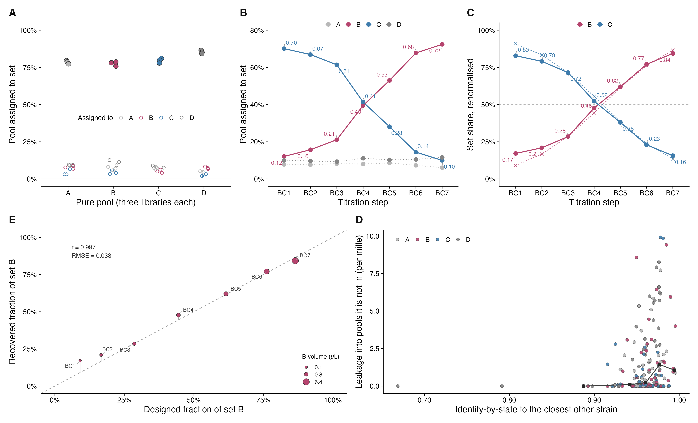
*Source: `plots/SUPP_FIG_XX_dilution_validation` &middot; print version: [`Figure_S2.pdf`](Figure_S2.pdf)*

NNLS recovers a designed DNA mixture of two strain sets from real pooled
sequence.

174 wild isolates were split into four sets of roughly equal size (A, B, C, D).
Genomic DNA from each set was pooled and sequenced both pure -- three libraries
per set -- and as a seven-step titration of set B against set C, BC1 to BC7.
Alt-allele counts were taken with GATK ASEReadCounter and deconvolved to
per-strain frequencies by NNLS against the CeNDR genotype matrix. This is the
middle of the three validations: the simulation has a known input and simulated
counts, this has a known input and real counts, and Figure 1A has a real input
and real counts.

(A) Pure pools, three libraries each. The fraction of each pool assigned to its
own set is 0.785 for A, 0.775 for B, 0.796 for C and 0.853 for D (filled
points). The fraction misassigned to each of the other three sets runs 0.020 to
0.127, mean 0.066 (open points), and the total misassigned per pool is 0.135 to
0.242.

(B) The titration on the 170-strain pool reference, with each B and C value
labelled. Set B rises monotonically 0.12, 0.16, 0.21, 0.40, 0.53, 0.68, 0.72
and set C falls monotonically 0.70, 0.67, 0.61, 0.41, 0.28, 0.14, 0.10
(Spearman rho +1 and -1 against step). Sets A and D are not titrated and stay
flat: 0.061-0.086 and 0.093-0.116, drawn dotted.

(C) The same seven samples with the reference restricted to the 84 strains of
sets B and C and renormalised, which is the analysis the original figure
showed: B 0.17, 0.21, 0.28, 0.48, 0.62, 0.77, 0.84 against C 0.83 down to 0.16,
crossing between BC4 and BC5.

(D) Whether the strains that resolve badly are the genetically similar ones.
For each of the 170 strains, the x axis is its identity-by-state to the closest
OTHER strain in the reference, and the y axis is its "leakage" -- the mean
frequency it is assigned across the nine libraries of the three sets it is NOT
in. That leakage must be zero whatever the DNA input was, so unlike own-pool
recovery it is an error measure that assumes nothing about the design. Grey
squares are medians of the bins printed by the script; points are coloured by
the strain's own set.

Leakage rises with nearest-neighbour identity: Spearman rho +0.326,
p = 1.4e-05, n = 170. Median leakage by bin: 0.0000 below IBS 0.90 (n = 5),
0.000101 for 0.90-0.95 (n = 34), 0.000231 for 0.95-0.97 (n = 75), 0.00143 for
0.97-0.99 (n = 52), 0.00106 above 0.99 (n = 4). Mean identity to all other
strains gives the same answer more weakly (rho +0.258, p = 6.8e-04).

READ THE TWO QUANTITIES AS ONE. For a pure pool the fractions sum to 1, so the
own-set share is exactly 1 minus the mass assigned to strains not in the pool
(verified to 4.4e-16 across all twelve pure pools; mean own-set 0.802,
out-of-pool 0.198). The recovery ceiling in panel A and the leakage in panel D
are the same quantity from opposite sides, not two problems.

The leakage is relatedness-directed. Across the 1,530 strain-by-pool
combinations in which a strain is absent from the pool, the mass assigned to it
averages 1.33 per mille when its nearest neighbour lies elsewhere and 2.25 per
mille when its nearest neighbour is IN that pool -- a 1.70-fold enrichment,
Mann-Whitney p = 3.6e-05. Those combinations are 24.3% of the total and carry
35.3% of all out-of-pool mass, putting the relatedness-attributable share of
that mass at roughly 14%. That is a LOWER BOUND: "nearest neighbour in the
pool" is a binary summary, and a strain has many relatives among a pool's ~43
members. The graded test needs relatedness to every pool member.

A NULL THAT MUST NOT BE OVER-READ. Per-strain own-pool recovery is uncorrelated
with relatedness (rho +0.046, p = 0.55 nearest-neighbour; +0.092, p = 0.23
mean). Per-strain recovery is BIDIRECTIONAL -- a strain both loses mass to
confusable partners and gains it from them, and a trade with a partner in the
same set leaves the set total untouched -- so it can show no correlation while
relatedness drives every transfer. Leakage is unidirectional, which is why the
signal appears there. The null concerns per-strain recovery and says nothing
about the set-level ceiling.

Not supported by these data, though the top of the leakage ranking is full of
near-identical partners: that the damage concentrates in near-identical pairs
SPLIT ACROSS sets. There are only 30 reciprocal nearest-neighbour pairs and two
of them sit above IBS 0.99, so the pair-level comparison is underpowered and
gives inconsistent answers at different thresholds. It is worth revisiting with
a larger design; it is not a result yet.

Both panels' plotted fractions are pinned as literals in the script and checked
against the deposit on every run, so the numbers in this caption cannot drift
from the figure without the script failing.

(E) Recovered against designed fraction of set B, the accuracy panel. The
design is a two-fold doubling series of set B against a fixed 1 uL of set C,
made up to 10 uL with water; stocks measured 100 ng/uL (B1) and 99.9 ng/uL
(C1), so the mass fraction is the volume fraction to within 2.5e-4 and the
equal-concentration assumption is verified rather than assumed. Point area is
the B volume pipetted. Recovery tracks the design with Pearson r = 0.997 and
RMSE 0.038 in fraction units, Spearman rho +1: designed 0.091, 0.167, 0.286,
0.444, 0.616, 0.762, 0.865 against recovered 0.171, 0.209, 0.285, 0.478, 0.620,
0.771, 0.843.

CAVEAT 1, now quantified rather than open. There are NO REPLICATE DILUTIONS, so
pipetting error is unreplicated and enters the comparison in full. The largest
deviation is at BC1 (+0.080), whose B volume is 0.1 uL and is the hardest
volume in the series to pipette accurately; dropping BC1 halves the error to
RMSE 0.024, max 0.043. Deviation does trend with 1/volume across the series but
not significantly at n = 7 (Spearman +0.50, p = 0.27), so the pipetting
explanation is mechanistically plausible and statistically unproven.

  A SECOND FEATURE OF THE DESIGN worth a sentence: total DNA is not constant
  across the series, running 11 ng at BC1 to 74 ng at BC7, because only the B
  volume was varied. Input mass and B fraction are therefore perfectly
  confounded, and a deviation scaling with total DNA would be indistinguishable
  from one scaling with B fraction.

  THE BIAS IS TOWARD B: mean deviation +0.021 on the B+C reference and +0.030
  on the pool reference. Stock concentration is excluded as the cause (100
  against 99.9 ng/uL). Set B holds 46 of the 84 reference columns against set
  C's 38, which is one candidate explanation and is not tested here.

CAVEAT 2. One isotype is assigned to two sets. Strain JU1580 and strain JU1793
are the same isotype, and the experiment put JU1580 in set B and JU1793 in set
D. The deconvolution works at isotype level and returns one frequency for the
pair, and the source prediction tables carry that isotype twice, once labelled
B and once labelled D. Summed naively the single estimate is added to both
sets, where it is 5-19% of set D's apparent frequency in BC1-BC7 and RISES
across the titration -- making set D appear to drift upward, when set D is not
titrated and cannot respond to the series. The figure resolves the isotype to
set B, which is what the original analysis did and what the estimate itself
says, and asserts that no other isotype is ambiguous. This is the same strain
whose duplicated genotype-reference entry is documented for the pos-1
phenotype, and it is a cross parent in Figures 2 and 3.

CAVEAT 3. Recovery of a pure pool tops out near 0.8, not 1.0, so roughly a
fifth of each pool is assigned to strains that are not in it -- and that fifth
IS the leakage of panel D, since the two sum to 1 by construction. Relatedness
directs that mass and accounts for at least ~14% of it. The remainder is not
attributed here: cross-contamination between pools and unequal DNA input across
the strains within a pool remain candidates these data cannot separate.

  Offering the solver fewer absent candidates measurably improves the answer.
  Against the designed B fraction: the un-renormalised 170-strain estimate has
  RMSE 0.0788 (bias -0.0593), renormalising within B and C brings it to 0.0415
  (+0.0297), and restricting the reference to the 84 strains actually present
  brings it to 0.0376 (+0.0208). Most of the damage is undone by
  renormalisation, which removes the ~18% of mass sitting on the untitrated
  sets; restricting the reference recovers a further 9%.

CAVEAT 4, on reference choice. Panels A and B use the 170-strain pool reference
and panel C the 84-strain B+C reference. After renormalising the pool reference
within B and C, the two disagree by at most 0.054 and on average 0.029 on the
same samples, which is the size of the reference-choice effect. The deposit also
carries the 540-strain full-panel and regenotyped references for extending that
comparison.

RNAi DOSE: not applicable; no RNAi in this experiment.

---

## Figure S3
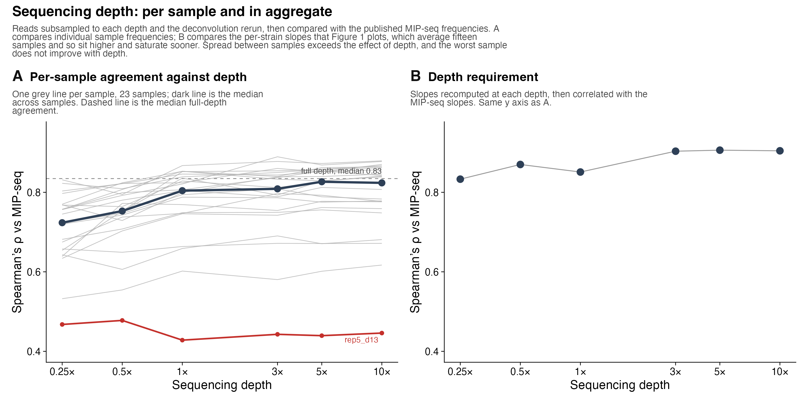
*Source: `plots/SUPP_FIG_XX_downsample_per_sample` &middot; print version: [`Figure_S3.pdf`](Figure_S3.pdf)*

The sequencing-depth requirement at two levels of aggregation, on a shared y
axis.

(A) Per-sample agreement against depth: one grey line per sample (23 samples),
dark line the median across samples, dashed line the median full-depth
agreement (0.835). Median rho rises 0.724 at 0.25x to 0.827 at 5x, saturating by
3-5x.

(B) The aggregate, slope-level curve -- Figure 1C -- with the 0.5x depth
restored: 0.833, 0.870, 0.851, 0.903, 0.906, 0.904 for 0.25x through 10x.

Panel B correlates slopes, which average fifteen measurements, so it sits above
A at every depth and saturates sooner: averaging removes most of what depth
costs an individual sample. Quoting the depth requirement from B alone overstates
how well any single sample is measured.

Two further points. The spread between samples exceeds the effect of depth --
the median moves about 0.10 across a fortyfold depth range while samples span
roughly 0.43 to 0.88 at any fixed depth. And rep5_d13 is worst at every depth
(0.428-0.478) without improving, so its disagreement is not a depth problem and
no amount of sequencing would have fixed it.

The 0.5x inversion visible in B -- 0.870, above the 0.851 of the 1x that follows
-- is why that depth is omitted from Figure 1C. No such inversion appears per
sample, so it looks like noise in one downsampling draw rather than a property
of that depth.

No error bars: the bootstrap array holds replicates of the full-depth
deconvolution only, so there is nothing to resample at a reduced depth.

---

## Figure S4

*Source: `plots/SUPP_FIG_XX_original_pos1_dfreq_rep_correlation` &middot; print version: [`Figure_S4.pdf`](Figure_S4.pdf)*

Replicate reproducibility of the 2023 pos-1 delta-frequency phenotype. All six
pairwise comparisons of the four pos-1 replicates, at read-depth cutoff 5, with
Spearman rho and n on each facet. Dashed line is y = x; red is the fitted slope.

Depth cutoff 5 is used because it is the cutoff the shipped association traits
were built from: taking the mean pos-1 delta per strain at cutoff 5 reproduces
delta_ctrl_pos-1_T2 to 2.5e-16, against r = 0.9998 at cutoff 3 and 0.9988 at
cutoff 10.

Rows sharing a (strain, sample) key are summed before the delta is taken. This
affects JU1793 only, which appears twice per sample at every depth cutoff and in
both arms -- one row carrying the real frequency and the other ~1e-21, which is
NNLS splitting one strain's abundance across two identical entries in the
genotype reference rather than two measurements. Summing roughly doubles
JU1793's pos-1 delta, from 0.00857 to about 0.0171. For every other strain the
collapse is a no-op.

---

## Figure S5

*Source: `plots/SUPP_FIG_plate_vs_paaby_vs_pos1original` &middot; print version: [`Figure_S5.pdf`](Figure_S5.pdf)*

Manual plate phenotyping of wild isolates on pos-1 RNAi, validated against two
independent measurements. The plate score is a six-level ordinal scale
(0 = complete RNAi response/sensitive, 5 = no response/resistant), so Spearman
rank correlation is used throughout: it requires only a monotonic relationship,
not shared units or linearity.

(A) Plate score against the pooled 2023 pos-1 response on the VST scale
(vst_ctrl_pos-1_T2), the same trait the association mapping was run on:
Spearman rho = 0.41, n = 111 strains, p = 7.8e-06. Positive is the expected
direction -- VST is positive for strains that gained pool frequency under
pos-1 RNAi, i.e. resistant, and resistant strains score high on the plate.
Dashed line marks zero.

(B) Plate score against Paaby et al. 2015 mean embryonic lethality for the
pos-1 clone, computed per well as unhatched eggs over eggs plus larvae and
averaged within a strain: Spearman rho = -0.55, n = 19 strains, p = 0.014.
Negative is the expected direction -- a low plate score means sensitive, and
sensitive means high lethality.

Both agree with the plate assay in the predicted direction. The Paaby
comparison rests on 19 shared strains and should be described as consistent
rather than as independent confirmation.

REBUILT on the VST trait. The earlier version of panel A used a bootstrap
frequency change from a different export (rho = 0.42, n = 106), which was on no
scale used elsewhere in the manuscript; the VST version is on the same scale as
every other phenotype panel. The script also now runs under Rscript, where
scripts/plate_pheno_comparisons.R -- which produced the earlier version and
also writes the two standalone panels under
plots/plate_pheno_comparisons/ -- resolves its working directory through the
RStudio API and runs only inside RStudio.

---

## Figure S6
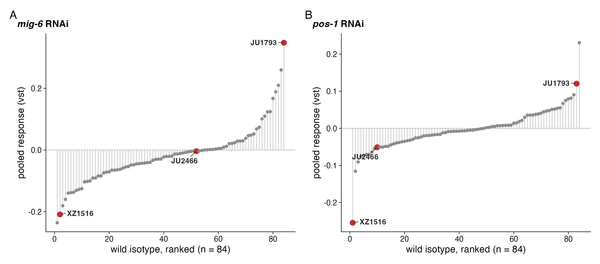
*Source: `plots/SUPP_FIG_XX_pooled_phenotype_ranks` &middot; print version: [`Figure_S6.pdf`](Figure_S6.pdf)*

Per-strain pooled RNAi response for mig-6 and pos-1 on the vst scale, ranked,
with the cross parents highlighted. Establishes that the crosses were built from
the extremes of the pooled assay rather than from convenience. Nine of the 93
panel strains have no vst value, so n = 84 and ranks are out of 84.

---

## Figure S7

*Source: `plots/SUPP_FIG_XX_cross_contrast_panels` &middot; print version: [`Figure_S7.pdf`](Figure_S7.pdf)*

The expanded view behind Figure 2's compressed tracks. Mirrored pooled GWAS on
top, then one panel per cross with all three contrasts overlaid: each knockdown
against the HT115 control -- pos-1 in purple, mig-6 in orange -- and the
difference between the two knockdowns in blue. Both HT115 traces high with the
blue difference flat marks a general RNAi-response locus, the machinery being
affected whatever the target; one HT115 trace high with blue tracking it marks a
knockdown-specific locus. This is the panel that justifies calling the
chromosome III locus general and the chromosome V, I and X loci specific: at
chromosome III both knockdowns respond, while chromosome V and X move under
mig-6 with pos-1 flat. Drawing the mig-6 response rather than inferring it from
the difference trace is what separates those two readings. Every peak in these
traces, at the genome-wide threshold rather than Figure 2's display cutoff of
LOD 100, is tabulated in plots/TABLE_cross_qtl_full.tsv.

---

## Figure S8
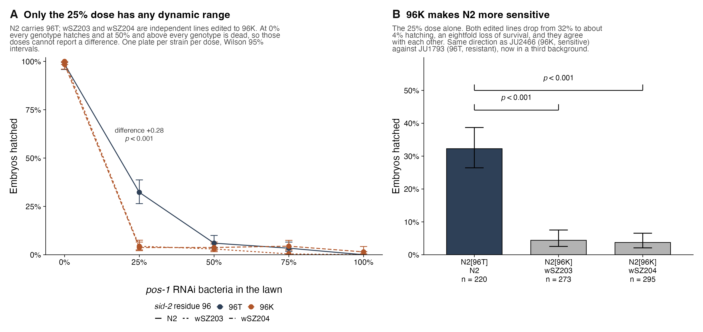
*Source: `plots/SUPP_FIG_XX_n2_swap_dose` &middot; print version: [`Figure_S8.pdf`](Figure_S8.pdf)*

The N2 residue-96 swap across the full pos-1 dilution series, which is what
justifies showing only the 25% dose in Figure 4B.

(A) Every genotype at every dose: 0, 25, 50, 75 and 100% pos-1 RNAi bacteria.
N2 carries 96T; wSZ203 and wSZ204 are independent lines edited to 96K. One
plate per strain per dose with Wilson 95% intervals.

(B) The 25% dose alone, as in Figure 4B.

Pooling the two edited lines against N2 at each dose:

    % pos-1    96T      96K     difference   Fisher p
         0    0.985    0.992      -0.006       0.43
        25    0.323    0.040      +0.282       8e-25
        50    0.060    0.034      +0.026       0.11
        75    0.034    0.027      +0.007       0.64
       100    0.000    0.007      -0.007       0.56

25% is not merely where the difference is largest; it is the only dose that can
carry one. Every other dilution sits at the ceiling or the floor for all three
genotypes. A single-dose experiment at full strength would have found nothing,
which is worth stating because it is also the likely reason a sub-maximal dose
is needed to see sid-2 alleles in a resistant background at all.

---

## Figure S9A
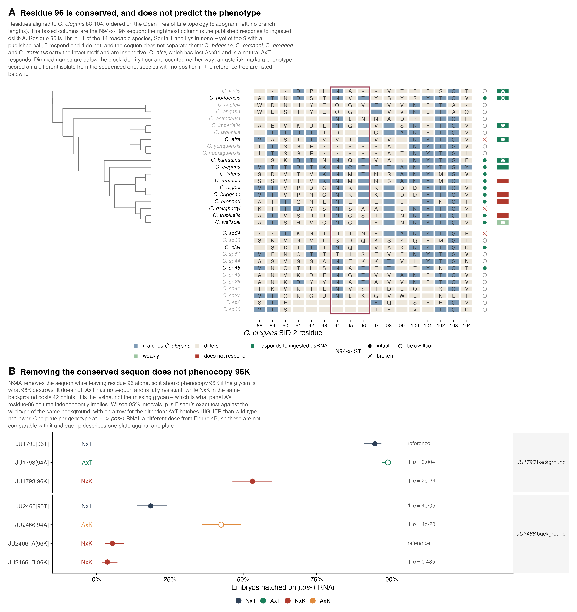
*Source: `plots/SUPP_FIG_XX_sid2_ortholog_conservation` &middot; print version: [`Figure_S9A.pdf`](Figure_S9A.pdf)*

Residue 96 of SID-2 across Caenorhabditis, and what removing the sequon it
belongs to actually does. sid-2 96K is a polymorphism inside C. elegans, so
calling 96T ancestral needs outgroups; this has 14 of them, paired with the
editing series that says what the conservation does and does not mean. The
search behind it and the calibration of its conservation are
SUPP_FIG_XX_sid2_ortholog_search.

(A) Residues aligned to C. elegans 88-104 in every Caenorhabditis species whose
ortholog has a BLAST HSP spanning the window, ordered by identity to
C. elegans; the boxed columns are the N94-x-T96 sequon. Species come from 20
UniProt reference proteomes and the 32 additional species of the Caenorhabditis
Genomes Project v2 release. Among the 14 species at or above the confidence
floor, residue 96 is Thr in 11, Ser in 1, and LYSINE IN NONE, and the sequon is
intact in 11. Of the three losses only C. doughertyi changes residue 96 itself,
to Ala; C. afra keeps Thr96 and loses Asn94, making it a natural AxT -- the
construct in panel B -- and C. sp54 changes both. So the constraint sits on
residue 96 being small and hydroxylated rather than on the sequon as a unit.

Each row carries its own confidence: the local identity of the +/-10 residue
block around the window. The floor is 37% because that is where the six
full-length Elegans-group orthologs already sat, not a threshold chosen to
produce an answer. Rows below the floor are drawn in the lower facet and counted
neither way, which is where the two species that appear to carry Lys96 sit, at
32% and 21% block identity.

Rows are ordered on a reference phylogeny -- the Open Tree of Life induced
subtree, synthetic tree opentree16.1, topology only, drawn as a cladogram at the
left. Nothing here re-estimates a tree; a SID-2 gene tree at 42-48% identity
would be the wrong object to draw. Species with no position in that tree, the
unnamed Caenorhabditis Genomes Project sp. NN isolates and C. oiwi, are listed
below it rather than placed arbitrarily.

The rightmost column is each species' published response to ingested dsRNA,
from Nuez & Felix 2012 (PLoS ONE 7:e29811). That paper scored species under
provisional designations, most since named -- C. sp. 11 is C. tropicalis and
C. sp. 10 is C. doughertyi -- so every call is mapped through Felix, Braendle &
Cutter 2014 (PLoS ONE 9:e94723), whose type strains are the isolates tested.
The mapping is deposited as sid2_species_name_map.tsv. Only calls that paper
states in prose are used, so species it tested but does not call, including
C. doughertyi and C. nigoni, carry a sequon marker and no phenotype tile.

THIS IS THE POINT OF THE FIGURE. Of the nine species with both a readable window
and a published call, five respond to ingested dsRNA and four do not, AND THE
SEQUON DOES NOT SEPARATE THEM: C. briggsae, C. remanei, C. brenneri and
C. tropicalis carry the intact motif and are insensitive, while C. elegans,
C. kamaaina, C. portoensis and C. wallacei carry it and respond. C. afra, which
has lost Asn94 and is a natural AxT, responds. Residue 96 is conserved; it does
not predict the phenotype. Nuez & Felix reached the same conclusion from the
phenotype alone, inferring a minimum of four gains or losses of environmental
RNAi within the genus.

An asterisk on a phenotype tile marks a call scored on a DIFFERENT ISOLATE from
the sequenced one, which is most of them: only C. elegans (N2), C. tropicalis
(JU1373) and C. drosophilae (DF5077) match. That matters more than it normally
would, because the same paper reports intraspecific variation in C. elegans.

(B) The editing series on pos-1 RNAi, Wilson 95% intervals. N94A removes the
sequon while leaving residue 96 alone, so it should phenocopy 96K if the glycan
is what 96K destroys. It does not: JU1793 AxT is 265/267 = 99.3% hatched, fully
resistant with no sequon, while JU1793 NxK is 110/207 = 53.1%. Losing the sequon
by removing Asn94 is harmless; losing it by substituting Lys96 costs 42 points,
so it is the lysine and not the missing glycan -- which is what panel A's
residue-96 column independently implies. In the JU2466 background N94A gains
more (88/207 = 42.5%) than the 96T swap does (40/217 = 18.4%), so the two
positions interact rather than acting through one shared modification. Wild
types are JU1793 NxT 202/213 = 94.8% and JU2466 NxK 11/204 = 5.4% and 8/215 =
3.7%. Significance is Fisher's exact test on the hatched/unhatched counts against the
wild type of the same background (JU1793[96T] and JU2466_A[96K]), with an arrow
for the direction. AxT is p = 0.004 HIGHER than its wild type, not lower; the
arrow is there so a bare p value cannot be read as impairment. NxK is p = 2e-24
lower, the 96T swap into JU2466 p = 4e-05 higher, N94A into JU2466 p = 4e-20
higher, and the second JU2466 line p = 0.49 against the first.

One plate per genotype at 50% pos-1 RNAi, A DIFFERENT DOSE FROM FIGURE 4B,
so these percentages are not comparable with that figure's, and each p describes
one plate against one plate; SUPP_FIG_XX_sid2_allele_swaps_full carries the same
data with HT115 controls.

A CORRECTION THIS FIGURE RECORDS. With only the UniProt proteomes it appeared
that the sequon was intact through the Elegans group and broken at C. angaria,
the most distant species with a detectable ortholog. Two things were wrong: the
C. angaria call came from a global alignment whose block identity around the
window is 26%, far too low to read a column from, and the UniProt sample
contained no Elegans-group species lacking the sequon, which the wider sample
shows do exist. The window is now read from the spanning HSP and every call
carries a confidence.

NO FUNCTIONAL CLAIM FOLLOWS FROM PANEL A. Conservation is evidence about
history; panel B is the mechanism test, and it fails for the glycan.

---

## Figure S9B
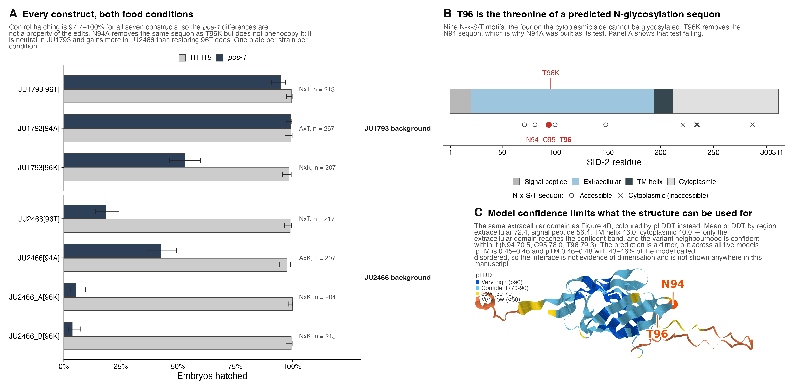
*Source: `plots/SUPP_FIG_XX_sid2_allele_swaps_full` &middot; print version: [`Figure_S9B.pdf`](Figure_S9B.pdf)*

Everything held back from Figure 4A: all seven constructs on both food
conditions at 50% pos-1 RNAi, the N-glycosylation sequon that motivated the
N94A edits, and the AlphaFold model confidence.

(A) All seven constructs, HT115 and pos-1. Control hatching is 97.7-100% for
every construct, so the pos-1 differences are not a property of the edits.

(B) T96 is the threonine of an N94-C95-T96 sequon; nine N-x-S/T motifs are
marked and the four on the cytoplasmic side cannot be glycosylated.

(C) The ectodomain coloured by pLDDT, with the per-domain means and the dimer
ipTM values that limit what the structure can be used for.

WHY THE GLYCOSYLATION HYPOTHESIS IS NOT IN FIGURE 4. N94A removes the same
sequon as T96K while leaving residue 96 alone, and should phenocopy T96K if
loss of the glycan is what matters. It does not:

    background   construct   motif   pos-1 hatching
    JU1793       96T (wt)    NxT     0.948
    JU1793       94A         AxT     0.993   <- no glycan, fully resistant
    JU1793       96K         NxK     0.531
    JU2466       96K (wt)    NxK     0.045
    JU2466       96T         NxT     0.184
    JU2466       94A         AxK     0.425   <- helps more than 96T does

The AxT construct cannot be glycosylated at N94 and is fully resistant, so the
glycan is not required for resistance; and removing Asn94 gains more in JU2466
(+0.38) than restoring Thr96 does (+0.14) while gaining almost nothing in
JU1793 (+0.045). Positions 94 and 96 interact. A description that fits all six
numbers is that Lys96 is deleterious and an unglycosylated Asn94 makes it
worse, either relievable independently -- but that is epistasis between
neighbouring residues, not a mechanism, and each genotype is a single plate.

---

## Figure S10
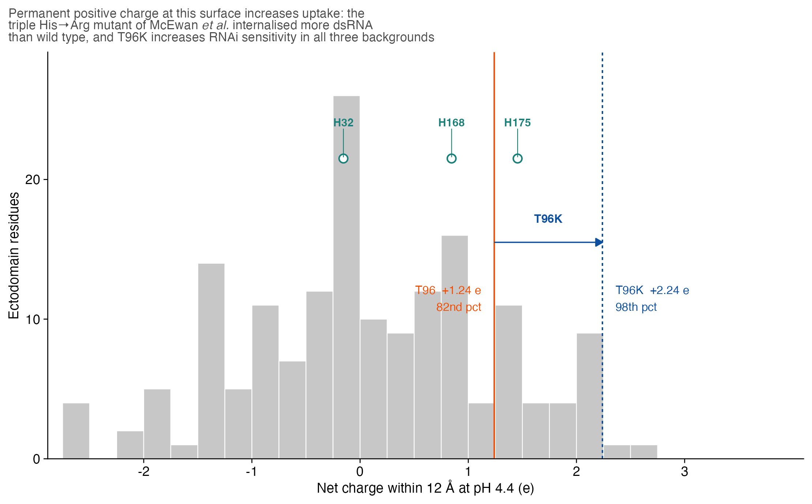
*Source: `plots/SUPP_FIG_XX_sid2_local_charge` &middot; print version: [`Figure_S10.pdf`](Figure_S10.pdf)*

Where T96's pocket sits in the ectodomain's charge distribution. Figure 4C shows
where the positive pocket is; this shows how unusual it is, which is the part
that can be argued with.

Local net charge is the Henderson-Hasselbalch side-chain charge summed over
every ectodomain residue with a Ca within 12 A, at the gut-lumen pH of 4.4, over
residues 21-188. Grey, all 168 ectodomain residues. Orange line, T96 at +1.24 e,
the 82nd percentile (domain median 0.00). Blue dashed line and arrow, T96K at
+2.24 e, the 98th percentile. Open circles, the three uptake histidines of
McEwan et al. 2012: H32 at -0.15, H168 at +0.85, H175 at +1.46 e -- H175, the
one 37.8 A from T96 and so absent from Figure 4C's field, sits in the most
positive environment of the three.

Two things bound the claim. 81 of the 168 residues have positive local charge at
this pH, so a positive pocket by itself is unremarkable; the 98th percentile is
the claim, not the sign. And the domain is net ACIDIC overall (-8.34 e at pH
7.4, +0.47 e at pH 4.4 across 21-188), so this is a basic pocket in an acidic
domain rather than a polybasic surface of the kind SID-1 uses. Charges are
formal: pKa shifts, local dielectric and glycan shielding are ignored, and three
of the nine N-glycosylation sequons lie in this domain.

---

## Not included

These figures exist in `plots/` but the current draft does not cite them, so they are not packaged here:

- `Figure2_no_cross_qtl`
- `SUPP_FIG_XX_baugh_per_sample_frequencies`
- `SUPP_FIG_XX_bootstrap_propagation_checks`
- `SUPP_FIG_XX_gwas_peak_genotype_splits`
- `SUPP_FIG_XX_nil_hatching_full`
- `SUPP_FIG_XX_nil_interval_genes`
- `SUPP_FIG_XX_sid2_allele_in_panel`
- `SUPP_FIG_XX_sid2_briggsae_alignment`
- `SUPP_FIG_XX_sid2_electrostatics`
- `SUPP_FIG_XX_sid2_model_confidence`
- `SUPP_FIG_XX_sid2_ortholog_search`

Add one by appending it to `MANIFEST` in `scripts/finalize_manuscript_figures.py` and re-running.
